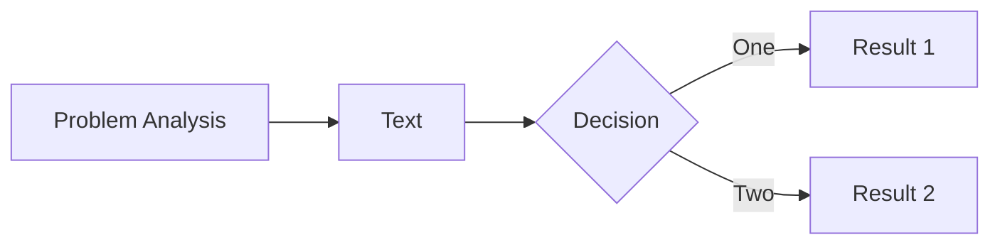
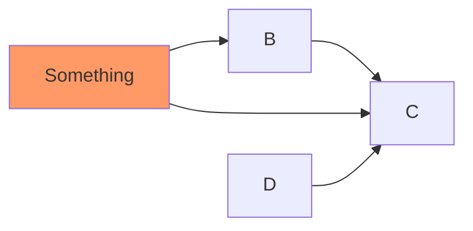

#### This is Graphic Practice!

```mermaid
graph LR 
A[Problem Analysis]--> B
B[Text] --> C{Decision}
C -->|One| D[Result 1] 
C -->|Two| E[Result 2]
```

```mermaid 
graph LR 
A["Something"]:::someclass --> B 
B --> C 
A --> C
D --> C 
classDef someclass fill:#f96;
```

```mermaid
graph LR
A[Problem introduction] --> B[]
```

