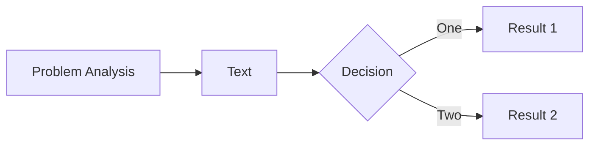
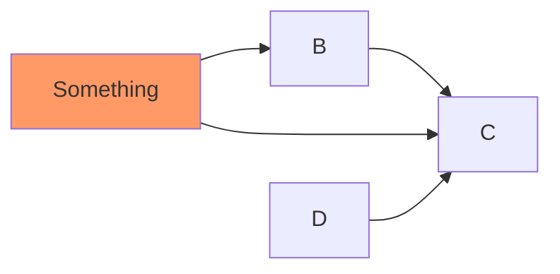
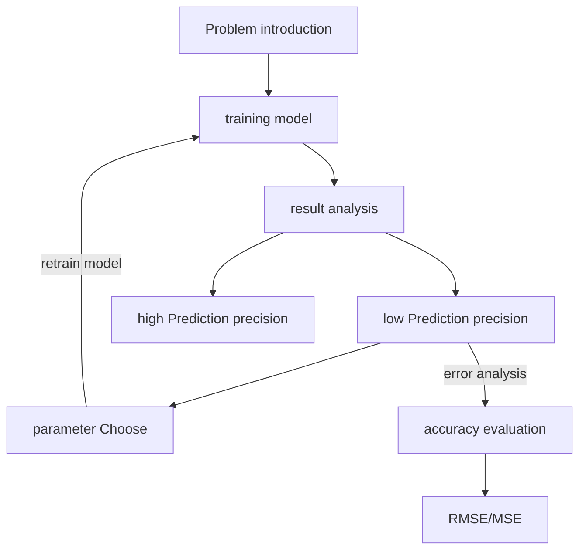

#### This is Graphic Practice!

```mermaid
graph LR 
A[Problem Analysis]--> B
B[Text] --> C{Decision}
C -->|One| D[Result 1] 
C -->|Two| E[Result 2]
```

```mermaid 
graph LR 
A["Something"]:::someclass --> B 
B --> C 
A --> C
D --> C 
classDef someclass fill:#f96;
```

```mermaid
graph TB
A[Problem introduction] --> B[training model]
B --> C[result analysis]
C --> D[low Prediction precision]
D --> E[parameter Choose]
D --> |error analysis|F[accuracy evaluation]
F --> H[RMSE/MSE]
E --> |retrain model|B

C --> G[high Prediction precision]


```

