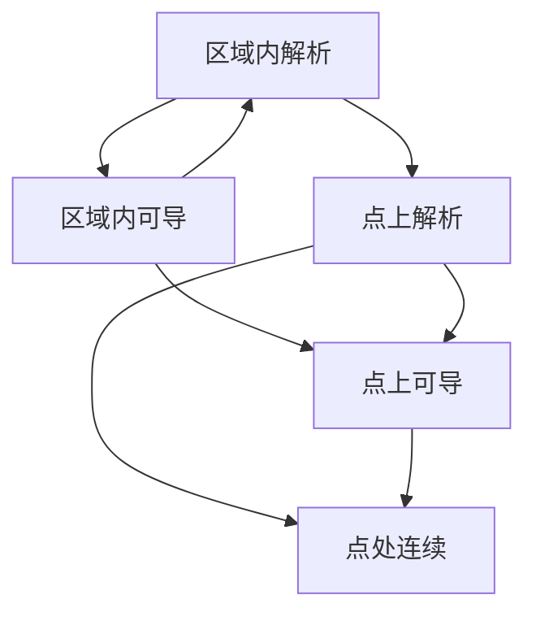

### 一、导数的定义

设函数$w = f(z)$为定义于区域$D$的函数，$z_0$为区域$D$中的一点
$$f'(z_0) = \frac{dw}{dz}|_{z=z_0}=\lim_{\Delta z\to 0} \frac{f(z_0 + \Delta z)}{\Delta z}$$
若上式存在，则说$f(z)$在$z_0$处可导，极限值称之为$f(z)$在$z_0$的导数

导数的要求是，极限值存在的要求与$z\to z_0$的方式无关

### 二、求导法则，解析函数

加减乘除: 与实变函数相同
$$\{f[g(z)]\}' = f'(w)g'(z)   \qquad \text{where} \quad w =g(z)$$
$$f'(z) = \frac{1}{\varphi'(w)}\qquad\text{where} \qquad z = \varphi(w) , w =f(z) \quad (\phi'(w)\neq 0)$$
##### 微分的概念:
$$dw = f'(z_0)dz$$
##### 解析函数的概念
	若函数f(z)在z0及其邻域内处处可导， 则称f(z)在z0处解析, 若f(z)在z0的每一点都解析，则称f(z)在区域D内解析
	如果f(z)在z0处不解析，则z0称为解析函数的奇点

##### 相关定理
	1) 在区域D内的两个函数f(z)和g(z)的和差积商(除分母为0点)在D内解析
	2) 设函数h=g(z)在z平面上的区域D内解析，函数w = f(h)在h平面上的区域G内解析， 而对应D内的每一个点z, 函数g(z)都有对应的h属于G, 则复合函数w = f[g(z)]在D内解析

### 三、解析函数的充要条件

[[2. 解析函数 2022-12-17 12.46.40.excalidraw|解析函数推导过程]]

设$f(x) = u(x,y)+iv(x,y)$ 定义在区域D内, 并且在D内一点$z = x+iy$可导, 则对于充分小的$\Delta z > 0$, 分别计算$\Delta x$和$\Delta y$ , 得到对应的条件

##### 定理： 
(1) 设函数$f(z) = u(x,y) + iv(x,y)$定义在区域D内，则$f(z)$在D内一点$z = x+iy$可导的充分必要条件是: $u(x,y), v(x,y)$ 可微，且满足柯西-黎曼方程: 
$$\frac{\partial u}{\partial x} =  \frac{\partial v}{\partial y},  \qquad \frac{\partial u}{\partial y} = - \frac{\partial v}{\partial x}$$
[[2. 解析函数 2022-12-19 12.29.12.excalidraw|导数公式推导]]
由柯西-黎曼方程，可得导数公式：
$$f'(z) = \frac{\partial u}{\partial x} +i \frac{\partial v}{\partial x} = \frac{1}{i} \frac{\partial u}{\partial y} + \frac{\partial v}{\partial y}$$
(2) 设函数$f(z) = u(x,y) + iv(x,y)$定义在区域D内,则其解析的充要条件是：  $u(x,y), v(x,y)$ 可微,且满足柯西-黎曼方程

注意：在一点处，解析的要求比可导的要求高很多

(3) 补充：圆柱坐标系下的柯西-黎曼方程：
$$\frac{\partial  u}{\partial r} = \frac{1}{r}\frac{\partial v}{\partial \theta}, \qquad \frac{\partial v}{\partial r} = -\frac{1}{r} \frac{\partial u }{\partial \theta}$$

### 四、初等函数

#### (1) 指数函数

在复平面内定义一个函数z， 使其满足如下三个条件 : 
	(1) f(z)在平面内处处解析
	(2) f'(z) = f(z)
	(3) Im(z) = 0时, f(z) = e^x, x = Re(z)

$$f(z) = e^z = e^x(\cos y + i\sin y)$$
等价于关系：
$$\begin{cases}
|expz| = e^x \\
Arg(expz) = y + 2k\pi
\end{cases}$$
性质 ：
加法定理：$e^{z1} \cdot e^{z2} = e^{z_1 + z_2}$
周期性(周期为$2k\pi$)

#### (2) 对数函数

满足
$$e^w = z$$
的函数称为对数函数。我们将$w = f(z)$称为对数函数，令$w = u + iv,z = re^i\theta$,则有 ：
$$e^{u+iv} = r e^{i\theta}$$
因此有$u = \ln r,  v = \theta$
则有： 
$$\large w = \ln |z| + i Arg z$$
为==复变函数的对数函数==
其中: 
$$\begin{matrix}
Ln z = ln |z| + iArgz \\
ln z = ln|z| + i\arg z 
\end{matrix}$$
其中,argz是幅角主值，而lnz是Lnz的主值
这样，我们有公式：
$$Lnz = ln z + 2k\pi i$$
注意：
有公式
$$\begin{matrix}
Ln(z_1 z_2) = Lnz_1 + Lnz_2 \\
Ln \frac{z_1}{z_2} = Ln z_1 - Ln z_2
\end{matrix}$$
但等式
$$\begin{cases}
Ln z^n = nLnz \\
Ln \sqrt[n]{z} = \frac{1}{n}Lnz
\end{cases} \qquad \text{不再成立！!}$$

再讨论对数函数的解析性，就主值$lnz$而言 , $ln |z|$除原点以外处处连续
$\arg z$在原点和负实轴内均不连续

#### (3) 幂函数

使用
$$a^b = e ^{bLna} $$
由于
$$Ln a = ln|a| + i (arga + 2k\pi)$$
则需要讨论整个函数的多值性
1.  b为整数时，$a^b = e^{b[ln|a| + i(arg a + 2k\pi)]}$ 此时由于$2 k\pi i \times b$为$2\pi$的整数倍, 故为单值函数 [[2. 解析函数#(1) 指数函数]]
2.  b为分数$\frac{p}{q}$时，$2 k\pi i \times b$ 有q个不同的位置,因此有q个不同的值 ($k = 0,1,2,3,....q-1$)
3.  其余情况，一般$a^b$有无穷多个值

$$a^b = e^{b(ln|a| + i Arga)}$$

#### (4) 三角函数

[[2. 解析函数 2022-12-18 02.24.33.excalidraw|三角函数简略证明]]

$cosz = \frac{e^{iz} + e^{-iz}}{2} \qquad sinz = \frac{e^{iz} - e^{-iz}}{2i}$
由于$e^{z}$以$2\pi i$为周期，因此正余弦函数均以$2\pi$为周期,各自奇偶性与三角函数相同

$$e^{iz} = cosz + isinz$$
正余弦和角公式等等，仍然成立, 求导公式： 仍然成立

对于$z = x + iy$时：
$$sin(x + iy) = \sin x \cos iy + \cos x \sin iy$$
$$cos(x+ iy) = \cos x\cos iy - \sin x \sin iy$$
其中有
$$\large\begin{matrix}
\cos iy = \frac{e^{-y} + e^y}{2} \\
\sin iy = \frac{e^{-y} - e^y}{2i} 
\end{matrix}$$

#### (5) 对应的双曲函数

$$\begin{matrix}
tgz = \frac{sinz}{cosz}, \qquad ctgz = \frac{cosz}{sinz} \\
secz = \frac{1}{cosz},  \qquad csc z = \frac{1}{sinz}
\end{matrix}$$
定义双曲函数
$$chz = \frac{e^z + e^{-z}}{2} , sh z  = \frac{e^z - e^{-z}}{2} , thz = \frac{e^z - e^{-z}}{e^z + e^{-z}}$$
为双曲正弦，双曲余弦和双曲正切函数
$chz$和$shz$以$2\pi i$为周期,
$$(chz)' = shz \qquad (shz)' = chz $$
#### (6) 反三角函数反双曲函数

反三角函数：
$$\begin{matrix}
Arcsinz = -i Ln (iz  + \sqrt{1-z^2})\\
Arctgz = -\frac{i}{2} Ln\frac{1 + iz}{1-iz}
\end{matrix}$$
反双曲函数：
$$\begin{matrix}
Arsh z = Ln(z + \sqrt{z^2 + 1 }) \\
Arch z = Ln(z + \sqrt{z^2 -1}) \\
Arth z = \frac{1}{2}Ln(\frac{1+z}{1-z})
\end{matrix}$$

### 五、 平面场的复势

#### (1) 使用复变函数表示平面向量场

![[2. 解析函数 2022-12-18 10.01.46.excalidraw]]
对于复变函数$u(x,y) + iv(x,y)$, 由此可以定义一个对应的平面向量场
$$\boldsymbol{A} = u(x,y) \boldsymbol{i}  + v(x,y)\boldsymbol{j}$$
#### (2) 平面流速场的复势： 
设向量场$v$不可压缩(密度= constant), 一个定常的流体速度场 
$$v = v_x(x,y)\boldsymbol{i} + v_y(x,y)\boldsymbol{j}$$
[[2. 解析函数 2022-12-18 10.20.43.excalidraw|部分推导]]
###### 1. 对于无源场（管量场）
$$\text{div} \boldsymbol{v} = \frac{\partial v_x}{\partial x}+\frac{\partial v_y}{\partial y} = 0$$
即有 
$$ \frac{\partial v_x}{\partial x}= -\frac{\partial v_y}{\partial y} $$
因此必定可以找到一个函数$\psi$
$$\frac{\partial \psi}{\partial y} = v_x, \qquad \frac{\partial \psi}{\partial x} = -v_y$$
其中, $\psi$为流函数, 其等值线即为流线

###### 2. 当流场为无旋场时， 有:
$$\text{rot} \boldsymbol{v} = \frac{\partial v_y}{\partial x} - \frac{\partial v_x}{\partial y} = 0$$
故可以找到
$$\frac{\partial \varphi}{\partial x} = v_x , \qquad \frac{\partial \varphi}{\partial y} = v_y$$
$$\text{grad} \varphi = \boldsymbol{v}$$
则$\varphi$为流场v的势函数(位函数)

###### 3. 复势函数（复势）

定义复势函数为 
$$w = f(z) = \varphi(x,y) + i\psi(x,y)$$
为平面流速场的复势函数，简称复势

