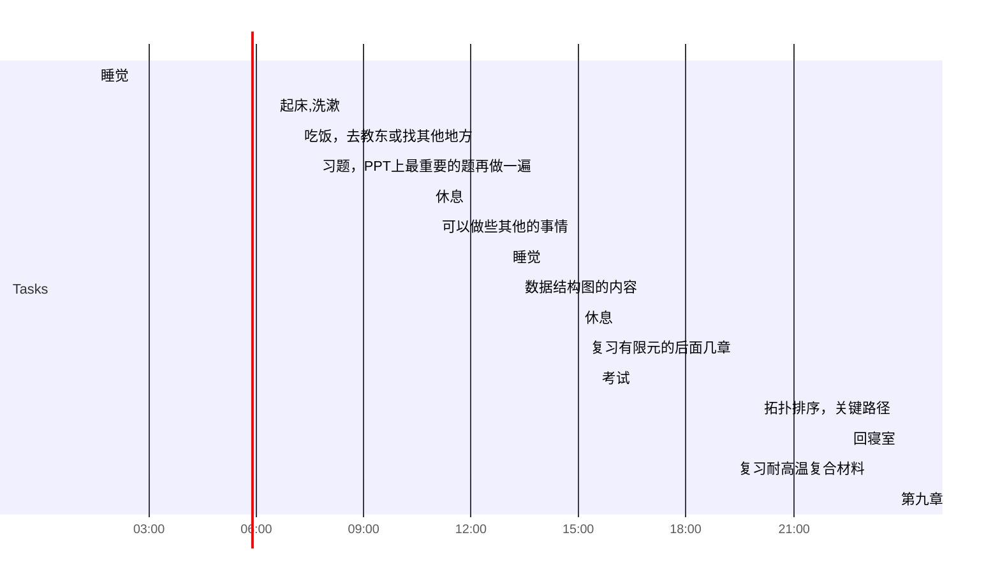

## Day Planner

- [x] 01:30 睡觉
- [x] 06:30 起床,洗漱
- [x] 07:10 吃饭，去教东或找其他地方
- [x] 07:40 习题，PPT上最重要的题再做一遍
- [x] 10:50 休息
- [x] 11:00 可以做些其他的事情
- [x] 13:00 睡觉
- [x] 13:20 数据结构图的内容
- [x] 15:00 休息
- [x] 15:10 复习有限元的后面几章
- [x] 15:30 考试
- [x] 20:00 拓扑排序，关键路径
- [x] 22:30 回寝室
- [x] 23:10 复习耐高温复合材料
- [x] 23:50 第九章
