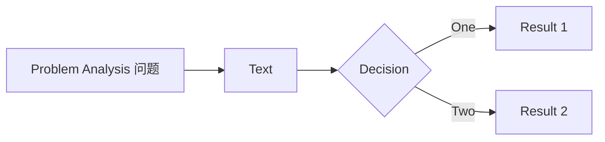
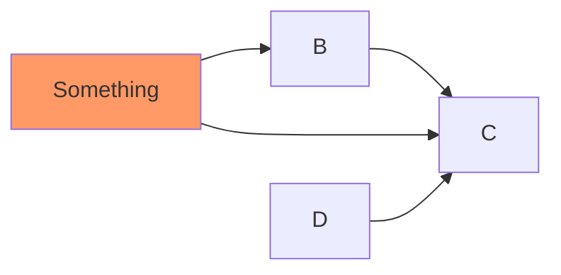
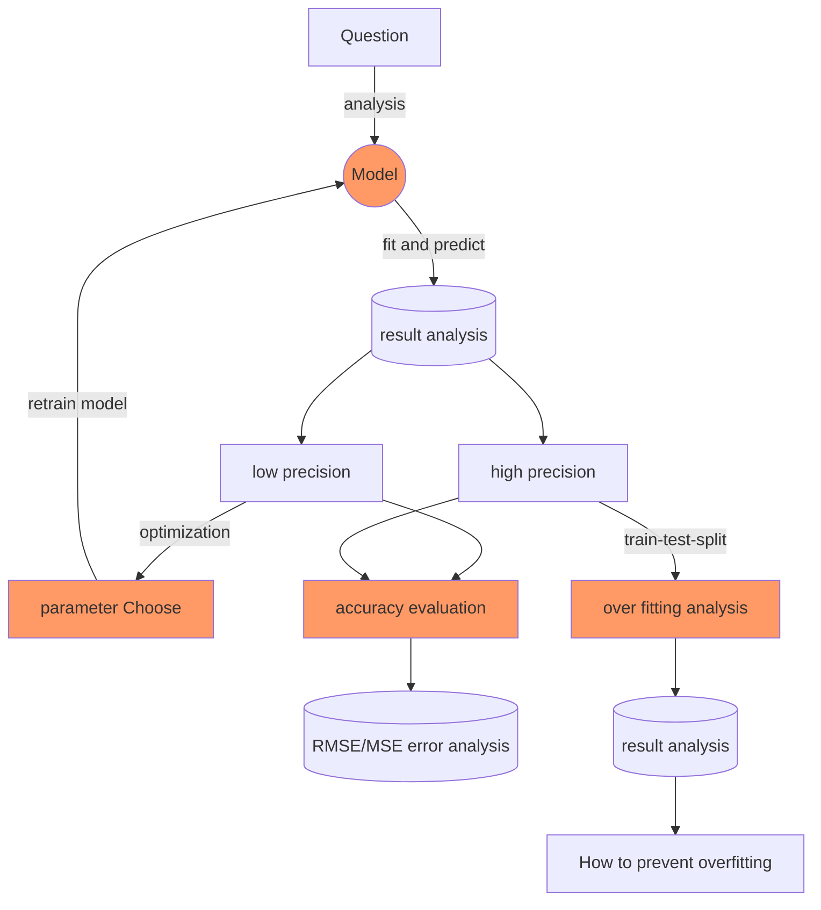

#### This is Graphic Practice!

```mermaid
graph LR 
A[Problem Analysis 问题]--> B
B[Text] --> C{Decision}
C -->|One| D[Result 1] 
C -->|Two| E[Result 2]
```

```mermaid 
graph LR 
A["Something"]:::someclass --> B 
B --> C 
A --> C
D --> C 
classDef someclass fill:#f96;
```

```mermaid
graph TB
A
A[Question] --> |analysis|B((Model))
B:::someclass --> |fit and predict|C[(result analysis)]
C --> D[low precision]
D --> |optimization|E[parameter Choose]
D --> F[accuracy evaluation]
F:::someclass --> H[(RMSE/MSE error analysis)]
E:::someclass --> |retrain model|B

C --> G[high precision]
G --> F

G --> |train-test-split|I[over fitting analysis]
I:::someclass --> J[(result analysis)]

J --> K[How to prevent overfitting]
classDef someclass fill:#f96;
```

