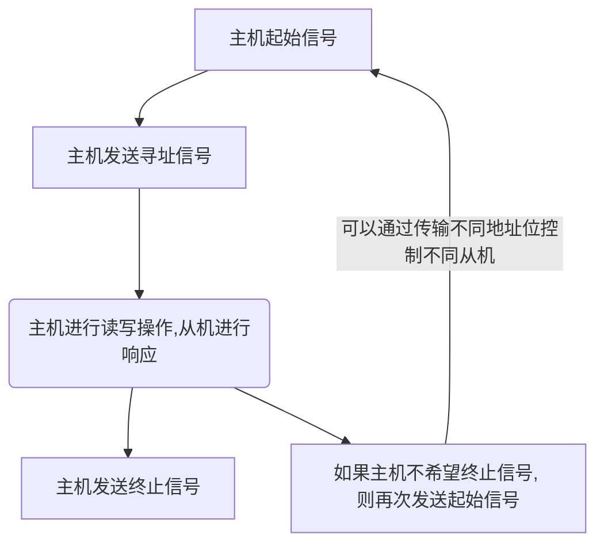

# I2C 总线简介
##  一、概述
最多用的总线形式有$I^2C$和SPI接口形式。

使用51单片机的IO口模拟$I^2 C$时序并实现与EEPROM串口进行通信。 
AT24C02的EEPROM芯片

$I^2 C$是由PHILIPS 公司开发的两线式串行总线，
用于连接微控制器和外围设备
是广泛采用的双向总线标准之一, 也是**一种特殊的同步通信形式**。

可以有多个$I^2C$总器件同时接入到$I^2C$的总线上,  所有的$I^2C$兼容器件需要有标准的接口， 并通过地址来识别对象, 使其可以通过$I^2 C$总线来进行直接通信 。 

<b><mark style="background: transparent; color: blue">总线包括数据信号线SDA, 时钟信号线 SCL</mark></b>, 硬件实现简单, 扩展性强, 在STM32中仍然含有$I^2C$接口, 例如OLED的屏幕等等, $E^2PROM$也使用$I^2 C$接口。 激光， 手势传感器等等
![[Excalidraw/I2C-EEPROM实验-原理与简介 2023-12-31 15.06.49|450]]
在总线上面可以支持多个设备的连接, 两个上拉电阻是保证所有设备空闲状态下, 总线始终处于高电平状态。
## 二、信号通信原理
### (1) I2C 物理层简介
I2C通信总线的特点如下: 
1.  在一个I2C通信总线上, <mark style="background: transparent; color: red">支持多个通信设备主机以及多个通信设备从机</mark>。 而232串口必须有一个主机可以连接多个从机。 
2. 仅使用了数据线SDA和时钟总线SCL, 其中时钟用于收发数据的同步。 
3. 每一个连接到I2C总线的**设备都有一个独立的地址**, 主机可以利用地址访问不同的设备。 保证器件的地址不同访问对应的设备。  
4. 总线通过上拉电阻接到电源， 而设备全部空闲时, 处于高阻态(总线处于高电平, 有上拉电阻保证)。
5. 为了防止数据冲突， 会<mark style="background: transparent; color: red">使用仲裁方式决定使用哪一个设备占用总线</mark>, 通过地址识别对哪个器件访问
6. 连接到I2C总线的设备个数不是无限的， 受到<mark style="background: transparent; color: red">总线的最大电容</mark>(400pf)限制, 一般连5-6个均可

主机: 启动数据传输并产生时钟信号的设备。 
从机: 被主机寻址的设备。 
多主机: 同时有多个主机设备尝试控制总线。 
主模式: I2C支持的自动字节的计数模式。控制数据的接受和发送
从模式: 发送和接受都是由I2C模式自动控制完成的。  例如在主机读取从机的设备时，由从机自动返回并发送数据到主机
仲裁: 一个在多个主机控制总线， 但只允许一个设备控制总线， 从而保证传输不被破坏
同步: 两个或者多个设备同步时钟信号的过程。 
发送器:  发送数据到总线的器件。 
接收器:  从总线接受数据的器件。

I2C接口有三种传输模式, 包括 : 

| 传输方式 | 一般方式 | 快速模式 | 高速模式 |
| ---- | ---- | ---- | ---- |
| 速率 | 100kb/s | 400 kpb/s |  (可以达到3.4Mbit/s, 但一般不支持)  |

### (2) I2C 协议层 
定义了通信的起始和停止信号，响应， 仲裁， 时钟停止广播等等。

通信要求: 
1. <mark style="background: transparent; color: red">在数据传动过程中</mark>, 当SCL 为高电平时, SDA必须保持稳定， 只有在SCL为低电平时， 才允许数据线上的部分变化。
2.  数据传输时, 以字节为单位。 一个字节 = 8bit,  可以进行多字节的发送。
3. 在SCL为高电平时, 若SDA跳变到低, 则开始传输, 跳变到高则停止传输。 
当要变换数据进行发送时，SCL变为低电平， 才能进行数据的传输。 
![[attachments/Pasted image 20231231163330.png|500]]

#### 1. 起始信号 
1. 首先, <mark style="background: transparent; color: red">维持时钟线SCL为高电平时, 数据线 SDA 由高电平变为低电平, 则为起始信号</mark> 
2. <mark style="background: transparent; color: red">维持SCL为高电平时, SDA由低电平变为高电平, 则为终止信号</mark>。  
![[attachments/Pasted image 20231231165013.png|500]]
3. 起始信号产生之后, 总线处于占用状态， 而终止信号发出后, 总线释放, 变为高电平。 

#### 2.  应答响应 
每当发送器件传输完一个字节之后, 必须<mark style="background: transparent; color: red">紧跟一个校验位</mark>, 此校验位是接收端控制SDA数据线实现(发送给主机?)的, 表示数据已经接收完成， 可以继续发送数据。 
![[attachments/Pasted image 20231231165459.png|500]]

校验位是数据和地址传输过程中的响应， 其中包括应答ACK, 非应答NACK两种。 

<mark style="background: transparent; color: red">当接受端接受到数据之后，如果希望对方继续发送数据， 则需要发送一个ACK应答信号, 当发送方接受到此信号时, 则会继续发送下一个数据</mark>。 ACK是特定低电平的信号;  而如果希望结束数据传输, 则发送一个NACK信号, 此时发送方就会产生一个停止信号结束传输。

ACK和NACK是紧跟在SDA的最后一个下降沿的。

每一个字节都必须保证8位长度,  数据传输时，先传输高位MSB, **从高位往低位传输**。 每个数据都要跟一个应答位， 因此一帧有9位数据。

由于**某种原因从机不对主机应答时, 必须将数据线置为高电平, 而由主机产生一个终止信号结束数据传输**, 如果<mark style="background: transparent; color: red">从机应答主机， 传输一段时间后，如果无法继续传输更多数据,  则从机发出非应答信号</mark>，主机结束数据传输。

当主机接受最后一个字节之后，必须向从机发送一个终止信号， 从机释放SDA, 也结束传输。 

> [!note] 说明
> 在数据传输过程中, 起始信号是必须要有的, 而终止信号， 包括应答，非应答信号都可以没有。

#### 3.  主机读取从机数据
在信号传输中， 主机可以从从机方读取数据。 读取数据时, 从机使用相同的方法对主机传输数据。

主机接受完从机的数据之后， 发出一个应答响应,  以表示继续接受从机的数据。 在从机接受到应答后，继续发送。
需要说明的是, 在主机读取从机数据时, 起始信号和终止信号都是主机发送的， 实现应答的启动和停止。 

#### 4. 总线的寻址方式 
使用I2C进行传输总线寻址有两种地址格式, 其中一种是7位， 另一种是10位。其中R/W为方向控制位, 即控制读和写。 
-  如果R/W = 0, 则代表W, 即主机向从机写数据。
- 如果R/W = 1, 代表R, 主机从从机读取数据。

地址数据共有8位， 其中高7位表示了从机的地址, 最低位为R/W标志位。 

| 位 | 7 | 6 | 5 | 4 | 3 | 2 | 1 | 0 |
| ---- | ---- | ---- | ---- | ---- | ---- | ---- | ---- | ---- |
|  |  |  |  |  |  |  |  | R/W |
|  |  |  |  |  |  |  |  |  |

10位寻址是和7位寻址兼容的，即10位也可以使用7位方法寻址。 
以7位方式发送时, 每个设备都将其地址与此地址比对， 如果相同， 则判断自身被主机寻址。 

其中<b><mark style="background: transparent; color: blue">从机地址</mark></b>由固定部分和可编程部分构成, 可编程部分的大小决定了接入相同类型从机设备的最大数目。

#### 5. 总的通信方式 

传输的数据包括地址信号和数据信号，都是通过SDA线进行传输。
1. 主机向从机发送数据 , 数据传送方向在整个过程中保持不变。 
2. 终止<mark style="background: transparent; color: red">数据传输都是以主机发出终止信号而停止</mark>。**每次如果主机希望继续占用总线进行新的数据传输**， 则可以不产生终止信号, 可以再次发送起始信号，此时可以通过传输不同地址位控制不同从机， 从而实现对另一个从机进行寻址。

数据传输有基本的三种方式格式: 
1. 主机向从机发送数据， 数据传送方向在整个传送的过程中保持不变。 
   
2. 主机在第一个字节之后， 立刻从