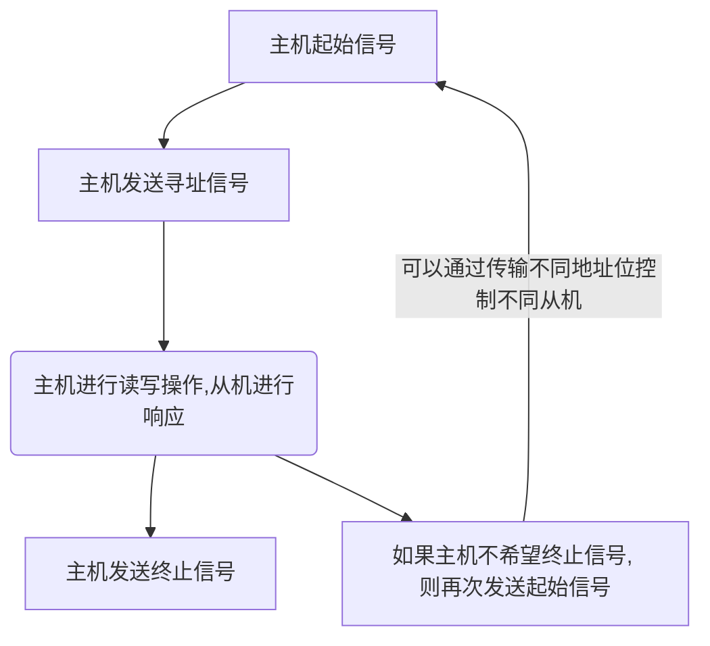

##  一、概述
最多用的总线形式有$I^2C$和SPI接口形式。
使用51单片机的IO口模拟$I^2 C$时序并实现与EEPROM串口进行通信。 
AT24C02的EEPROM芯片

$I^2 C$是由PHILIPS 公司开发的两线式串行总线，
用于连接微控制器和外围设备
是广泛采用的双向总线标准之一, 也是**一种特殊的同步通信形式**。

可以有多个$I^2C$总器件同时接入到$I^2C$的总线上,  所有的$I^2C$兼容器件需要有标准的接口， 并通过地址来识别对象, 使其可以通过$I^2 C$总线来进行直接通信 。 

<b><mark style="background: transparent; color: blue">总线包括数据信号线SDA, 时钟信号线 SCL</mark></b>, 硬件实现简单, 扩展性强, 在STM32中仍然含有$I^2C$接口, 例如OLED的屏幕等等, $E^2PROM$也使用$I^2 C$接口。 激光， 手势传感器等等
![[Excalidraw/I2C-EEPROM实验-原理与简介 2023-12-31 15.06.49|450]]
在总线上面可以支持多个设备的连接, 两个上拉电阻是保证所有设备空闲状态下, 总线始终处于高电平状态。
## 二、信号通信原理
### (1) I2C 物理层简介
I2C通信总线的特点如下: 
1.  在一个I2C通信总线上, <mark style="background: transparent; color: red">支持多个通信设备主机以及多个通信设备从机</mark>。 而232串口必须有一个主机可以连接多个从机。 
2. 仅使用了数据线SDA和时钟总线SCL, 其中时钟用于收发数据的同步。 
3. 每一个连接到I2C总线的**设备都有一个独立的地址**, 主机可以利用地址访问不同的设备。 保证器件的地址不同访问对应的设备。  
4. 总线通过上拉电阻接到电源， 而设备全部空闲时, 处于高阻态(总线处于高电平, 有上拉电阻保证)。
5. 为了防止数据冲突， 会<mark style="background: transparent; color: red">使用仲裁方式决定使用哪一个设备占用总线</mark>, 通过地址识别对哪个器件访问
6. 连接到I2C总线的设备个数不是无限的， 受到<mark style="background: transparent; color: red">总线的最大电容</mark>(400pf)限制, 一般连5-6个均可

主机: 启动数据传输并产生时钟信号的设备。 
从机: 被主机寻址的设备。 
多主机: 同时有多个主机设备尝试控制总线。 
主模式: I2C支持的自动字节的计数模式。控制数据的接受和发送
从模式: 发送和接受都是由I2C模式自动控制完成的。  例如在主机读取从机的设备时，由从机自动返回并发送数据到主机
仲裁: 一个在多个主机控制总线， 但只允许一个设备控制总线， 从而保证传输不被破坏
同步: 两个或者多个设备同步时钟信号的过程。 
发送器:  发送数据到总线的器件。 
接收器:  从总线接受数据的器件。

I2C接口有三种传输模式, 包括 : 

| 传输方式 | 一般方式 | 快速模式 | 高速模式 |
| ---- | ---- | ---- | ---- |
| 速率 | 100kb/s | 400 kpb/s |  (可以达到3.4Mbit/s, 但一般不支持)  |

### (2) I2C 协议层 
定义了通信的起始和停止信号，响应， 仲裁， 时钟停止广播等等。

通信要求: 
1. <mark style="background: transparent; color: red">在数据传动过程中</mark>, 当SCL 为高电平时, SDA必须保持稳定， 只有在SCL为低电平时， 才允许数据线上的部分变化。
2.  数据传输时, 以字节为单位。 一个字节 = 8bit,  可以进行多字节的发送。
3. 在SCL为高电平时, 若SDA跳变到低, 则开始传输, 跳变到高则停止传输。 
当要变换数据进行发送时，SCL变为低电平， 才能进行数据的传输。 
![[attachments/Pasted image 20231231163330.png|500]]

#### 1. 起始信号和中职信号
1. 首先, <mark style="background: transparent; color: red">维持时钟线SCL为高电平时, 数据线 SDA 由高电平变为低电平, 则为起始信号</mark> 
2. <mark style="background: transparent; color: red">维持SCL为高电平时, SDA由低电平变为高电平, 则为终止信号</mark>。  
![[attachments/Pasted image 20231231165013.png|500]]
3. 起始信号产生之后, 总线处于占用状态， 而终止信号发出后, 总线释放, 变为高电平。 

#### 2.  应答响应 
每当发送器件传输完一个字节之后, 必须<mark style="background: transparent; color: red">紧跟一个校验位</mark>, 此校验位是接收端控制SDA数据线实现(发送给主机?)的, 表示数据已经接收完成， 可以继续发送数据。 
![[attachments/Pasted image 20231231165459.png|500]]

校验位是数据和地址传输过程中的响应， 其中包括应答ACK, 非应答NACK两种。 

<mark style="background: transparent; color: red">当接受端接受到数据之后，如果希望对方继续发送数据， 则需要发送一个ACK应答信号, 当发送方接受到此信号时, 则会继续发送下一个数据</mark>。 ACK是特定低电平的信号;  而如果希望结束数据传输, 则发送一个NACK信号, 此时发送方就会产生一个停止信号结束传输。

ACK和NACK是紧跟在SDA的最后一个下降沿的。

每一个字节都必须保证8位长度,  数据传输时，先传输高位MSB, **从高位往低位传输**。 每个数据都要跟一个应答位， 因此一帧有9位数据。

由于**某种原因从机不对主机应答时, 必须将数据线置为高电平, 而由主机产生一个终止信号结束数据传输**, 如果<mark style="background: transparent; color: red">从机应答主机， 传输一段时间后，如果无法继续传输更多数据,  则从机发出非应答信号</mark>，主机结束数据传输。

当主机接受最后一个字节之后，必须向从机发送一个终止信号， 从机释放SDA, 也结束传输。 

> [!note] 说明
> 在数据传输过程中, 起始信号是必须要有的, 而终止信号， 包括应答，非应答信号都可以没有。

#### 3.  主机读取从机数据
在信号传输中， 主机可以从从机方读取数据。 读取数据时, 从机使用相同的方法对主机传输数据。

主机接受完从机的数据之后， 发出一个应答响应,  以表示继续接受从机的数据。 在从机接受到应答后，继续发送。
需要说明的是, 在主机读取从机数据时, 起始信号和终止信号都是主机发送的， 实现应答的启动和停止。 

#### 4. 总线的寻址方式 
使用I2C进行传输总线寻址有两种地址格式, 其中一种是7位， 另一种是10位。其中R/W为方向控制位, 即控制读和写。 
-  如果R/W = 0, 则代表W, 即主机向从机写数据。
- 如果R/W = 1, 代表R, 主机从从机读取数据。

地址数据共有8位， 其中高7位表示了从机的地址, 最低位为R/W标志位。 

| 位 | 7 | 6 | 5 | 4 | 3 | 2 | 1 | 0 |
| ---- | ---- | ---- | ---- | ---- | ---- | ---- | ---- | ---- |
|  |  |  |  |  |  |  |  | R/W |
|  |  |  |  |  |  |  |  |  |

10位寻址是和7位寻址兼容的，即10位也可以使用7位方法寻址。 
以7位方式发送时, 每个设备都将其地址与此地址比对， 如果相同， 则判断自身被主机寻址。 

其中<b><mark style="background: transparent; color: blue">从机地址</mark></b>由固定部分和可编程部分构成, 可编程部分的大小决定了接入相同类型从机设备的最大数目。

#### 5. 总的通信方式 

传输的数据包括地址信号和数据信号，都是通过SDA线进行传输。
1. 主机向从机发送数据 , 数据传送方向在整个过程中保持不变。 
2. 终止<mark style="background: transparent; color: red">数据传输都是以主机发出终止信号而停止</mark>。**每次如果主机希望继续占用总线进行新的数据传输**， 则可以不产生终止信号, 可以再次发送起始信号，此时可以通过传输不同地址位控制不同从机， 从而实现对另一个从机进行寻址。

数据传输有基本的三种方式格式(其中S为起始, 灰色为主机的数据): 
1. 主机向从机发送数据， 数据传送方向在整个传送的过程中保持不变。    
![[attachments/Pasted image 20231231185851.png|600]]
   
2. 主机在第一个字节之后， 立刻从从机读取数据。（直接使用1）
![[attachments/Pasted image 20231231190007.png|600]]

3. 传送过程中, **需要改变传送的方向时**， **起始信号和从机地址都被重复产生一次**。 但是<mark style="background: transparent; color: red">两次的读写方向刚好相反</mark>。 (为了改变方向, 则重复发送起始信号)
![[attachments/Pasted image 20231231190243.png|600]] 

需要说明的是， 其中接受地址信号后， 从机也会发送一次应答信号， 之后进行发送或者接受信号。

> [!NOTE] 说明
> 我们往往采用第三种方式进行通信。 

有的高端单片机有I2C的硬件接口，可以<mark style="background: transparent; color: red">使用IO口进行模拟I2C时序进行通信</mark>。 
STM32, DSP等单片机可以使用I2C, 需要对硬件内部的寄存器进行一系列的配置。 

# AT24C02芯片简介 
具有I2C总线结构的E2PROM 有Ateml公司的AT24C系列产品, 包括AT24C01/02/04/08/16等。
其区别在于存储容量不同。 即128x 8/ 256x8  kbit/ ...  (注意是位不是字节, 一个字节(byte)等于8bit) , AT24C02即256kbytes
采用上述芯片可以进行掉电时的数据保存。并可以重复擦写10万次以上。

AT24C02是AT24C系列的芯片, 有专门的写保护功能。在开发板上的模块是EEPROM模块， 以实现掉电的数据存储。 
![[attachments/Pasted image 20231231212518.png|350]]
其封装方式有如下的两种:  其中SCL, SDA 为I2C接口的读写接口, 开发板上<mark style="background: transparent; color: red">分别接入P2_1和P2_0管脚。 </mark>
需要说明, 由于**此处的P2_0, P2_1已经做了上拉电阻**, 因而无需在总线上继续使用上拉电阻。 (其中VSS实际上是GND) 

![[attachments/Pasted image 20231231193630.png]]
上述管脚中, A0-A2是地址输入管脚, 有7个位地址, 4个固定, 3个可编程(对应1,2,3脚), 实际通信中, 需要通过A0, A1,A2设置某个器件的地址值。 
> [!note] 说明
> 在单片机中， 由于仅有一个AT24C02, 地址已经默认设置为0, 即A0 - A2已经默认接地

![[attachments/Pasted image 20231231194409.png|700]]
参考芯片手册, 芯片的器件发送地址前4位固定(1010), 而A2-A0为发送的地址

显然应当传入的数据为1010000W/R, 
对于**写数据时**, 可以设置给EEPROM发送的数据为0xA0。
而**读数据时,** 设置发送的数据为0xA1;

板载的EEPRM是
WP是写保护功能, 当WP 为低电平(GND)时, 允许数据进行读写操作, 而接入VCC 时, 只能读, 不能进行写操作。 (51单片机板载的部分是进行接地的)

SCL, SDA  接入总线上, 并且有一个约为10k的上拉电阻(4.7-10k), 可以保证总线的电平稳定。 

对于AT24C02, 可以依靠I2C的部分, 在芯片的数据手册中, 有延时的范围。(往往稍微进行偏高的延时)

而对于5,6,7模块的部分, 可以使用导线连接到不同的管脚口上。 
![[attachments/Pasted image 20231231212717.png]]

可以使用P0_1, P0_2来模拟与I2C的通信。 

# 读写EEPROM的代码实现
### (1) 构建多文件工程
首先, 通过多文件工程, 可以实现
App中可以放置外设驱动文件, 其中往往可以
Obj 存放Keil软件的生成的文件。
public 存放共有代码文件, 变量定义等等

通过Select Folder for Objects可以更改生成文件的位置(最好最先更改), 默认是Objects文件夹下。 
![[attachments/Pasted image 20240101131424.png|550]]
可以得到如下文件(包括hex 文件)已经被放在Obj中。
![[attachments/Pasted image 20240101131736.png|500]]

Keil 在构建多文件工程时 , 一种编译通过的方法是将
![[attachments/Pasted image 20240102115856.png]]

但是使用多个组时，如果include 头文件会导致can't create command file 报错
![[attachments/Pasted image 20240102120034.png|700]]

解决方案是在add source file时不添加头文件, 直接加源文件.c 即可。  
![[attachments/Pasted image 20240102120541.png]]

在实际的单片机管脚模拟中，通过I2C总线操作对EEPROM进行操作。 

参考手册, 所有的信号上升和下跳沿都是在us量级(1us左右, 则使用两个机器周期来延时就足够了) 
```c
void delay(){
    _nop_();
    _nop_();
}
```

### (2) I2C部分的启动， 停止信号和读写操作
#### 1. 起始和停止信号
对于起始和停止信号, 首先应当设置SCL为1, 并SDA产生一个突跳沿(起始是下跳, 终止是上跳), 如果前面SDA有其他状态例如start时, SDA = 0), 则相当于先产生一个终止信号， 再发送一个起始信号。 

需要注意的, 对于起始, 应答信号和非应答信号之后， 都应当将SCL设置为0以允许数据的变化。 
```c
void I2C_Init(){
    SCL = 1; 
    SDA = 1;
}
/// **for  start, ack and nack, return default as SCL = 0**
void I2C_start(){ // SDA  from 1 to 0 when SCL = 1;
	 // **must add SDA = 1, don't forget it.** since SCL = 1, it  will equal to a end signal 
    SDA = 1;
    delay();
    SCL = 1;
    delay();
    SDA = 0; // set SDA = 0;
    delay();
    SCL = 0; // occupy the I2C bUS
    delay();
}

void I2C_Stop(void){
	SDA = 0; // start signal
    delay();
    SCL = 1; // check default
    delay();
    SDA = 1; 
    delay();
}
```

#### 2. 主机发送ACK和NACK应答
在主机发送应答时, 首先将SCL置为低电平以允许数据变化, 然后若发送ACK, 则将SDA设置为0, 否则设置1, 并产生一个时钟SCL的上升和下降沿(先设置1,再设置0)来使数据发出。 发送完成后将SDA置一即可。
```c
// send acknowledge;
void I2C_ACK(void){
    SCL = 0; // check default
    delay();
    SDA = 0;
    delay(); // send a 0
    SCL = 1;
    delay();
    SCL = 0; 
    delay();
	// 下面这两句没有太大用， 可以不加: 
    SDA = 1; // return default (no use )
    delay(); 
}

// send not acknowledge
void I2C_NACK(void){
    SCL = 0;
    delay();
    SDA = 1;
    delay();
    SCL = 1;
    delay();
    SCL = 0;
    delay();
}
```

#### 3. 主机等待ACK, NACK应答
需要注意的是, 主机在等待应答时, 先将SCL设置为1， 此时需要一个循环等待SDA是否为0。
- 如果是0, 则认为是ACK, 此时SCL置0, 从而允许位变化和下一步接受, 并返回1(成功)。
- 如果等待超过一定时长， 则认为是NACK,  此时, 发送停止信号并返回0即可。 
```c
// define a function to packge the read of the acknowledge. 
u8 I2C_Wait_Answer(void){ // accept the answer, succeed as 1 and not succeed as 0; 
    u8 time_temp = 0;
    SCL = 1;  // firstly, set SCL to  high voltage level 
    delay(); // wait for answer 
    // wait for SDA change 
    while (SDA){ // if SDA 
        time_temp++;
        if (time_temp > 100){
            I2C_Stop();  // send stop signal 
            return 1;    // SCL = 1;
        }
    }
    SCL = 0;  // allow receive data again;
    Delay10us();  // 记得加上等待10us 
    return 0;
}
```

#### 5. 主机发送和读取数据(包括地址) 
数据的写入: 
首先置SCL = 0, 然后使用&0x80和 每次左移一位的方法来进行写入, 从高到低进行写入, SDA先设置为相应的位, 写入完毕之后保证SCL为0允许下一次写入。 
```c
// write data operation 
void I2C_WriteByte(u8 _data_){
    u8 i;
    SCL = 0; //  
    delay();
    for (i = 0; i< 8; i++){
		data_temp = _data_ >> 7;  // wrong code : SDA = _data_ & 0x80; -> it will cause all data to set to 0 
	    SDA = data_temp;          // set SDA as data
        _data_ <<= 1;
        delay();
        // send data
        SCL = 1;
        delay();
        SCL = 0; 
        delay();
    }
}
```
数据的读取:  在读取数据的情况下， 仍然是主机设置总线的电平的。当主机设置为低电平时， 从机会改变对应的数据, 而主机设置为高电平时，数据是稳定的。此时通过判断SDA的位来进行读取数据。

是否根据ack继续读取: <mark style="background: transparent; color: red">在数据读取完毕之后, 需要由主机发送(传入参数)ack或者nack</mark>，如果发送的是ack 则进行继续读取 ;  如果发送的是nack, 则主机**发送一个nack, 然后发送一个停止信号**。  

```c
// read data operation 
u8 I2C_ReadByte(u8 ack){ // if ack is 
    u8 _data_ = 0, i;
    for (i = 0; i < 8; i++){
        SCL = 0;      // use host to set SCL = 0; -> in this time slave will send data;
        delay();
        SCL = 1;      // use host to set SCL = 1; 
        
        _data_ <<= 1;
        if (SDA) _data_++; 
        
	    Delay10us();  // ****** 很重要, 此处获取到数据之后继续再 Delay一次 ***********
    }
    // check if the slave give the answer -> 
    if (ack){
        I2C_ACK();
    }else{
        I2C_NACK(); 
    }
    return _data_;
}
```

### (3) 利用上述函数进行整体 EEPROM 的读操作和写操作
对于EEPROM一共有256kb的内存空间, 在写入时必须指定写入的地址以及数据。 

在对AT24C02进行信号传输时，首先由主机发送起始信号，然后发送从机地址, 从机发出响应, 然后进行从机的读取和写主机的操作。如果需要切换模式, 则重新发送起始信号和从机地址。

从机会在接受到主机相应的信号后自动发出ACK， 不需要编程操作从机

> [!important] AT24C02数据写入和读取方式
> AT24C02的寻址方式分为芯片寻址和片内地址寻址两种方式。 
> 在AT24C02写入数据时, 先传写入的地址, 再传入对应的数据。
> 在读取数据时, 不需要数据, 只需要每一次切换模式, 先发送对应数据的地址, 切换模式之后,  再接受对应的数据。 
> 对于AT24C02 芯片内部有256个地址单元，其存储位置是从0到255, 对于某个地址只要传入0-255即可。
> 对于EEPROM的每一位没有进行写操作之前， 默认置为0xff (即1111 1111), 

下面是使用十六进制输出调试位的代码: 
```c
ES = 0;
TI = 1; 
printf("---testout-->");
printf("data read is %x\n", byte);
while (!TI);
TI = 0;
ES = 1;
I2C_Stop();
```

利用串口对整个程序进行调试, 常见的错误如下: 
1. 在send_msg之前需要先定义一个变量存储P2管脚初始状态, 否则会导致发送时有P1,P2对应的管脚亮起。 
![[attachments/Pasted image 20240101214512.png|250]]

2. 右移的要求是 `if (i!=7) _data_ <<= 1;` 因此有如下重要注意
   
> [!caution] 读取和写入的移位方式
> 在写入时, 每次先右移7位, 写入, 然后左移1位。 
> 在读取时, 先左移1位， 然后再写入。 

3. <mark style="background: transparent; color: red">严格注意 start 和stop 函数的操作顺序， 其中必须将SDA处理放在SCL之前, 否则会出问题 </mark>: 
```c
void iic_start(void)
{
	SDA=1;//如果把该条语句放在SCL后面，第二次读写会出现问题 
	delay_10us(1);
	SCL=1;
	delay_10us(1);
	SDA=0;	//当SCL为高电平时，SDA由高变为低
	delay_10us(1);
	SCL=0;//钳住I2C总线，准备发送或接收数据
	delay_10us(1);
}

// send Stop signal
void I2C_Stop(void){
    SDA = 0; // ** must place before the SCL or the next time to write will be erroe
    Delay10us();
    SCL = 1; // check default
    Delay10us();
    SDA = 1;
    Delay10us();
}
```
我们解释为什么入果将SDA放到后面会出问题: 
若有 SCL = 1, 显然发送的是一个终止信号。 

4.  注意wait_Answer的书写, 其中<mark style="background: transparent; color: red">返回0时是接受成功, 而返回1是接受不成功</mark> 
```c
u8 I2C_Wait_Answer(void){ //**accept the answer, fai as 1 and not succeed as 0**
    u8 time_temp = 0;
    SCL = 1;  // firstly, set SCL to  high voltage level 
    Delay10us(); // wait for answer 
    // wait for SDA change 
    while (SDA){ // if SDA 
        time_temp++;
        if (time_temp > 100){
            I2C_Stop();  // send stop signal
            return 1;    // SCL = 1;
        }
    }
    SCL = 0;  // allow receive data again;
    Delay10us();  
    return 0;
}
```

5.  使用Delay Tool 正常生成的 Delay1ms 函数有问题,  需要修改为以下的Delay函数 :

```c
// 错误的Delay如下, 会导致延时很长时间 ; 
void Delay(u16 xms)	//@11.0592MHz
{
    u16 k;
    for (k = 0; k < xms; k++){        
        u16 i, j;
        _nop_();
        i = 2;
        j = 199;
        do
        {
            while (--j);
        } while (--i);
    }
}
// 应当改用正确的Delay 如下: 
```

6. 读函数缺少一个Delay的问题 
```c
u8 I2C_ReadByte(u8 ack){ // if ack is
    u8 _data_ = 0, i = 0;
    for (i = 0; i < 8; i++){
        SCL = 0;      // use host to set SCL = 0; -> in this time slave will send data;
        Delay10us();
        SCL = 1;      // use host to set SCL = 1;  
        if (i!=7) _data_ <<= 1;
        Delay10us();  // ?** important ***********
    }

    // check if the slave give the answer ->
    if (ack){
        I2C_ACK();
    }else{
        I2C_NACK();
    }
    return _data_;
}
```

7. 很==关键的一点是应答函数的书写==: 

## 重点误区说明以及代码实现 

说明几个误区: 
1. 在I2C的通信函数中, 是可以使用串口函数进行Debug的, 不会产生错误。 
2. 在 ACK 时, SDL和SCL第一次变化可以不Delay 也可以Delay() ;

带有串口调试器的代码如下: 
```c
#include <REGX52.H> 
#include <STDIO.H>
#include <INTRINS.H>
#include "EEPROM_OP.h"
#define EEPROM_ADDRESS 0x00

typedef unsigned char u8;
typedef unsigned int u16;

//_nop_(); for delay a machine cycle -> nop for 2 times 

sbit SCL = P2^1;    // Series Clock 
sbit SDA = P2^0;    // Series 

void Delay10us(void){ // 10us delay 
	u16 ten_us = 1;
    while(ten_us--);
}

void Delay(u16 xms)
{
	u16 i,j;
	for(i= xms;i>0;i--)
		for(j=110;j>0;j--);
}

void I2C_Init(){
    SCL = 1; 
    SDA = 1; 
}

// send Start signal 
void I2C_Start(){ // SDA  from 1 to 0 when SCL = 1;
    // **must add SDA = 1, don't forget it.** since SCL = 1, it  will equal to a end signal 
    SDA = 1; // ** caution !!!! must place SDA at first, or it can't read correct message. 
    Delay10us(); 
    // **note : for  start, ack and nack, return default as SCL = 0**    
    SCL = 1;
    Delay10us();
    SDA = 0; // set SDA = 0;
    Delay10us();
    SCL = 0; // occupy the I2C bus 
    Delay10us(); 
}

// send Stop signal 
void I2C_Stop(void){
    SDA = 0; // ** must place before the SCL or the next time to write will be erroe 
    Delay10us();
    SCL = 1; // check default
    Delay10us();
    SDA = 1; 
    Delay10us(); 
}

// send acknowledge;
void I2C_ACK(void){
    SCL = 0; // check default
    Delay10us();
    SDA = 0;
    Delay10us(); // send a 0
    SCL = 1;
    Delay10us();
    SCL = 0;
    Delay10us();
    // SDA = 1; // return default (no use )
    // Delay10us();  
}

// send disacknowledge
void I2C_NACK(void){
    SCL = 0;
    Delay10us();
    SDA = 1;
    Delay10us();
    SCL = 1;
    Delay10us();
    SCL = 0;
    Delay10us();
}

// Read Function of the acknowledge.
u8 I2C_Wait_Answer(void){ //**accept the answer, fai as 1 and not succeed as 0**
    u8 time_temp = 0;
    SCL = 1;  // firstly, set SCL to  high voltage level 
    Delay10us(); // wait for answer 
    // wait for SDA change 
    while (SDA){ // if SDA 
        time_temp++;
        if (time_temp > 100){
            I2C_Stop();  // send stop signal
            return 1;    // SCL = 1;
        }
    }
    SCL = 0;  // allow receive data again;
    Delay10us();  
    return 0;
}

// write data by I2C 
void I2C_WriteByte(u8 _data_){
    u8 i, data_temp = 0;
    SCL = 0; // 
    Delay10us();
    UART_Debug("send the message: ");
    for (i = 0; i< 8; i++){
        data_temp = _data_ >> 7;  // wrong code : SDA = _data_ & 0x80; -> it will cause all data to set to 0
        if (data_temp == 1){
            UART_Debug("1");
        }else if (data_temp == 0){ 
            UART_Debug("0");
        }
        _data_ <<= 1;
        SDA = data_temp;          // set SDA as data
        Delay10us(); 
        SCL = 1;
        Delay10us();
        SCL = 0 ;
        Delay10us();
    }
    UART_Debug("\n");
}

// read one byte use I2C 
u8 I2C_ReadByte(u8 ack){ // if ack is 
    u8 _data_ = 0, i = 0; 
    UART_Debug("receive the message: ");
    for (i = 0; i < 8; i++){
        SCL = 0;      // use host to set SCL = 0; -> in this time slave will send data;
        Delay10us();
        SCL = 1;      // use host to set SCL = 1;

        _data_ <<= 1; // move first 
        if(SDA) { UART_Debug("1"); _data_++;}
        else{UART_Debug("0");}

        Delay10us();  // ****** important-> don't forget ***********
    }
    // check if the slave give the answer -> 
    if (ack){
        I2C_ACK();
    }else{
        I2C_NACK();
    }
    UART_Debug("\n");
    return _data_;
}

// write one byte to AT24C02 
void AT24C02_write_byte(u8 addr, u8 _data_){ 
    u8 ans = 0;
    I2C_Start();            // send start singnal 
    I2C_WriteByte(0xA0);    // send address 
    ans = I2C_Wait_Answer();// can be written
    if (!ans) {UART_Debug("EEPROM connected and write address successfully\n");}  
    // use ans = 0 as successful to provide reset answer 

    I2C_WriteByte(addr);    // send the address to be written 
    ans = I2C_Wait_Answer();
    if (!ans) { UART_Debug("send write addresssuccessfully\n");} 
    I2C_WriteByte(_data_);
    ans = I2C_Wait_Answer();
    if (!ans) { UART_Debug("Write Bytes successfully\n");}
    I2C_Stop();

    ES = 0;
    TI = 1;
    printf("---testin-->");
    printf("data write is %x\n", _data_);  // Debug the message that send to the at24c02;
    while (!TI);  // wait until TI set to 1;
    TI = 0;
    ES = 1;
    UART_Debug("==== write byte complete ============ \n") ; 
    Delay(10);
}

// read one byte from AT24C02;
u8 AT24C02_read_byte(u8 addr){
    u8 ans = 0, byte_temp = 0; 
    // first we write the address to read. 
    I2C_Start ();
    I2C_WriteByte (0xA0);  // for write address
    ans = I2C_Wait_Answer();
    I2C_WriteByte(addr); // write the addres of 
    ans = I2C_Wait_Answer(); 
    
    I2C_Start(); // reuse read mode 
    I2C_WriteByte (0xA1); // for read bytes
    ans = I2C_Wait_Answer();

    byte_temp = I2C_ReadByte(0);
    I2C_Stop();

    UART_Debug("receive message successfully");
    ES = 0;
    TI = 1; 
    printf("---testout-->");
    printf("data read is %x\n", byte_temp);
    while (!TI);
    TI = 0;
    ES = 1;

    UART_Debug("==== read byte complete ============ \n") ;
    Delay(10);
    return byte_temp;
}

/// @brief  use the P2 
void main(){
    UART_INIT(); // INIT the UART Debugger;  
    I2C_Init();
    P2 = 0x7f;
    UART_Debug("Init Successfully\n");
	while (1){
        if (!P3_0){
            Delay(10);
            if (!P3_0){
                P2 = 0xbf;
                while (!P3_0);
            }
        }
        
        if (!P3_2){
            Delay(10);
            if (!P3_2){
                P2 = _cror_(P2, 1);
                while (!P3_2); // when raise the button
            }
        }

        if (!P3_3){
            Delay(10);
            if (!P3_3){
                u16 cnt = 0;
                while (!P3_3){
                    if (cnt < 800)cnt++;
                    Delay(1);
                };
                if (cnt <= 400 && cnt > 0){
                    u8 msg_send  = P2; // record the current T2 (before )
                    // note the storge location is from 0 to 255 
                    AT24C02_write_byte(0x00,msg_send); // record the LED state; 
                }
                else if (cnt >400){ 
                    u8 bt;
                    bt = AT24C02_read_byte(0x00);
                    P2 = bt;
                }
            }
        }

    }
}
```

成功的调试与串口输出如图所示 (K2复位到一个灯, K3左移, K4记忆, 长按K4读取):  
![[attachments/Pasted image 20240102103639.png]]


