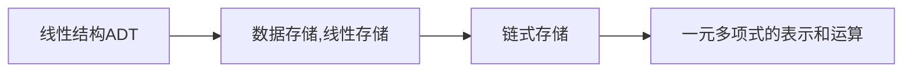

https://10.12.13.242/


线性结构存储的基本特点
在数据元素的<mark style="background: transparent; color: yellow">非空有限集</mark>中，
(1) 存在唯一的一个被称为“首项”的元素
(2) 存在唯一称为"尾项"的元素
(3) 除第一个以外，其余均有且只有一个前驱(predecessor)；除最后一个之外，其余均有且只有一个后继(successor)


`````ad-example
title: 案例
collapse: open
Djkestra 算法寻求路径的最短问题
`````

线性表是零个或有穷多个元素的序列，表中的元素个数为长度，表中的元素称为"表目"

Basic Functions 
1. Initialization 
2. Element Insertion 
3. Element removal 
4. Find out the specific element 
5. Find out the predecessor/successor of the specific element 
6. Judge if the list is empty 

最大整形为$2^{31} -1$

```c
struct LinkList{
LinkList* prev;
LinlList* next;
int data;
}; 

typedef LinkLisk List; // rename the LinkList 

// 此时，通过 
L -> elem[i-1] // 访问顺序表中序号为[i]的元素a_i

```

线性表的顺序存储结构
采用<mark style="background: transparent; color: yellow">顺序存储结构存储的线性表</mark>称为顺序表，可以将顺序表归纳为<mark style="background: transparent; color: yellow">关系线性化和节点顺序存储</mark>
线性表就是一个指定部分长度的数组

```c 
#define MAXNUM 100 

typedef int DataType;
typedef int ElemType;

typedef struct SeqList{
DataType element[MAXNUM];
int length; /*存储序列的长度，空表置为0*/
} SeqList;

typedef struct SeqList *SeqL; // 表示顺序表指针, 指向类型是顺序表

int GetData(SeqList L,int index){
	if (index < L.length){
		return L.element[i];  // 
	}else{
		return -1; // 返回空序号
	}
}
```

编写顺序表的部分: 插入，删除等等

