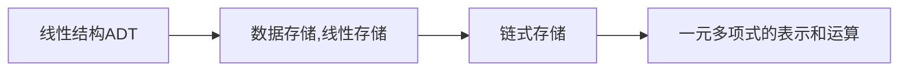

## 一、线性表

线性结构存储的基本特点
在数据元素的<mark style="background: transparent; color: yellow">非空有限集</mark>中，
(1) 存在唯一的一个被称为“首项”的元素
(2) 存在唯一称为"尾项"的元素
(3) 除第一个以外，其余均有且只有一个前驱(predecessor)；除最后一个之外，其余均有且只有一个后继(successor)

`````ad-example
title: 案例
collapse: open
Djkestra 算法寻求路径的最短问题
`````

线性表是零个或有穷多个元素的序列，表中的元素个数为长度，表中的元素称为"表目"
Basic Functions 
1. Initialization 
2. Element Insertion 
3. Element removal 
4. Find out the specific element 
5. Find out the predecessor/successor of the specific element 
6. Judge if the list is empty 

最大整形为$2^{31} -1$

```c
struct LinkList{
LinkList* prev;
LinlList* next;
int data;
}; 

typedef LinkLisk List; // rename the LinkList 

// 此时，通过 
L -> elem[i-1] // 访问顺序表中序号为[i]的元素a_i
```

线性表的顺序存储结构
采用<mark style="background: transparent; color: yellow">顺序存储结构存储的线性表</mark>称为顺序表，可以将顺序表归纳为<mark style="background: transparent; color: yellow">关系线性化和节点顺序存储</mark>
线性表就是一个指定部分长度的数组

```cpp 
#define MAXNUM 100 

typedef int DataType;
typedef int ElemType;

typedef struct SeqList{
	DataType element[MAXNUM];
	int length; /*存储序列的长度，空表置为0*/
} SeqList;

typedef struct SeqList *SeqL; // 表示顺序表指针, 指向类型是顺序表

int GetData(SeqList L,int index){
	if (index < L.length){
		return L.element[i];  // 
	}else{
		return -1; // 返回空序号
	}
}
```

编写顺序表的部分: 插入，删除等等

`````ad-note
title: 代码示例 
collapse: close

```cpp 
#include <iostream>
#define MAX_LENGTH 100
using namespace std;
// 增，删，查找

typedef struct SeqList {
	int Array[MAX_LENGTH];
	int length;
};

SeqList initList (int Array[], int length) {
	SeqList L;
	if (length > MAX_LENGTH) {
		printf("The length exceed the boundary! The length should not exceed 100");
	}
	if (length < 1) {
		printf("The length must be a positive integer");
	}

	L.length = length;
	for (int i = 0; i < length; i++) {
		L.Array[i] = Array[i];
	}
	return L;
}

int Find(SeqList seq, int index) {
	if (index < seq.length && index > 0) {
		// 
		return seq.Array[index];
	}
	else {
		throw ("The index exceed the boundary");
	}
}

void DelData(SeqList *seq, int data) {
	// if (seq.length >0) 不用加
	for (int i = 0; i < (*seq).length; i++) {
		if ((*seq).Array[i] == data) { // delete the data;
			for (int j = i; j < (*seq).length -1; j++) {
				(*seq).Array[j] = (*seq).Array[j + 1]; // 整体向前移动
			}
			(*seq).length -= 1;
		}
	}
}

void InsData(SeqList *seq, int data, int index) {
	if ((*seq).length == MAX_LENGTH) {
		throw ("The sequence has reached the maximum length");
	}
	else if (index < 0 || index >= (*seq).length) {
		 throw ("the index is illegal");
	}
	for (int i = (*seq).length + 1; i > index; i--) {
		(*seq).Array[i] = (*seq).Array[i - 1];
	}
	(*seq).Array[index] = data;
	(*seq).length += 1;
}

void ShowList(SeqList* seq) {
	for (int i = 0; i < (*seq).length; i++) {
		cout << (*seq).Array[i] << " ";
	}
	cout << endl;
}

int main_linear_list() {
	int A[9] = { 1,4,3,9,7,6,13,21,5 };
	int length = 9;
	SeqList List1 = initList(A, length);
	DelData(&List1,13);
	InsData(&List1, 5, 0);
	ShowList(&List1);
	return 0;
}
```

`````

## 二、链表

```cpp 
// 在课本上，链表的定义如下：
typedef struct Node{
ElemType Data;
struct Node* next;
}Node, LinkList;
// 我们往往在定义完毕之后直接实例化一个对象
```
其中，链表有两种插入方法， 头插法需要定义一个`p = head` 然后每一次的插入代码如下,
```cpp 
void InitList(LinkList* head, int length){
	if (!head) head = new LinkList();
	if (length == 1) return head;
	// 事先生成一个尾结点
	LinkList *p = new LinkList(); 
	head -> next = p;
	
	for (int i = 2; i < length; i++){
		LinkList *p = new LinkList();
		p -> next = head -> next;
		head -> next = p;
	}
}
```

往往尾插法是自己用的较多的方法， 即定义一个`p = head`, 每一次`p`向后移动,`p`每一次指向链表的表尾
```cpp 
void InitList(LinkList* head, int length) {
	if (!head) head = new List();
	if (length == 0) return; // 创建链表为空
	LinkList* p = head;
	for (int i = 1; i < length; i++) {
		LinkList* L = new List();
		p->next = L;
		p = p->next;
	}
	p->next = NULL;
}
```

### (1) 顺序链表 
优点是动态存储，可以在数据量比较大时，使用对应的部分
```cpp 
#include <iostream>
#include <stdlib.h>
using namespace std;

typedef int DataType;

typedef struct LinkList { // 有序链表类型
	DataType data;
	LinkList* next;
}List;
```
翻转链表
```cpp 
LinkList* ReverseList(LinkList* head) {
	LinkList* tail = head;
	if (!head) return head;
	if (head->next == NULL) return head; // 长度为1
	int length = 1;
	for (int i = 0; tail->next != NULL; tail = tail->next, length++); // tail移动到尾节点
	LinkList* p = tail;
	LinkList* q;
	for (int i = length - 1; i > 0 ; i--) { // 例如 length = 2, i = 1;
		q = head;
		for (int j = 1; j < i; j++, q = q->next); // 从第一个节点开始移动; 并移动到第i个节点
		p->next = q; // 注意是p-> next =q
		p = q;
	}
	p->next = NULL; // 将尾节点设置为空
	head = tail; 
	return head;
}
```

上述方法的复杂度是$O(n^2)$，因此我们还可以进行优化，多消耗一个指针next作为后继指针的存储位置，每一次改动next的位置并使用next来重置current的位置， 即使用三个指针作为存储
```cpp 
class Solution {
public:
    ListNode* reverseList(ListNode* head) {
        ListNode* prev = nullptr; // 初始化头指针为空指针
        ListNode* curr = head;
        while (curr) {
            ListNode* next = curr->next;
            curr->next = prev;
            prev = curr;
            curr = next; // 将current 
        }
        return prev;
    }
};

// 也可以使用递归方法进行改写 : 
class Solution {
    public ListNode reverseList(ListNode head) {
        if (head == null || head.next == null) {
            return head;
        }
        ListNode newHead = reverseList(head.next);
        head.next.next = head;
        head.next = null;
        return newHead;
    }
}
```

另外需要注意的是 ,对于结构体指针可以使用括号按顺序依次直接赋值，只需要分别使用p->val为其参数赋值，并将原来的ans指针参数作为后继节点就可以了
```cpp 
/**
 * Definition for singly-linked list.
 * struct ListNode {
 *     int val;
 *     ListNode *next;
 *     ListNode() : val(0), next(nullptr) {}
 *     ListNode(int x) : val(x), next(nullptr) {}
 *     ListNode(int x, ListNode *next) : val(x), next(next) {}
 * };
 */
class Solution {
public:
    ListNode* reverseList(ListNode* head) {
        ListNode* ans = NULL;
        for (ListNode* p = head; p!= NULL; p = p->next) {
            ans = new ListNode(p->val,ans);  // ListNode 赋值为p->val并使用ans作为后继
        }
        return ans;
    }
};
```

`int* Array = new int[elenum]; // 分配内存空间`
删除所有指定的元素
```cpp 
LinkList* DelElement(LinkList* head, DataType elem) {
	for (;head!=NULL && head->data == elem;) { // 有可能前面几个都是相应的元素, 同时保证不是空
		head = head->next;
	}
	LinkList* p = head;
	for (;p!= NULL ; p = p->next){
		// 对于p!=NULL时，可以进行访问p->next, 不需要判断p->next
		while (p->next != NULL && p->next->data == elem) { // 删除下一个节点
			LinkList *q = p->next;
			p->next = p->next->next;
			delete q; // 释放节点
		}
	}
	return head;
}
```

删除重复元素
```java
/**
 * Definition for singly-linked list.
 * public class ListNode {
 *     int val;
 *     ListNode next;
 *     ListNode(int x) { val = x; }
 * }
 */
class Solution {
    public ListNode deleteDuplicates(ListNode head) {
        ListNode cur = head;
        while(cur != null && cur.next != null) {
            if(cur.val == cur.next.val) {
                cur.next = cur.next.next;
            } else {
                cur = cur.next;
            }
        }
        return head;
    }
}
```

对于**单链表和双向不循环链表的搜索问题, 需要考虑是否到达尾结点的问题**,  往往返回节点的存储位置，如果没有找到则返回NULL 
```cpp 
LinkList* GetElement(LinkList* head, int index) {  
	LinkList* p = head;
	if (!p) return NULL; // 找不到返回-1
	for (int i = 0; p!=NULL ;p = p->next, i++) {
		if (i == index) {
			return p; //  返回节点的存储位置
		}
	}
	// 如果需要按值查找，
	// for (int i = 0; p!=NULL && p->data!= data ;p = p->next, i++);
	// if (p && p-> data == data) .....
	cout << "can't get the element" << endl;
	return NULL;
}
```
插入元素的基本操作
```cpp 
LinkList* InsertElem(LinkList* head, DataType data) { 
	// 在有序链表中插入数字
	if (data < head->data) {  // 新建一个头结点,并将头结点移动到这个上面
		LinkList* L = new List();
		L->data = data;
		L->next = head;
		head = L;
	}
	else {
		LinkList* p = head;
		for (; p->next != NULL && p->next->data <= data ;p = p->next);
		// 最移动大于节点的前面的一个节点上
		LinkList* L = new List();
		L->data = data;
		L->next = p->next;
		p->next = L;
	}
	return head;
}
```

### (2) 循环链表
下面的代码给出了一个循环双链表的定义和初始化
```cpp 
#include <iostream>
using namespace std;

typedef char DataType;

typedef struct LinkList {
	LinkList* prev = NULL;
	LinkList* next = NULL;
	int* freq = 0;
	DataType data = NULL;
};

void InitList(LinkList* head, int length) {
	if (!head) head = new LinkList();
	LinkList* p = head; 
	if (length == 1) {
		head->next = head;
		head->prev = head;
	}
	else {
		for (int i = 1; i < length; i++) {
			LinkList* List = new LinkList();
			p->next = List;
			List->prev = p;
			p = p->next;
		}
		p->next = head;
		head->prev = p;  // 注意设置prev节点
	}
}
```

对于循环链表中元素的定位, 需要注意的是可能定位到也可能定位不到，可以用`p->next!=head` 来进行判断是否遍历到节点尾部，但是注意可能**到达尾部之后还需要再次进行处理**(常见于双向循环链表的show函数)

下面的定位代码往往可以用于查找和删除元素， 以及在链表中的顺序搜索 : 
```cpp
LinkList* Locate(LinkList* head, DataType elem) {
	LinkList* p = head;
	// 调整位置时，只需要将对应链表前后连起来，再插到合适的位置就可以了
	for (; p->data!= elem && p->next != head; p = p->next);
	if (p->data == elem) { // 上面一句移动指针,但是可能移到尾结点也无法找到相同的
		p->freq += 1; // 相当于查找到了元素
	}
}
```

下面的代码演示了在index为递减的序列中，找到某个index和给定index相等的节点并替换其元素的方法；
```cpp 
DCLinkList* setElemSeq(DCLinkList* head, int index, ElemType number) {
    // 按顺序搜索一遍，如果有则替换
    DCLinkList* p = head;
    for (; p->index > index && p->next != head; p = p->next);
    if (p->index == index) {
        p->elem = number; return head; 
    }
    else {
        head = InsertElementSeq(head, index, number); // 如果不存在，插入对应元素
        return head;
    }
}
```

下面代码演示了删除循环双链表index对应节点的部分

```cpp
// 将某个index对应链表的节点进行删除或对0节点进行清空操作(没有时,不删除)
DCLinkList* delElemSeq(DCLinkList* head, int index) {
    DCLinkList* p = head;
    for (; p->index > index && p->next != head; p = p->next);
    if (p->index == index) { // 注意有可能删除头结点
        if (p == head) {
            if (head-> next == head) { 
            return NULL; // 直接清零为空指针
            }
            else {
	            // 先取头结点的上一个节点为q, 删除p即head
                DCLinkList* q = head->prev;
                q->next = head->next;
                head = head->next;
                delete p;
                head->prev = q;
            }
        }
        else{
	        // 也是先查找上一个结点
            DCLinkList* q = p ->prev; 
            p = p->next;
            p->prev = q;
            delete q->next;
            q->next = p;
        }
    }
    return head;
}
```

## 三、一元多项式

使用线性表存储一元多项式 : 

| a0  | a1  | a2  | a3  | ... |
| --- | --- | --- | --- | --- |
每一项的系数使用数字来存储

**方法二是使用表来存储对应的值:**
这种表示方法对于所有项都比较全的时候是很好的，但是如果指数很高并且变化很大时，这种表示方法就不合适了。这时我们可以把每一项的系数和指数都存储下来，也就是对于每一项都用两个数据项来存储。即为如下的形式：


使用链表的连续存储方法：

| order | 6   | 30  | 100 |
| ----- | --- | --- | --- |
| coeff | 5   | 4   | 2   |
$$5x^6 + 4x^{30} + 2x^{100}$$
可以使用代码定义一元多项式为：
```cpp 
typedef struct PolyNode{
int coef; 
int exp;
PolyNode *next;
}PolyNode, *Polylist;
```

$x + x + x$
可以使用哈希表，但是哈希表的缺点是没有相同的项， 且难以访问
需要按照幂指数从小到大的系数进行存储

## 四、其他知识点 

对于顺序表本身，如果其长度变化较大，则需要较为准确地估计空间以避免浪费 

如果同时存在若干类型相同的链表，则它们可以共享空间， 

对于存取过程，顺序表是基于向量实现的，空间复杂度为$O(1)$, 因此**对于频繁存取的表，应当采用顺序表作为存储结构**

对于**频繁进行插入和删除操作的部分，往往使用链表进行操作**, 

往往从存储角度来说，顺序表的存储密度为1, 而链表的存储密度小于1(还需要存储节点需要的空间)
