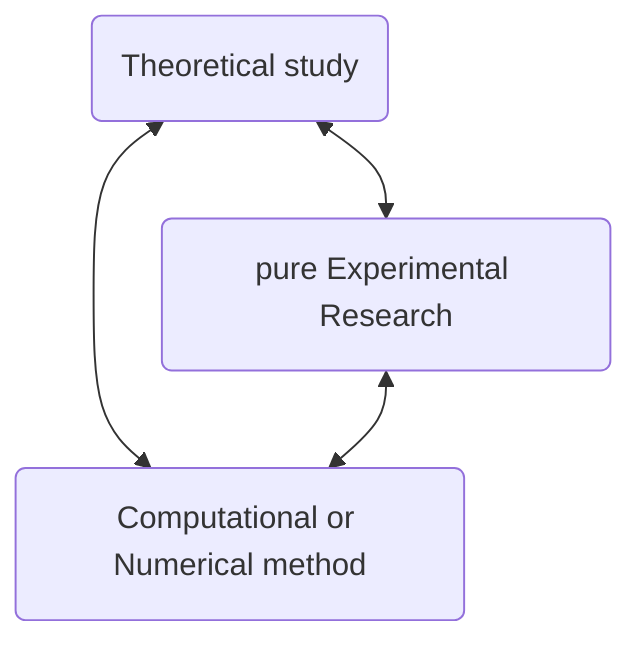
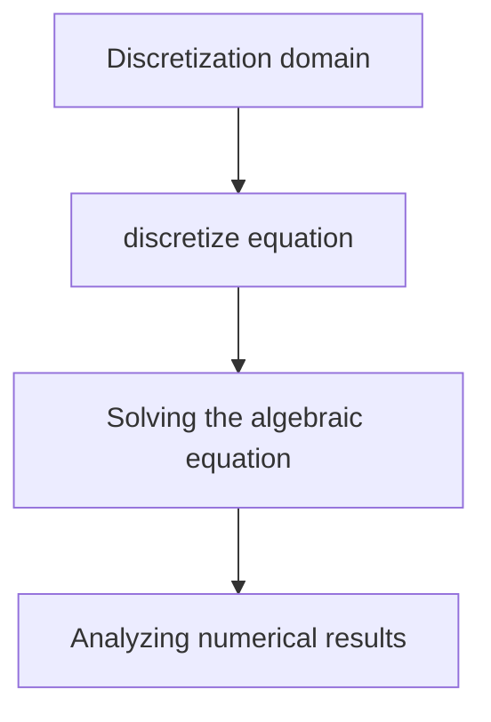
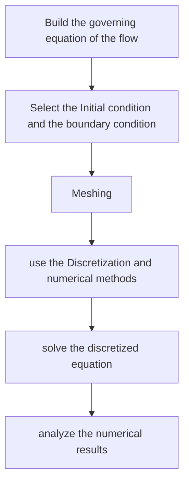

## (1) Introduction For the fundamentals of Fluid dynamics 
#### 1. What can the CFD used for ? 
for the experiments in which we can simultaneously simulate the higher Mach numbers and High flow field temperatures to be encountered by the transatmospheric vehicles, also the prospects for such wind tunnels in the 21th century.<mark style="background: transparent; color: yellow"> The major player in the design of such vehicles is computational fluid dynamics. </mark>

CFD numerical  methods allow us to study in detail the physics differences between the laminar and turbulent flows. 

For [[1-11 Some Introductory Thoughts#1.1 Importance of aerodynamics & Examples|blunt body example analysis]], the CFD is a breakthrough in the blunt body problem, and a time dependent approach to the steady state is applied approach to the steady state.

`````ad-note
title: Reference 
collapse: open


### 2. Famous CFD international journal
(1) Computational methods of Applied Mechanics and Engineering
(2) Journal of computational Physics 
`````

#### 2. Three study method of the computational fluid dynamics include: 



#### 3. Basic method for CFD
##### 1) Definition of the computational fluid dynamics 
*Computational fluid dynamics is the art of replacing the integrals or the partial derivates in the governing equations with discretized algebraic forms, which is in turn are solved to obtain numbers for the flow field values at discrete points in time and/or space*

CFD is a strong role as a design tool, Along with its role as a research tool.  Along with its  role as  a research tool.  It is a tool for the research of the fluid dynamics and aerodynamics to do business. 

##### 2) Governing equations
Derivation can be found in the [[📘ClassNotes/👨‍🔧Mechanics/⛲Computational Fluid Dynamics/CFD of J.D. Anderson/Part 1 Basic Equations/Implements/Governing Equations of Flow.pdf|Governing Equations of Flow.pdf]]
We have the following 3 fundamental physical principles: 
1. Mass is conserved 
$$\frac{\partial \rho}{\partial t} + \nabla \cdot (\rho V) = 0$$
2. <mark style="background: transparent; color: yellow">The Equation of momentum (N-S equation) -> Newton's Second law</mark>
$$ \frac{\partial (\rho \vec{V})}{\partial t} + \left(V\cdot \nabla  \right)(\rho V) =  \rho \vec{f}-\nabla p  + \mathcal{F}_{viscous}$$
where $\mathcal{F}_{viscous} = \frac{\partial }{\partial x_j}\left[ \mu\left(\frac{\partial u_i }{\partial x_j} + \frac{\partial u_j}{\partial x_i}\right) + \delta_{ij}\lambda \nabla\cdot V \right]$
for example, in x direction : 
$$\small\frac{\partial(\rho u)}{\partial t}   + \nabla \cdot (\rho u V)= - \frac{\partial p}{\partial x} + \rho f_x + (\mathcal{F_x})_{viscous}$$
3. The Conservation of energy
Nonconservation form : 
$$\rho\frac{D T}{D t} = \rho \dot{q} + \nabla\cdot  (k\nabla T) + \nabla \cdot (\tau_{ij} \cdot \vec{V}) + \rho \vec{f}\cdot \vec{V}$$
also we can derive the conservation form :  
$$\rho\frac{\partial T}{\partial t} +  \nabla\cdot (\rho \vec{V} T) = \rho\dot{q} + \nabla\cdot  (k\nabla T) + \nabla \cdot (\tau_{ij} \cdot  \vec{V}) + \rho\vec{f}\vec{V}$$

`````ad-bug
title: wrong in PPT
collapse: open
the $q$ should be fixed as $\dot{q}$

1. the equation  in the PPT in 1.1 has the condition that It is inviscous and uncompressable flow, also the volume force is neglected. 
2. the term of the volume force shouldn't be neglected
`````

##### 3) Basic Steps for CFD analysis
firstly, we discretize the integral computation in the domain of the governing equation 

Steps: 


Basic computational method for the analysis of the Fluid Dynamics 

| Method | Whole name               | Introduction                                                                            | Basic solving Method                                                                                                                                                                                                             |
| ------ | ------------------------ | --------------------------------------------------------------------------------------- | -------------------------------------------------------------------------------------------------------------------------------------------------------------------------------------------------------------------------------- |
| FDM    | Finite difference method | [[Chapter1 Philosophy of Computational Fluid Dynamics 2023-03-07 17.01.04\|FDM Method]] | discretize the domain we need to solve, and ***use the difference as the differential*** in each domain                                                                                                                                |
| FVM    | Finite volume method     | [[Chapter1 Philosophy of Computational Fluid Dynamics 2023-03-07 17.07.39\|FVM Method]] | use an approximate function as function of the whole domain, but it's difficult for solving the difficult problems                                                                                                               |
| FEM    | Finite element method    | [[Chapter1 Philosophy of Computational Fluid Dynamics 2023-03-07 17.03.53\|FEM Method]] | derive the equation through interpolation, and discretize the domain to solve. and construct the function in each element, then build a whole continuous function in the solving domain(solving the linear equations are needed) | 

The most fundamental Thought for the FDM method is <mark style="background: transparent; color: yellow">using the difference quotient as the derivate</mark>

Concise Steps for CFD computation 


where the meshing include *structured grid, Unstructured grid and self-adapted grid*.

#### 4. The Importance of the computer hardware in the CFD process 
The application of CFD is intimately related to advances in computer hardware, particularly in regard to storage and execution speed. 
The finite speed of electrons pose an inherent limitation on the ultimate execution speed of the high-speed supercomputers. To detour around the limitation, two Computers architectures are being used. 
1. *Vector processors*. a configuration that ==allows a string of identical operations on an array of numbers simultaneously==. Which save both time and memory. 
2. *Parallel processors*. Which is a configuration that is really two or more fully functioning <mark style="background: transparent; color: yellow">central processing units (CPUs)</mark>. each of which can handle different instruction and data streams and which can execute separate parts of a program simultaneously. 

#### 5. Road Map for the Book 
##### 1) whole book roadmap 
![[Screenshot_20230308_065413_com.adobe.reader.png|400]]

##### 2) CFD Ideas of different Researches 
![[Screenshot_20230308_071401_com.adobe.reader.png|500]]
![[Screenshot_20230308_071424_com.adobe.reader.png|500]]
![[Screenshot_20230308_071445_com.adobe.reader.png|500]]
![[Screenshot_20230308_071506_com.adobe.reader.png|500]]


## (2) Introduction FDM, FVM and FEM method
Road map of three basic finite method
![[Screenshot_20230308_132919_com.adobe.reader.png|400]]

in this book we will not discuss finite-volume method or finite-element methods which have been in widespread use in computational mechanics. 

### 1. The Finite Difference Method
As is frequently done in CFD, the numerical calculations are carried out in a transformed computational space which has the <mark style="background: transparent; color: yellow">uniform spacing in the transformed independent variables</mark>. but which correspond to nonuniform spacing in the transformed independent variables in the physical plane.

note the recent CFD has focused on unstructured grids. 
The analysis of the grids are as the following process 
![[Chapter1 Philosophy of Computational Fluid Dynamics 2023-03-08 12.39.06|200]]

The grid points are identified by index $i,j$ runs in $x,y$ direction 

We are interested in replacing a partial derivate with a <mark style="background: transparent; color: yellow">suitable algebraic difference quotient</mark>.
using the Taylor series expansion, the velocity about the point $(i,j)$ as follows: 
$$u_{i+1, j} = u_{i,j} + \left( \frac{\partial u}{\partial x}\right)_{i,j}\Delta x +\left( \frac{\partial^2 u}{\partial x^2}\right) \frac{(\Delta x)^2}{2} +\left( \frac{\partial^3 u}{\partial x^3}\right)\frac{(\Delta x)^3}{6} +......$$
in each element,  the <mark style="background: transparent; color: yellow">partial derivate can be approximate as a finite difference representation.</mark> which can be explained as: 
$$\boxed{\left( \frac{\partial u}{\partial x}\right)_{i,j} =\frac{u_{i+1,j} - u_j}{\Delta x} + O(\Delta x)}$$
this is expressed as a ***first order forward difference***

also ,by replacing the $\Delta x$ on the right hand side as $-\Delta x$, we can get 
$$\boxed{\left( \frac{\partial u}{\partial x}\right)_{i,j} = \frac{u_{i,j} - u_{i-1,j}}{\Delta  x} + O(\Delta x)}$$
This equation is called a ***reward difference(backward difference)***

But in most applications with CFD, the <mark style="background: transparent; color: yellow">first order accuracy is not sufficient</mark>, we eliminate the second-order term and get a higher-order accuracy by subtracting two equations above. we can get :
$$u_{i+1,j} = u_{i-1,j} + 2\left(\frac{\partial u}{\partial x}\right)\Delta x + 2 \left(\frac{\partial^3 u}{\partial x^3} \right)_{i,j}\frac{(\Delta x)^3}{6}$$
then we have the equation: 
$$\boxed{\left( \frac{\partial u}{\partial x}\right)_{i,j} = \frac{u_{i+1,j} - u_{i-1,j}}{2\Delta x}+ O(\Delta x^2)}$$
The equation above use the finite difference which comes from the both sides of the grid point. And it is called a ***second-order central difference***
also the equation in the y-direction can also be written analogous to the previous equation : 
$$\boxed{\left( \frac{\partial u}{\partial y}\right)_{i,j} = \frac{u_{i, j+1} - u_{i,j-1}}{2\Delta y} + O(\Delta y^2)}$$
Next, summing the two equations given by the equations above gives: 
$$\boxed{\left( \frac{\partial^2 u}{\partial x^2}\right)_{i,j} = \frac{u_{i+1,j} - 2u_{i,j}+u_{i-1,j}}{(\Delta x^2)}+ O(\Delta x^2)}$$
$$\boxed{\left(\frac{\partial^2 u}{\partial y^2}\right)_{i,j} = \frac{u_{i,j+1} - 2u_{i,j} +u_{i,j-1}}{(\Delta y^2)} + O(\Delta y^2)}$$
For  the mixed derivates  we can derive it by the following process : 
$$\left(\frac{\partial u}{\partial y}\right)_{i+1,j} = \left( \frac{\partial u}{\partial y}\right)_{i,j} + \left(\frac{\partial^2 u}{\partial x\partial y}\right)_{i,j} \Delta  x+ \left(\frac{\partial^3 u }{\partial x^2\partial y}\right)_{i,j} \frac{(\Delta x)^2}{2} +\left(\frac{\partial^4 u}{\partial x^3 \partial y}\right)_{i,j}\frac{\Delta x^3}{6}$$
$$\left( \frac{\partial u}{\partial y}\right)_{i-1,j} = \left( \frac{\partial u}{\partial y}\right)_{i,j} - \left(\frac{\partial^2 u}{\partial x\partial y}\right)_{i,j} \Delta x +  \left(\frac{\partial^3 u}{\partial^2 x\partial y}\right)_{i,j} \frac{\Delta x^2}{2 } +.....$$
then we have 
$$\left(\frac{\partial u}{\partial y}\right)_{i+1,j} - \left(\frac{\partial u}{\partial y} \right)_{i-1,j} = 2\left(\frac{\partial^2 u}{\partial x\partial y} \right)_{i,j} \Delta x + O(\Delta x^3)$$
thus we can solve the mixed derivates as : 
$$\left(\frac{\partial^2 u}{\partial x\partial y}\right)_{i,j} = \frac{\left(\frac{\partial u}{\partial x}\right)_{i+1,j} - \left( \frac{\partial u}{\partial x}\right)_{i-1,j}}{2\Delta  x} + O(\Delta x^2)$$
substitute the partial derivate into the equation, we have :
$$\boxed{\left(\frac{\partial^2 u}{\partial x\partial y}\right)_{i,j} = \frac{u_{i+1, j+1} - u_{i-1, j+1}- u_{i+1,j-1} + u_{i-1,j-1}}{4\Delta x \Delta  y} + O[(\Delta x)^2,(\Delta y)^2]}$$
This equation gives a ***second-order central difference for the mixed derivative.***
The truncation error comes from the equation above. 

The equation above can be summarized as following picture : 
![[Screenshot_20230308_160003_com.adobe.reader.png|400]]

### 2. The Finite Volume Method
the basic thought of the finite volume is to construct each discrete equation for each control volume, and then calculate the parameters by the equations. 

`````ad-note
title: Contents 
collapse: close

![[Screenshot_20230308_162904_com.tencent.mobileqq.jpg|400]]
![[Screenshot_20230308_162924_com.tencent.mobileqq.png|400]]
`````

`````ad-note
title: Reference
collapse: close
Numerical Heat transfer and fluid flow, by S.V.Patanker
`````

### 3. Finite Element Method 

we discrete the domain as the elements and  then use the interpolation. Then transform the governing equation into each element. finally consider the equation of elements together and solve the algebraic equations. 

The examples can be found as : 
[[📘ClassNotes/👨‍🔧Mechanics/⛲Computational Fluid Dynamics/Basics of Finite Element Methods/Part 1/Chapter 1 One-Dimensional Boundary Value Problem|Galerkin's Method of the 1-D thermal conductivity FEM problem]]
