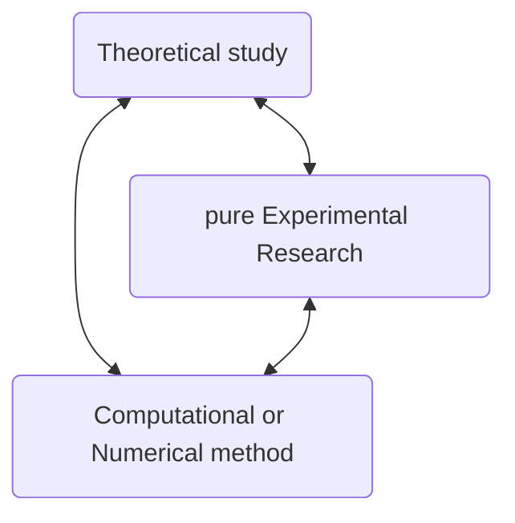
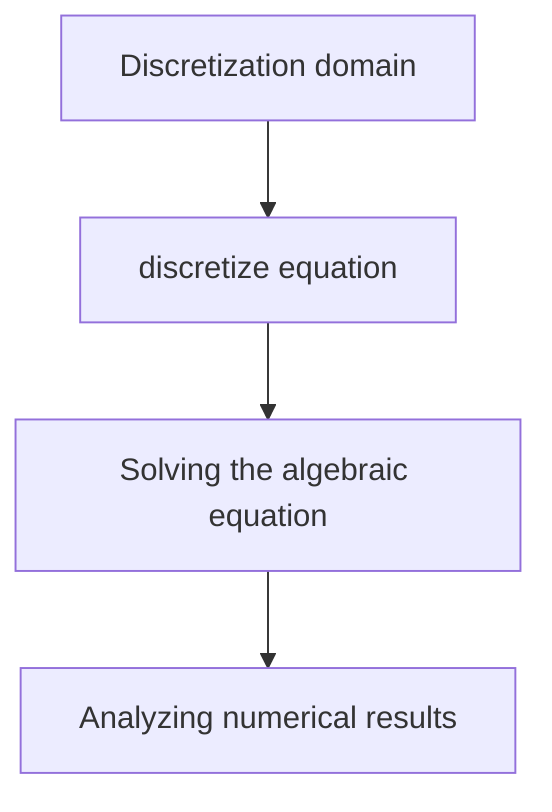

## (1) The Study Reason and Basic concepts of the CFD
#### 1. What can the CFD used for ? 
for the experiments in which we can simultaneously simulate the higher Mach numbers and High flow field temperatures to be encountered by the transatmospheric vehicles, also the prospects for such wind tunnels in the 21th century.<mark style="background: transparent; color: yellow"> The major player in the design of such vehicles is computational fluid dynamics. </mark>

CFD numerical  methods allow us to study in detail the physics differences between the laminar and turbulent flows. 

#### 2. Three study method of the computational fluid dynamics include: 

#### 3. Basic method for CFD
##### Definition of the computational fluid dynamics 
Computational fluid dynamics is 

CFD is a strong role as a design tool, Along with its role as a research tool.  Along with its  role as  a research tool.  It is a tool for the research of the fluid dynamics and aerodynamics to do business. 

##### Governing Equations
the motion of the fluid obeys 3 fundamental laws, which are:
1. The Conservation of mass
$$\frac{\partial \rho}{\partial t} + \nabla \cdot (\rho V) = 0$$
2. The Conservation of momentum (N-S equation)
$$\rho \frac{\partial V}{\partial t} + \rho\left(V\cdot \nabla  \right)V = -\nabla p  + \nabla \cdot \left[ \mu \nabla V\right] +\rho f$$
3. The Conservation of energy 
$$\frac{\partial T}{\partial t} +  V \cdot  \nabla T = \nabla\cdot  (a\nabla T)+ q$$
##### Basic Steps
firstly, we discretize the integral computation in the domain of the governing equation 

Steps: 

Basic computational method for the analysis of the Fluid Dynamics 
| Method | Whole name               | Introduction                                                                     | Method Explaination                       |
| ------ | ------------------------ | -------------------------------------------------------------------------------- | ----------------------------------------- |
| FDM    | Finite difference method | [[Chapter1 Philosophy of Computational Fluid Dynamics 2023-03-07 17.01.04\|150]] |                                           |
| FVM    | Finite volume method     | [[Chapter1 Philosophy of Computational Fluid Dynamics 2023-03-07 17.07.39\|150]] |                                           |
| FEM    | Finite element method    | [[Chapter1 Philosophy of Computational Fluid Dynamics 2023-03-07 17.03.53\|150]] | derive the equation through interpolation |

