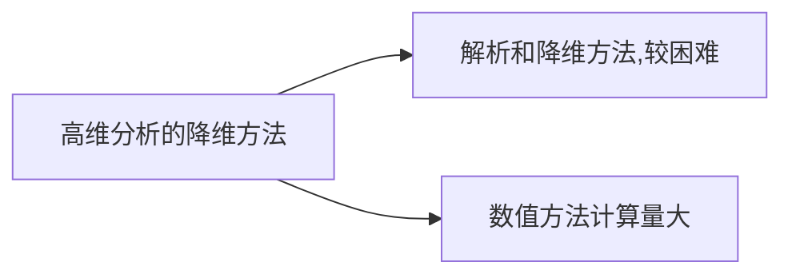

# POD方法
## 1. 本征正交分解
## 2. PCA (主成分分析)
## 3. SVD分解, KLD分解

三种方法是等价的
**1. CMS降维 `->` 99.7\%**
**2. 加捻 `->` POD `->` 95\%以上**

`````ad-note
title: POD参考书籍
collapse: open
Turbulence , Coherent Structure Dynamical System and Symmetry
`````

PDD 是在普适性系统中应用的一种高效的方法

`````ad-caution
title: 主要的降维方法(重点)
collapse: open
1. CMS
2. POD 
3. 中心流形
4. L-S 约化方法 
5. 伽辽金方法
6. 惯性流形方法
7. 近似惯性流形方法
8. 混合方法
`````


**两机: 航空发动机 , 燃气轮机**
主体: 转轴，叶盘，叶片


POD方法的分类是: 
1. 全局POD方法
2. 局部POD方法
3. 适定POD方法
4. 双重POD方法
5. **瞬态POD方法** `->` 每一次提取一个点在一个时刻的速度和位移信息

并得到**相应的自相关矩阵**和**特征值**， 自相关矩阵较大的特征根张成子空间， 并向低维系统做投影


找到POV对应的POM(能量判别方法), 本征正交模态， 前n阶的能量的和达到总系统的大部分，则可以直接降阶为


---
用任意一种近似解析方法求解任意一个非线性振动方程
- 自由/受迫振动形式
(纸质版，手写求解过程)

时间曲线，相图等等

振动的种类:
**1. 自由振动**
**2. 受迫振动** 
**3. 自激振动**
**4. 参激振动**

<mark style="background: transparent; color: yellow">用HB方法(谐波振动)方法求解单DOF的Duffing方程 </mark>
$$\ddot{x } + \omega_0^2 (x  + \varepsilon x^3) = 0$$
注意: 考题可能改成<u>平均方法</u>或者<u>小参数方法</u>

摄动法， 谐波平衡法，小参数法，平均法，多尺度方法

**相平面，相点，相轨迹的概念**

**简述摄动法/HB, 平均法求解单自由度Duffing方程的的系统过程**

**什么叫自激振动，什么叫参激振动**

列举自激振动和参激振动的典型方程: 
Mathieu方程， WonderPoll方程

**混沌振动的特点**
1. 初始条件敏感性
2. 往复非稳态运动
3. ？？共3点

**颤振的定义**
弹性体在气流中运动，**在弹性力，气动力和惯性力**作用下做的**可持续性的不衰减的**

简述李雅普诺夫稳定性理论 
吸引性是振动系统长期运动形态的另一种描述

相平面，相轨迹 $t0 x_0, y_0, t_1$时 $x_1, y_1$，相点

奇点处，相点的移动速度为0
$$\frac{dx}{dt} = \frac{dy}{dt} = 0$$
为平衡点

**奇点的稳定性问题**以及**奇点的分类**：
引入特征根参数 `->` 引入$\alpha = \frac{\lambda_{1}}{\lambda_2}$, 此时$\alpha < 0$, 此时$\lambda_1, \lambda_2$异号时， 奇点为鞍点， $\lambda_{1}, \lambda_2$同号时，为结点
