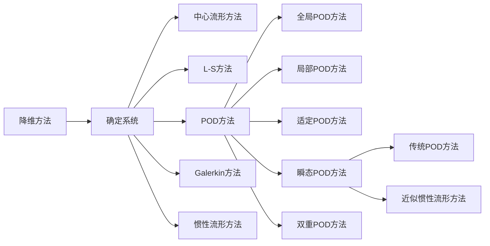

## 一、 正规摄动法
### (1) 正规摄动法
`````ad-note
title: 实例引入
collapse: close
对于振动问题的非线性系统求解， 往往找不到精确解，需要使用数值方法进行求解
例如在单摆做小幅度运动时， 有：
$$\ddot{\varphi} + \frac{g}{a} \sin \varphi = 0$$
对于大幅运动时，解不封闭， 其周期$T$和初始周期$T_0 = \frac{2\pi}{\omega_0}$有如下关系
1. 摆角越大，周期越大
2. 随摆角的增加，摆的波形趋于矩形

将所得结果进行一阶近似的泰勒展开
$$\sin \varphi = \varphi - \frac{1}{6}\varphi^3$$

此时, 我们令 $\omega_0 =\sqrt{\frac{g}{a}}$， 则容易得到: 
$$\varphi = \frac{\dot{\varphi}_0}{\omega_0} \sin \omega_0 t  + \varphi_0 \cos \omega t$$
`````

将非线性系统的解按照小参数$\varepsilon$的幂次展开的方法，称为<mark style="background: transparent; color: yellow">摄动法</mark>或者<mark style="background: transparent; color: yellow">小参数法</mark>。
$$\boxed{\Large\ddot{x} + \omega_0^2 x = F(t) + \varepsilon f(x,\dot{x})}$$
其中，$f$为扰动，$\varepsilon$为小量，则系统为**弱非线性系统**。
其中，当$\varepsilon = 0$时，上式退化为固有频率为$\omega_0$的线性系统
$$\Large\boxed{\ddot{x} + \omega_0^2 x = F(t)}$$
上式称为原非线性系统的==派生系统==

对于线性的派生系统有周期解$x_0(t)$，若实验观测得到**原非线性系统**也存在周期解，可以认为，<mark style="background: transparent; color: yellow">周期解</mark>是**线性派生系统的解**加以修正得到。 
$$x(t, \varepsilon) = x_0(t) + \varepsilon x_1(t) + \varepsilon^2x_2(t) + \dots$$
**代入非线性系统**即可对原有的解进行修正
使用展开进行<u>正规摄动法</u>，对$x, \dot{x}$进行展开，有:
$$\Delta  x  = \varepsilon x_1  + \varepsilon^2 x_2  + \varepsilon^3 x_3  + ...$$
$$\Delta \dot{x} = \varepsilon \dot{x}_1 +  \varepsilon^2 \dot{x}_2 + ...$$

$$\Large{
\begin{matrix}
f(x,\dot{x}) =  \\ \\ \\ \\ \\ \\ 
\end{matrix} \begin{matrix} 
f(x_0,\dot{x}_0) + \frac{\partial f(x,\dot{x}_0)}{\partial x}(\varepsilon x_1 (t) + \varepsilon^2 x_2(t) + ...) \hfill  \\
+\frac{\partial f(x_0, \dot{x}_0)}{\partial \dot{x}}(\varepsilon \dot{x}_1(t) + \varepsilon^2 \dot{x}_2(t) +...)  \hfill \\ 
+ \frac{1}{2!}\frac{\partial^2 f(x,\dot{x}_0)}{\partial x^2}(\varepsilon x_1(t) + \varepsilon^2 x_2(t) + \varepsilon^3 x_3 (t) + ...) \hfill \\
+ \frac{1}{2}\frac{\partial^2 f(x,\dot{x}_0)}{\partial x \partial \dot{x}} (\varepsilon x_1(t) + \varepsilon^2 x_2(t) + ...)(\varepsilon \dot{x}_1(t) + \varepsilon\dot{x}_2(t)) +...) \hfill \\
+ \frac{1}{2}\frac{\partial^2 f(x,\dot{x}_0)}{\partial ^2 \dot{x}^2} (..... \hfill
\end{matrix}}$$
上述方程对任意的$\varepsilon$均成立，则要求方程两边$\varepsilon$的<mark style="background: transparent; color: yellow">同幂次系数相等</mark>， 导出**近似解的线性微分方程组**为
$$\boxed{\begin{cases}
\varepsilon^0 : \ddot{x} + \omega_0^2 x_0 = F(t)  \\ 
\varepsilon^1 : \ddot{x}_1 + \omega_0^2 x_1 = f(x_0,\dot{x}_0) \\
\varepsilon^2 : \ddot{x}_2 + \omega_0^2 x_2 =  x_1\frac{\partial f(x_0,\dot{x}_0) }{\partial x} + \dot{x}_1 \frac{\partial f(x_0 , \dot{x}_0)}{\partial \dot{x}} \\ ... 
\end{cases}}$$
将上式代入非线性系统， 有： 
$$\ddot{x}_0 (t) + \varepsilon \ddot{x}_1(t)  + \varepsilon^2 \ddot{x}^2(t) + ... + \omega_0^2 \left[ x_0(t) +\varepsilon x_1(t) + \varepsilon^2 x_2(t) +... \right] = F(t) + \varepsilon f(x,\dot{x})$$

求解非线性系统的周期解时， 通过迭代计算先解出$\ddot{x}_0$,代入可以分别解出$x_1, x_2,...$最终可以得到周期解为
$$x(t, \varepsilon) = x_0(t) + \varepsilon x_1(t) + \varepsilon^2 x_2(t) +...$$

### (2) Duffing 方程的非共振受迫振动
`````ad-note
title: 补充: 振动的相关概念 
collapse: close

分频($\frac{1}{3}\omega$)和倍频($2\omega$)
- 分频 (downsampling)：将原始信号的采样率降低，相当于将信号的频率范围缩小，从而减少数据量和计算量。在数字信号处理中，通常使用低通滤波器对原始信号进行滤波，去除高频部分，然后对滤波后的信号进行抽样，从而实现分频操作。

- 倍频 (upsampling)：将原始信号的采样率提高，相当于将信号的频率范围扩大，从而提高信号的精度和分辨率。在数字信号处理中，通常使用插值算法对原始信号进行插值，从而得到更多的采样点，然后使用高通滤波器对插值后的信号进行滤波，去除低频部分，从而实现倍频操作。
非线性系统在频率为$\omega$的激励下，产生的响应包括 $\omega, 3\omega, 5\omega$ 等等频率的高次谐波， 称为倍频响应
注意: 激励频率为$\omega$，往往使用

- 主共振 (fundamental resonance)：系统在自然频率上振动的情况，此时系统的振幅最大。
- 内共振 (internal resonance)：系统中存在多个自由度，其中一个自由度的振动会影响到另一个自由度的振动的现象。
- 组合共振 (combination resonance)：系统中存在多个自由度，这些自由度的振动频率之间存在简单的数学关系，导致它们在某些特定频率上同时共振的现象。
- 谐波共振 (harmonic resonance)：系统在某个整数倍于主频的频率上发生共振的现象。
- 超谐共振 (superharmonic resonance)：系统在某个**非整数倍于主频但是大于主频的频率上发生共振**的现象。
- 亚谐共振 (subharmonic resonance)：系统在某个非整数倍于主频但是小于主频的频率上发生共振的现象。
`````
Duffing方程的形式为： 
$$\boxed{\ddot{x} + \omega_0^2(x + \varepsilon x^3) = F\cos \omega t}$$
上式可以变型为：
$$\ddot{x} + \omega_0^2 x = F\cos \omega t - \varepsilon\omega_0^2 x^3$$
其中，弱非线性项为$-\varepsilon\omega^2_0 x^3$，代入上述公式， 其级数解为：
$$x(t,  \varepsilon) = x_0(t) + \varepsilon x_1(t) + \varepsilon^2x_2(t) + ...$$
容易列写出**微分方程**为
![[Excalidraw/第二章、流固耦合中的基本解题方法 2023-05-09 15.10.00|400]]
通过[[📘ClassNotes/👨‍🔧Mechanics/🌊Thermal and Fluid dynamics/🛩️Fluid structure interaction/补充/非共振受迫振动的推导.pdf|非共振受迫振动的推导.pdf]]得到
零次近似方程为线性系统的受迫振动方程:
$$x_0 = A_0 \cos (\omega_0 t + \theta_0) + A\cos \omega t$$
使用机械振动中的求解过程, 容易得到
$$A  = \frac{F}{\omega_0^2 - \omega^2} $$
代入近似方程得到$x_0$，再代入$x_1$的式子, 再代入$x_2$，以此类推
对于一阶的方程， 会产生$\cos 3 \omega t$项， 此时我们使用三次余弦的变换公式:
$$\boxed{\cos^3 \omega t  = \frac{1}{4} \cos \omega t  + \frac{3}{4} \cos 3\omega t}$$
代入一阶方程并可以推导得
$$x_1 = B_1 \cos \omega t + B_2 \cos 3 \omega t$$
其中
$$B_1 = -\frac{3 \omega_0^2 A^3}{4(\omega_0^2 - \omega^2)} \qquad  B_2 = -\frac{\omega_0^2 A^3}{4(\omega_0^2 - 9 \omega^2)}$$
代入得到式 (2) 中, 有:
$$x_2 = C_1 \cos \omega t + C_2 \cos 3\omega t + C_3  \cos 5 \omega t$$
$$C_1 = -3 \omega_0^2 A^2 \left( \frac{3}{4} B_1 - \frac{1}{4}B_2\right) \qquad  C_2 = -\frac{3 \omega^2_0 A}{4(\omega_0^2 - 9 \omega^2)} (B_1 - 2B_2) \qquad  C_3 = - \frac{3\omega_0^2 A^2 B_2}{4(\omega_0^2 - 25 \omega^2)}$$
若 Duffing 方程受到两个不同频率的简谐激励，即:
$$\ddot{x} + \omega_0^2(x + \varepsilon x^3) = F_1 \cos \omega_1 t + F_2\cos \omega_2 t$$
特解(自由振动解)为$x = A\cos\omega t$
对于<mark style="background: transparent; color: red">激励频率和固有频率重合的情况</mark>，会导致<u>振幅对时间无限增加的项</u>， ==随时间不断增长的项==称为**久期项**
对于一般的振动，为了保持稳定，，**必须保证久期项为0**


## 二、 奇异摄动法(LP摄动法)
### (1) 奇异摄动法解Duffing方程自由振动
1. 久期项的概念: 久期项是存在激励频率和固有频率重合的项，久期项的出现反映出，正则摄动法的缺陷， 
为了消除久期项，提出了LP(奇异摄动法)， 即 Lindstedt-Poincare 方法
$$\ddot{x} + \omega_0^2 (x + \varepsilon x^3) = 0$$
L-P方法的基本思想是， <u>认为非线性系统的固有频率并不等于派生系统的固有频率</u>，而也是小参数$\varepsilon$的未知数，除了**将$x_0$展开成$\varepsilon$的幂级数以外**， 即
$$x = x_0 + \varepsilon x_1 + \varepsilon^2 x_2 + ...$$
还需要将<mark style="background: transparent; color: red">频率也展开成</mark>$\varepsilon$的幂级数
$$\Large\boxed{\omega = \omega_0  + \varepsilon \omega_1 + \varepsilon ^2\omega_2 + ...}$$
此时 `->` 我们考虑: 对于Duffing 方程的自由振动，有: 
$$\ddot{x} + \omega_0^2 (x + \varepsilon x^3) = 0$$
此时，<mark style="background: transparent; color: red">将时间进行无量纲化</mark>，令$t = \omega \tau$, 得到:
$$\Large\boxed{\omega^2 x'' + \omega_0^2 (x + \varepsilon x^3) = 0}$$
其中, $x''$是x 对于$\tau$的二阶导数。
将上式中的解和频率展开为$\varepsilon$的幂级数:
$$x = x_0  + \varepsilon x_1 +\varepsilon^2 x_2 + ... \qquad  \omega = \omega_0 + \varepsilon \omega_1 + \varepsilon^2 \omega_2 + ...$$
并代入上述的无量纲化方程，得到: 
$$(\omega_0 + \varepsilon \omega_1 + \varepsilon^2\omega_2  +...)^2(x_0'' + \varepsilon x_1'' + \varepsilon^2 x_2'' + ...)  + \omega_0^2 (x + \varepsilon x^3) = 0$$
此时将原系统展开为$\varepsilon$的幂级数, 取$\omega^2 = \omega_0^2 (1+\varepsilon_1 \sigma_1 + \varepsilon^2 \sigma_2 +...)$则得到
$$\omega_0^2 (1 + \varepsilon_1 \sigma_1 + \varepsilon^2 \sigma_2 +...)x'' + \omega_0^2(x + \varepsilon x^3) = 0$$
则有:
$$x + \varepsilon x^3  + x'' (1 + \varepsilon \sigma_1 + \varepsilon^2 \sigma_2 +...) = 0$$
将$x , \varepsilon x^3$ 展开得到组合方程:
$$\begin{cases}
x'' + x_0 = 0 \\
x_1''  + \sigma_1 x''_0  + x_1 + x_0^3 = 0 \\
x_2'' + \sigma_1 x_1'' + \sigma_2 x_0''  + x_2  + 3 x_0^2 x_1= 0
\end{cases} \tag{1}$$
其中，各个方程的初始条件为 :
$$\begin{matrix}
x_0(0) = A  , \quad  x'(0) = 0 \\
x_1(0) =  0 , \quad  x'_1(0) = 0\\
x_2(0) = 0, \quad  x'_2(0) = 0
\end{matrix}$$
此时由方程(1) 得到: 
$$x_0  = A\cos \phi$$
代入一次近似方程，得到(其中注意$\cos$的求导):
$$x_1'' + x_1  -  \sigma_1 A \cos \phi + A^3 \cos^3\phi = 0$$
将$\cos^3\phi$展开，得到其中的久期项为
$$x_1 ''  + x_1 = \sigma_1 A \cos \phi  - \frac{3}{4} A^3 \cos \phi - \frac{1}{4} A^3\cos 3\phi$$
则久期项$\cos \phi$项的系数必定为0，有:
$$\sigma_1 - \frac{3}{4}A^3 = 0 \rightarrow  \sigma_1 = \frac{3}{4}A^3$$
将$\sigma_1$代入方程(1)中解出第二个方程， 同理可以解出第三个方程，解过程中，每一次保证久期项的系数为0
分别求得$\sigma_1, \sigma_2, ...$之后，最终可以得到自由振动频率与振幅的关系: 
$$\omega^2  = \omega_0^2 (1 + \varepsilon \frac{3}{4}A^2 - \varepsilon^2 \frac{3A^4}{128} + ... )$$
此时，对于单摆的大幅摆动，结果如下:
![[Excalidraw/第二章 流固耦合中的基本解题方法 2023-06-16 09.55.44|400]]
### (2) Duffing 方程主共振
我们考虑Duffing 方程的**受迫振动部分**
$$\ddot{x} + 2 \zeta \omega_0 \dot{x} + \omega_0^2 (x + \varepsilon x^3) = \varepsilon F_0 \cos (\omega t + \theta)$$
此时， ==阻尼项， 激振力频率和派生系统的固有频率==之差均与小参数同一数量级, 可以将$\omega$展开为
$$\zeta  = \varepsilon \zeta_1 \qquad \omega^2  = \omega_0^2 (1 + \varepsilon \sigma_1)$$
此时， 令$\omega t = \varphi$, $F_0 = \omega_0^2 B_1$
此时将原系统展开为$\varepsilon$的幂级数$x = x_0 + \varepsilon x_1 + \varepsilon^2x_2 +...$
此时代入Duffing 方程: 
$$\begin{matrix}
\ddot{x}_0 + x_0 = 0  \\
\ddot{x}_1  + x_1 = - \sigma_1 \dot{x}_0 - 2 \zeta_1 \dot{x}_0 - x_0^3 + B_1(\cos \theta \cos \varphi + \sin \theta \sin \varphi)
\end{matrix}$$
从而得到零次的近似解:
$$x_0 = A\cos \varphi$$
然后将$x_0$代入$x_1$的方程中, 得到: 
$$\ddot{x}_1 + x_1 = \left(\sigma_1 A - \frac{3}{4}A^3 + B_1 \cos \theta \right)\cos \varphi + (2\zeta_1 A -B_1 \sin \theta) \sin \varphi - \frac{1}{4} A^3 \cos 3\varphi$$
此时， 为了保证解的周期性, **久期项为0** `->` 此时$\sin \varphi, \cos \varphi$ 的系数必须全部为零, 从而有
$$2 \zeta_1 A - B_1\sin \theta = 0 \qquad  \sigma_1 A - \frac{3}{4}A^3 + B_1 \cos \theta = 0$$
此时，消去待定参数$\theta$, 得到:
$$\left(\frac{3}{4} A^2 - \sigma_1\right)^2 + (2 \zeta_1)^2 = \frac{B_1^2}{A^2}$$
可以解出振幅， 从而得到弯曲的幅频曲线

### (3) Duffing 方程的亚谐共振
实践中观察到，当**固有频率**接近于**激励频率**的1/3时， 往往也会引发强烈共振， 称为1/3亚谐共振。

其中， 亚谐共振通常由较强的激励引起，考虑: 
$$\ddot{x} + \omega_0^2 x  + \varepsilon x^3 = F_0 \cos \omega t$$
其中, 发生亚谐共振时，$\omega_0$和$\frac{\omega}{3}$基本相同, 即**相差与$\varepsilon$同数量级**, 此时我们令
$$\boxed{\left(\frac{\omega}{3}\right)^2 = \omega_0^2 + \varepsilon \sigma_1}$$
将原来的系统展开成$\varepsilon$幂级数， 则有
$$\begin{matrix}
\ddot{x}_0 + \left(\frac{\omega}{3}\right)^2x_0 = F_0 \cos \omega t \\ 
\ddot{x}_1 + \left(\frac{\omega}{3}\right)^2x_1 = \sigma_1 x_0 - x_0^3
\end{matrix}$$
此时解出$x_0$, 则零次方程的解**由$\frac{\omega}{3}$的自由振动和$\varepsilon$频率的受迫振动组成**
$$\boxed{x_0 = A_{\frac{1}{3}} \cos \frac{1}{3}\omega t + A \cos \omega t}$$
其中，受迫振动的振幅为: 
$$A = -\frac{9 F_0}{8 \omega^2}$$
此时将零次方程的解代入一次方程，并且令久期项$\cos (\frac{\omega t}{3})$的系数为0, 则得到:
$$A_{1/3} = 0 \qquad \text{or}\qquad  A_{1/3}^2 + AA_{1/3} + 2A^2 - \frac{4}{3}\sigma_1= 0$$
此时，解出$A_{1/3}$的非零解如下，将A代入即可解得$A_{1/3}$部分。
$$A_{1/3} = -\frac{A}{2} \pm \sqrt{\frac{4}{3}\sigma_1 - \frac{7}{4}A^2} = \frac{9F_0}{16\omega^2} \pm \sqrt{\frac{4}{3\varepsilon} \left( \frac{\omega^2}{9} - \omega_0^2 \right) - \frac{567 F_0^2}{256\omega^4} }$$
此时，由根号内的部分 > 0可以确定1/3亚谐解的存在条件:
$$\omega_0^2 \leq \left(\frac{\omega}{3}\right)^2 (1- \frac{15309 \varepsilon F_0^2}{1024 \omega^6}) \qquad \varepsilon > 0$$
$$\omega_0^2 \leq \left(\frac{\omega}{3}\right)^2 (1+ \frac{15309 \varepsilon F_0^2}{1024 \omega^6}) \qquad \varepsilon < 0$$
对应的亚谐抛物线方程:
$$\left(A_{\frac{1}{3}} - \frac{9 F_0}{16 \omega^2}\right)^2 + \frac{4\omega_0^2}{3\varepsilon_0} = \frac{4\omega^2}{27\varepsilon} - \frac{567 F_0^2}{256 \omega^4}$$
需要说明， 当派生系统的固有频率$\omega_0$恰好为$\frac{\omega}{3}$时， 亚谐波响应反而不可能产生
![[Excalidraw/第二章 流固耦合中的基本解题方法 2023-06-17 14.57.16|450]]
此时，每条线均有两个分支，只有较大振幅的响应是稳定的，而另一个解是不稳定的。

### (4) Duffing 方程的超谐共振
当**固有频率**接近**激励频率**的3倍时，也会发生强烈的共振
$$\ddot{x} + \omega_0^2 x + \varepsilon x^3 = F_0 \cos \omega t$$
其中, $\omega_0$和$3\omega$之差与$\varepsilon$同数量级， 令
$$(3\omega)^2 = (\omega_0)^2 + \varepsilon \sigma_1$$
并将系统展开为幂级数
$$x = x_0 + \varepsilon x_1 +\varepsilon^2 x_2 +...$$
`````ad-todo
title: 推导
collapse: open
`````
代入Duffing方程， 然后分别展开到高阶部分
$$\begin{matrix}
\ddot{x}_0 + (3\omega)^2 x_0 = F_0 \cos \omega t \\
\ddot{x}_1 + (3 \omega)^2 x_1 = \sigma_1 x_0 - x_0^3
\end{matrix}$$
解出零次方程得到:
$$A = \frac{F_0}{8\omega^2}$$
之后代入一次方程，并令对应的久期项系数为0, 得到
$$\sigma_1 A_3 - \frac{1}{4} A^3 - \frac{3}{2} A^2 A_3 - \frac{3}{4}A_3^3 = 0$$
则$A_3$存在共振峰值， 此时为超谐共振

## 三、谐波平衡法(H-B方法)
### (1) 谐波平衡法的概念 
谐波平衡法是用于求解非线性微分方程的简便方法， 不仅适用于弱非线性系统， 也适用于强非线性系统。

基本思想是**将振动系统的激励项和方程的解都展开成==傅里叶级数==**， 并==令动力学方程两端的同阶谐波系数相等==, 从得到包含未知系数的一系列代数方程组， 确定解的傅里叶系数

此时，考虑一阶的非线性振动系统:
$$\ddot{x} + g(x, \dot{x}) = F(t) \tag{2.3.1}$$
并将外激励展开成傅里叶级数:
$$F(t) = \sum^{\infty}_{n=1}  f_{cn}  \cos (n \omega t) + \sum^{\infty}_{n=1} f_{sn} \sin (n\omega t)$$
其中的系数为:
$$\begin{matrix}
f_{cn} = \frac{2}{T} \int_{0}^{T} F(t) \cos (n \omega t) dt \\
f_{sn} = \frac{2}{T} \int_{0}^{T} F(t) \sin (n \omega t) dt
\end{matrix}$$
方程的解也展开为傅里叶级数
$$x = A_0 + \sum^{\infty}_{n=1}  A_{cn} \cos n \omega t + \sum^{\infty}_{n=1} A_{sn} \sin (n \omega t)$$
此时，非线性函数也可以展开成傅里叶级数
$$g (x, \dot{x}) = \sum^{\infty}_{n=1} g_{cn} \cos(n\omega t) + \sum^{\infty}_{n=1} g_{sn} \sin (n\omega t) $$
此时代入非线性振动方程(2.3.1)， 则按照**谐波系数相等**，可以得到:
$$\begin{matrix}
-(n\omega)^2 A_{cn} + g_{cn} = f_{cn} \\
-(n\omega)^2 A_{sn} + g_{sn} = f_{sn}
\end{matrix}$$
可以解出$A_{cn}, A_{sn}$

### (2) 谐波平衡解Duffing方程的自由振动
自由振动的Duffing方程为:
$$\ddot{x} + \omega_0^2(x + \varepsilon x^3) = 0$$
此时，我们**讨论零阶和一阶的谐波解**: 
$$x = A_0  + A_{c1} \cos \omega t + A_{s1} \sin \omega t$$
代入Duffing 方程得到:
$$-\omega^2 A_{c1} \cos \omega t - \omega^2 A_{s1} \sin \omega t + \omega_0^2 A_0 + \omega_0^2A_{c1} \cos\omega  t + \omega_0^2 A_{s1} \sin \omega t + \varepsilon \omega_0^2 A_0^3 + g_{c1} \cos \omega t +g_{s1} \sin \omega t +... = 0$$
此时由于久期项为零， **各阶的系数均为零**， 从而:
`````ad-todo
title: 推导
collapse: open
`````
零次系数:
$$\omega_0^2 A_0 + \varepsilon \omega_0^2 A_0^3 = 0$$
$\cos (\omega t)$系数
$$ - \omega^2 A_{c1} + \omega_0^2 A_{c1} + g_{c1} = 0$$
$\sin (\omega t)$系数
$$-\omega^2 A_{s1} + \omega_0^2 A_{s1} + g_{s1} = 0$$
求解可以得到
$$A_{c1}^2 + A_{s1}^2 = A_1^2 = \frac{4 (\omega^2 - \omega_0^2)}{3 \varepsilon \omega_0^2} \qquad \rightarrow \qquad \omega^2 = \omega_0^2\left( 1+\frac{3}{4} \varepsilon A_1^2\right)$$

### (3) Duffing 方程的受迫振动
$$\ddot{x} + 2 \zeta \omega_0 \dot{x}  + \omega_0^2 (x + \varepsilon x^3)  = \varepsilon F_0 \cos (\omega t +  \theta)$$
此时令 $T= \omega t$, 得到
$$\omega^2 x'' + 2 \zeta \omega_0  \omega x'  + \omega_0^2 (x +  \varepsilon x^3) = \varepsilon F_0 (\cos T\cos \theta - \sin  T \sin \theta)$$
我们讨论一阶的谐波解， 令: 
$$x = A_{c1} \cos T + A_{s1} \sin T$$
代入Duffing 方程并令$\cos T , \sin T$的系数为零，得到关系，然后令$A_{c1} = A\cos\alpha , A_{s1} = A\sin \alpha$, 有
$$\begin{matrix}
(\omega_0^2 - \omega^2) A + \frac{3}{4} \varepsilon \omega_0^2 A^3 = \varepsilon F_0 \cos (\alpha + \theta) \\
2\zeta \omega_0 \omega A = \varepsilon F_0 \sin (\alpha + \theta)
\end{matrix}$$
得到幅频方程为:
$$\left((\omega_0^2  - \omega^2) A + \frac{3}{4}\varepsilon \omega_0^2 A^3 \right)^2 + (2 \zeta \omega_0 \omega A)^2 = (\varepsilon F_0)^2$$

## 四、平均法
### (1) 平均法的推导过程
考虑**一般的非线性系统的自由振动**
$$\boxed{\ddot{x} + \omega_0^2 x  = \varepsilon f(x, \dot{x})}$$
当$\varepsilon$为零时， 该式退化为固有频率为$\omega_0$的自由振动，将其解称为派生解

我们认为，<mark style="background: transparent; color: yellow">非线性系统的解和派生解的形式相同</mark>而基于此提出平均法， 利用<mark style="background: transparent; color: red">微分系统的派生解</mark>得到:
$$\dot{x} = \dot{a} \cos (\omega_0 t - \theta) - a (\omega_0 - \dot{\theta}) \sin(\omega_0 t - \theta)$$
推导过程在[[📘ClassNotes/👨‍🔧Mechanics/🌊Thermal and Fluid dynamics/🛩️Fluid structure interaction/补充/平均法推导弱非线性系统的自由振动.pdf|平均法推导弱非线性系统的自由振动.pdf]]中详细进行给出

通过推导可以得到系统的运动微分方程 
$$\boxed{\Large\begin{cases}
\dot{a} = - \frac{\varepsilon}{\omega_0} f(a \cos \psi, - a\omega_0 \sin \psi)\sin \psi \\
\dot{\theta} = \frac{\varepsilon}{\omega_0 a } f(a\cos \psi, - a\omega_0\sin \psi )\cos \psi
\end{cases}}$$
我们在进行平均化时，只需令: 
$$\Large\begin{cases}
\dot{a} = -\frac{\varepsilon}{2\omega_0} Q(a, \theta) \\
\dot{\theta} = \frac{\varepsilon}{2 \omega_0 a} P(a, \theta)
\end{cases}$$
其中: 
$$\begin{cases}
P(a, \theta) = \frac{1}{\pi} \int_{0}^{2\pi} f(a\cos \psi, -a\omega_0 \sin \psi)\cos \psi d\psi \\
Q (a, \theta) = \frac{1}{\pi} \int_{0}^{2\pi} f(a\cos \psi, -a\omega_0 \sin \psi)\sin\psi d\psi 
\end{cases}$$
### (2) 平均法的物理意义
物理意义是：在每一个周期中， 认为运动均为简谐振动， 而第二个周期的振幅和相角相对于第一个周期发生了改变

平均法也可以称为<mark style="background: transparent; color: red">常数变易法或者慢变振幅法</mark>

## 五、中心流形方法
### (1) 中心流形方法简介
中心流形的方法是线性系统的中心子空间的概念在非线性系统中的推广。

在高维的非线性系统的非双曲平衡点的邻域内，存在一类维数较低的局部不变流形， 当系统的相轨迹在此流形上时，可能出现分岔， 而在流形之外动力学行为非常简单。 

中心流形定理是一种高维系统的降维方法，**高维系统的分岔特性**可以由系统<mark style="background: transparent; color: red">在相应中心流形上 的动力学行为</mark>确定

我们设有线性系统:
$$\dot{x} = Ax \qquad  x \in R^n$$
其中，$A$为$n\times n$的矩阵有$n_s$个特征值具有负实部, $n_c$个特征值具有零实部，  $n_u$个特征值具有正实部。此时，分别以 $u_i( i = 1,2,.... n_s)$, $v_j(j = 1,2,... n_c)$, $w_k(k = 1, 2, ... n_u)$表示矩阵A具有负实部，零实部，正实部的特征向量。并且张成子空间：
$$E^s = \text{span} \{ u_1, u_2, ... u_{n_s}\} \qquad E^c = \text{span}\{v_1, v_2 , ... v_{n_c}\} \qquad  E^k = \text{span} \{ w_1, w_2, ....w_{n_u}\}$$
此时**三个子空间构成$R^n$的直和分解**
$$R^n = E^s \oplus E^c  \oplus E^u$$

### (2) 非线性系统的双曲平衡点和不稳定流形

平衡点的不变流形是系统空间中一类特殊的曲线或者曲面， 其上出发的相轨迹中，随着时间增加而渐进地趋近或远离平衡点。 **随着时间增加而渐进趋于平衡点的不变流形称为稳定流形**。而**随着时间增加，渐进远离平衡点的不变流形称为不稳定流形**

设有非线性系统
$$\dot{x} = f(x)$$
有平衡点$x_0$, 而$U$是$x_0$在相空间中的某个邻域，并将方程的初值的解记为$x(t,X)$。

此时， 将**局部稳定流形中的点**在相轨迹上**沿着时间负向运动， 得到的点集**称为平衡点的**全局稳定流形**， 简称稳定流形。将**局部不稳定流形中的点**在相轨迹上**沿时间的正向运动，得到的点集**称为平衡点的**全局不稳定流形**，简称不稳定流形
$$W_{\text{loc}}^s(x_0) = |X \in U| \text{对于任意} t\geq 0\text{有}x(t, X) \in U, \text{且}t \rightarrow +\infty, x(t, X) \rightarrow x_0|$$
$$W_{\text{loc}}^u(x_0) = |X \in U| \text{对于任意} t\leq 0\text{有}x(t, X) \in U, \text{且}t \rightarrow -\infty, x(t, X) \rightarrow x_0|$$
### (3) 中心流形定理
双曲平衡点的不变流形定理表明， 在<mark style="background: transparent; color: red">双曲平衡点的邻域内， 只存在稳定流形和不稳定流形</mark>。在非双曲平衡点的邻域内，<u>除稳定流形和不稳定流形以外</u>，还存在另一类局部不变流形， 这种<mark style="background: transparent; color: red">与线性近似系统的中心于空间相切的局部不变流形</mark>称为<mark style="background: transparent; color: red">局部中心流形</mark>

**中心流形定理**: 设 $x = x_0$ 为$n$维<u>非线性系统的平衡点</u>，其中$f$为具有$r$阶连续导数的矢量函数，此时将系统在$x_0$处的**线性近似系统**的<u>稳定子空间， 中心子空间和不稳定子空间</u>分别记为$E^s, E^c, E^u$, 维数分别为$n_s,n_c, n_u$。此时，唯一存在$n_s$维稳定流形$W^s(x_0)$和$E^s$维不稳定性流形$W^u(x_0)$，**以及存在$n_c$维中心流形使得$W^s(x_0)$和$E^s,W^c(x_0)$和$E^c$以及$W^u(x_0)$和$E^u$在$x_0$处分别相切**。其中, $W^s(x_0), W^c(x_0), W^u(x_0)$均为$C^r$微分流形

我们以确定下面一个系统的中心流形为例:
$$\begin{cases}
\dot{x} = x^2 \\
\dot{y} = - y 
\end{cases}$$
使用
$$\frac{1}{x^2} \frac{dx}{dt} = 1,\qquad \int (- \frac{1}{x})dx = -\frac{1}{x} + \frac{1}{x_0} = t$$
设初始条件为 $x_0 = X, y_0 = Y$则容易解出
$$x(t) = \frac{X}{1 - Xt} \qquad  y(t) = Ye^{-t}$$
消去时间$t$之后，可以得到:
$$\Large y(x) = Y e^{\frac{X - x}{Xx}} =(Ye^{-\frac{1}{X}}) e^{\frac{1}{x}}$$
即为系统的中心流形, 并可以绘图如下:
![[Excalidraw/第二章 流固耦合中的基本解题方法 2023-06-19 01.05.55|350]]

## 六、约化原理

对于方程: 
$$\dot{x} = f(x)$$
若$f(x)$在$x_0$处计算的雅各比矩阵$D_x$**存在实部为正的特征值**，则系统在平衡点$x_0$处不稳定，我们==更多研究$D_xf(x_0)$不含实部为正的特征值的情况==, 此时显然 $W^u(x_0) = \emptyset$, 设此时的平衡点为原点， 并且**在原点的某个邻域中**，非线性系统<u>通过非奇的变换可以写为如下的形式</u>: 
$$\boxed{\begin{cases}
\dot{u} = A u  + G_1(u,v) \\
\dot{v} = B v + G_2(u,v)
\end{cases} \qquad  u, v \in R^n\tag{1}}$$
其中A为$n_c \times n_c$矩阵, B为$n_s \times  n_s$矩阵, 且**两个矩阵的特征值分别仅有零实部和负实部**, 而$G_1, G_2$以及一阶偏导数在原点处均为0。

根据中心流形定理, 中心流形$W^c$存在， 且在原点处于中心子空间$v= 0$相切, 因此，在邻域内，可以将中心流形$W^c$表示为: 
$$v = h(u) \qquad  h(0) = 0, \quad  Dh(0) = 0 \tag{2}$$
![[Excalidraw/第二章 流固耦合中的基本解题方法 2023-06-19 01.38.16]]
此时, 将(2)代入(1)得到:
$$\dot{v} = \dot{h}(u) = B h(u) + G_2(u,h(u))$$
然后利用$\dot{h}(u) = Dh(u) * \dot{u}$,将(1)中的方程1代入得到关于$h(u)$的方程：
$$\boxed{Dh(u) \left(Au + G_1(u,v) \right) - Bh(u) - G_2(u, h(u)) = 0}$$
其初值条件为:
$$h(0) =  0 \qquad D h(0) = 0$$
这个方程一般不能精确求解， 但是可以使用待定系数法求解其渐进的级数解。

## 七、非线性方程的本征正交分解(POD)方法
目前对于复杂高维非线性系统， 主要有解析方法(奇异性理论)和数值方法两种研究方法。


本征正交分解(POD, proper orthogonal decomposition)， 是研究转子轴承系统等等**复杂高维非线性动力系统**的方法之一。
其思想主要是通过降维理论，对系统进行分析， 从而对振动问题进行简化。

瞬态POD方法的主要思想为: 
1. 提取**每个自由度方向的瞬态过程位移信息**
2. 提取**每个自由度方向等时间的间隔序列**
3. 获取相应**自相关矩阵和特征值**
4. 获取自相关矩阵**较大特征值所张成的子空间**
5. 原始系统向低维系统投影

例如转子的动力学方程, 可以依据第二类拉格朗日方程建立得到:
$$M\ddot{Z} + C\dot{Z} + KZ = F$$
整个时间$t$假设为$N$， 则可以得到整个系统的自由度数量$DOF = M$, 时间间隔为$N$
则在每个自由度，每个时间进行采集信息数据， 得到$M\times N$的矩阵, **表达式**为: 
$$X = \left[\begin{matrix}
d_1 (t_1) & d_1(t_2) & ... & d_1(t_N) \\
d_2(t_1) & d_2(t_2) & ... & d_2(t_N) \\
...\\
d_M(t_1) & ... & & d_M (t_N)
\end{matrix}\right]$$
瞬态POD方法中， 无法给定系统降维条件, 且没有明确的物理意义， 无法判断简化模型的自由度数量。 往往**采用POM能量方法**进行选取， 即**找到能量最高的POM对应的转速**，并在此转速下，使用瞬态POD方法得到对应的简化模型。

POM全称为"Projection onto the One-norm ball Method"，即一范数球投影法
$$s = \sum^{l}_{i=1}\lambda_i / \sum^{m}_{j=1} \lambda_j \times  100 \% $$
奇异性理论: 
开折参数 :
- 普适开折参数
- 工程开折参数
分叉特性分析


自相关理论
$$ V_{M\times  M} =  \frac{1}{N}X X^T$$
其中矩阵V特征根所对应的特征向量为模态，这个模态叫**本征振动模态(POM)**，
有m个自由度， 则设有m个特征根
$$\sum^{M}_{i=1} \frac{\lambda_i}{\lambda_1 + ...+ \lambda_M} = \left[\begin{matrix}
\lambda_1 \\ & \lambda_2 \\ && ... \\ &&& \lambda_m
\end{matrix}\right]$$
前m 个DOF的特征根的能量**占据了总体的大部分能量($\geq 96\%$)**，则可以将整体系统**降维**到m阶系统

**瞬态POD方法**包括<mark style="background: transparent; color: red">传统POD方法</mark>和<mark style="background: transparent; color: red">近似惯性流形方法</mark>


对于高维复杂的非线性动力学, 往往使用**瞬态POD方法**结合**PDD方法**(**不确定性量化方法**)进行降阶操作
得到降阶两次的方程: 

PCE <mark style="background: transparent; color: red">多项式混沌展开</mark>


