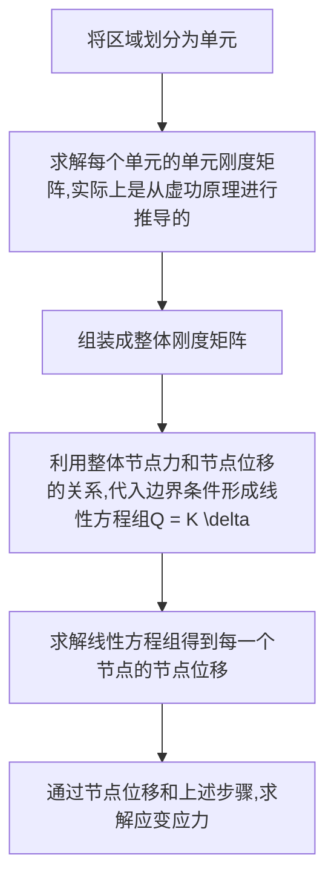

对于平面问题其应力状态可以视为不随$z$改变， 其应力和应变的物理方程也可以进行简化
## 一、平面问题的基本方程
#### 1) 几何方程(平面应变和平面应力均为此方程)
$${\varepsilon} = \left\{\begin{matrix}
\varepsilon_x \\
\varepsilon_y \\ 
\gamma_{xy}
\end{matrix} \right\} = \left[\begin{matrix}
\frac{\partial }{\partial x}  & 0\\0 & \frac{\partial }{\partial y} \\
\frac{\partial }{\partial y} & \frac{\partial }{\partial x}
\end{matrix}\right]\left\{\begin{matrix}
u \\v
\end{matrix} \right\}$$
#### 2) 物理方程
1. 平面应力问题
$${\sigma} = \left\{\begin{matrix}
\sigma_x \\ \sigma_y \\ \tau_{xy}
\end{matrix} \right\} = \frac{E}{1-\nu^2}\left[\begin{matrix}
1 & \nu \\ 
\nu & 1 \\
& & \frac{1-\nu}{2}
\end{matrix}\right]\left\{ \begin{matrix}
\varepsilon_x \\ \varepsilon_y \\ \varepsilon_z
\end{matrix}\right\}$$
2. 平面应变问题
$$\left\{\begin{matrix}
\sigma_x \\ \sigma_y  \\ \tau_{xy} 
\end{matrix}\right\} = \frac{E(1- \nu)}{(1+\nu)(1-2\nu)}\left[\begin{matrix}
1 & \frac{\nu}{1 - \nu} & 0  \\
\frac{\nu}{1-\nu} & 1 & 0\\
0 & 0&\frac{1- 2\nu}{2(1-\nu)}
\end{matrix}\right]$$
两大物理方程均可以表示为:
$$\left\{ \sigma\right\} = [D] \left\{ \varepsilon\right\}$$
## 二、连续体的离散化
### (1) 形状函数
对于一般的平面结构，将其离散成单元之后， 每个节点的位移和节点载荷均有两项, 可以表示为: 
$$\{\delta_i\} = \left\{ \begin{matrix}
u_i \\ v_i
\end{matrix}\right\}\qquad \left\{Q_i\right\} =\left\{ \begin{matrix}
X_i \\ Y_i
\end{matrix}\right\}$$
则对于三角形单元，只有6项位移, 而节点力
$$\left\{p^e\right\} = [k^e]\{\delta^e\}$$
使用<u>多项式插值函数</u>表示三角形单元的<mark style="background: transparent; color: yellow">位移函数</mark>， 即
$$a_1 + a_2 x + a_3 y + a_4 xy +  a_5x^2 y +...$$
故设三角形单元的<mark style="background: transparent; color: yellow">位移函数</mark>为：
$$\boxed{\Large\begin{cases}
u = \alpha_1 + \alpha_2 x + \alpha_3 y \\
v = \alpha_4 + \alpha_5 x + \alpha_6 y 
\end{cases}}$$
可以说明，上式在单元大小趋于零时，可以拟合更高阶的曲线。 将上式表征为
$$\Large\boxed{\left\{ \delta\right\} = [M]\left\{ \alpha\right\}}$$
其中：
$$[M] = \left[\begin{matrix}
1 & x_i &   y_i \\
& & & 1 & x_i & y_i
\end{matrix}\right]$$
写成矩阵形式，有：
$$\left\{ \begin{matrix}
u_i \\ v_i
\end{matrix}\right\} = \left[\begin{matrix}
1 & x_i &   y_i \\
& & & 1 & x_i & y_i
\end{matrix}\right]\left\{\begin{matrix}
\alpha_1 \\ \alpha_2 \\ \alpha_3 \\ \alpha_4 \\ \alpha_5 \\ \alpha_6
\end{matrix} \right\}$$
由于一个三角形上的位移模式是相同的， 因此共享一套$\alpha$ 
$$\left\{ \begin{matrix}
u_i \\ v_i \\ u_j \\ v_j \\ u_k \\ v_k
\end{matrix}\right\} = \left[\begin{matrix}
1 & x_i &   y_i \\
& & & 1 & x_i & y_i \\
1 & x_j &   y_j \\
& & & 1 & x_j & y_j \\
1 & x_k &   y_k \\
& & & 1 & x_k & y_k \\
\end{matrix}\right]\left\{\begin{matrix}
\alpha_1 \\ \alpha_2 \\ \alpha_3 \\ \alpha_4 \\ \alpha_5 \\ \alpha_6
\end{matrix} \right\}$$
![[第二章 平面问题 2023-03-20 09.42.18|150]]
上式记为 :
$$\{\delta\}^e = [A] \left\{ a\right\}$$

### (2) 位移函数的求解方法
如果每个节点的位移已知， 即$u_i, v_i, ....$ 已知，
则单元内任意一点的位移可以使用
$$\left\{ a \right\} =[A]^{-1} \left\{ \delta\right\}$$
求解出待定的所有系数$a_i,a_j, a_k$
则单元内任意一点的位移可以使用
$$\boxed{\Large\left\{\begin{matrix}
u(x,y) \\ v(x,y)
\end{matrix} \right\} = [M] [A]^{-1} \{\delta\}^e = [N]\left\{ \delta\right\}^e}$$
进行计算
上式可以简写为: 
$$\left\{ \delta\right\} = [N]\left\{\delta \right\}^e$$

其中,  $[N]$称为<mark style="background: transparent; color: yellow">形状函数矩阵</mark>

形状函数矩阵可以分块表示为
$$[N] = \left[\begin{matrix}
N_i & 0 & N_j & 0 & N_m & 0 \\
0 & N_i & 0 & N_j & 0 & N_m
\end{matrix}\right]$$
其中
$$N_i = \frac{a_i + b_i x +  c_i y}{2\Delta } \qquad (i = i,j, k)$$
上式中的$a_i, b_i, c_i$可以使用矩阵$[\Lambda]$来进行求解
$$[\Lambda] = \left[\begin{matrix}
1  & x_i & y_i \\ 
1 & x_j & y_j \\ 
1 & x_k & y_k
\end{matrix}\right]$$
其中可以用代数余子式分别表示对应的系数： (详见[[📘ClassNotes/👨‍🔧Mechanics/🖥️Computational_Mechanics/🕸️FEM Analysis/Structural FEM Analysis/补充内容/三角形三节点的刚度分析.pdf|三角形三节点的刚度分析.pdf]])
另外有$\Delta$的计算公式 (这个推导参考[[📘ClassNotes/👨‍🔧Mechanics/🌊Thermal and Fluid dynamics/⛲Computational Fluid Dynamics/Basics of Finite Element Methods/Part 1/Implements/Derivation of transformation between the local Coordinate & Cartesian Coordinate.pdf|Derivation of transformation between the local Coordinate & Cartesian Coordinate.pdf]])
$$\Large \Delta  = \frac{1}{2}\left|\Lambda \right|$$
为三角形的面积

### (3) 单元的应变和应力矩阵
单元的应变矩阵为： 
$$\left\{\varepsilon\right\} = \left[\begin{matrix}
\frac{\partial }{\partial x} & 0\\
0 & \frac{\partial }{\partial y} \\
\frac{\partial }{\partial y} & \frac{\partial }{\partial x}
\end{matrix}\right][N][\delta]^e$$
或简写为： 
$$\Large\boxed{\left\{\varepsilon\right\} = [B] \left\{\delta\right\}^e}$$
其中，$B$为**应变矩阵**(3 x 6)，其完全形式为：
![[第二章 平面问题 2023-03-21 20.24.55|300]]
可以分块表示为：
$$[B] = \left[\begin{matrix}
B_l & B_m & B_n
\end{matrix}\right]$$
单元的应力可以使用下式进行计算 : 
$$\Large\left\{\sigma\right\} = [D]\left\{\varepsilon\right\}  = [D][B]\left\{\delta\right\} = [S]\left\{\delta\right\}^e$$
其中， $[D]$为弹性矩阵
$$\Large \boxed{[S] = [D][B]}$$
称为**应力矩阵**，并可以进行分块表示为: 
$$[S] = [\begin{matrix}
S_l & S_m & S_n
\end{matrix}]$$
其中: 
$$\boxed{[S_i] = \frac{E}{2\Delta (1-\nu^2)} \left[\begin{matrix}
b_i & \nu c_i \\
\nu  b_i & c_i \\
\frac{1-\nu}{2} c_i & \frac{1-\nu}{2}b_i
\end{matrix}\right] \qquad (i = l,m,n)}$$

### (4) 三角形单元刚度矩阵的表达
对于下图中的三角形单元， 有**位移和应变**：
$$\left\{\delta_e\right\} = \left[\begin{matrix}
u_l & v_l & u_m & v_m & u_n & v_n
\end{matrix}\right]^T$$
$$\left\{p_e\right\} = \left[\begin{matrix}
p_{xl} & p_{yl} & p_{xm} & p_{ym} & p_{xn} & p_{yn}
\end{matrix}\right]^T$$
`````ad-info
title: 附注
collapse: close
其中变形和应变可以使用下式进行计算： 
$$\begin{cases}
\left\{\varepsilon\right\}^e = [B] \left\{ \delta\right\}^e \\
\left\{\sigma\right\}^e = [D] [B] \left\{ \delta\right\}^e
\end{cases}$$
`````
![[第二章 平面问题 2023-03-21 20.43.02|200]]
根据<mark style="background: transparent; color: yellow">虚功原理</mark>，在任意给出节点的虚位移状态下， 结构引起<u>内部应力，处于平衡状态。 根据虚功原理，在任意给出的节点虚位移下</u>， **单元节点力$\left\{ p\right\}^e$ 和 内力$\left\{\sigma\right\}$所做的虚功之和为零**, 即有:
$$\boxed{\delta A_p + \delta A_\sigma = 0}$$

`````ad-info
title: 刚体和变形体虚位移原理表达式
collapse: open

注意: 对于刚体，由于内部不发生变形，虚功原理的表达式为**外力虚功为0**

对于变形体，虚功原理的表达式为**外力的虚功等于内力的虚功**

`````

此时设单元节点的虚位移数值为:
$$\left\{\delta^*\right\} = \left[\begin{matrix}
u_l^* & v_l^* & u_m^* & v_m^* & u_n^* & v_n^*
\end{matrix}\right]^T$$
整体的<mark style="background: transparent; color: yellow">虚位移可以使用如下公式进行插值</mark>得到：
$$\left\{\begin{matrix}
u^* \\ v^*
\end{matrix}\right\} = [N] \left\{\delta^*\right\}$$
而**虚应变**显然可以由
$$\left\{\varepsilon^*\right\} = [B] \left\{ \delta^*\right\}$$
来计算获取。 

我们容易得知： 单元的节点力虚功为： 
$$\Large\delta A_p = \left\{\delta^*\right\}^T\left\{p\right\}^e$$
而内力的虚功为: 
$$\Large \delta A_\sigma = -\int_{V^e} \left(\varepsilon_x^*\sigma_x + \varepsilon_y^*\sigma_y  + \tau_{xy}^*\gamma_{xy}\right) dV = -\int_{V^e} \left\{ \varepsilon^*\right\}^T \{\sigma\}dV$$
通过推导[[📘ClassNotes/👨‍🔧Mechanics/🖥️Computational_Mechanics/🕸️FEM Analysis/Structural FEM Analysis/补充内容/使用虚功原理推导三角形单元刚度矩阵.pdf|使用虚功原理推导三角形单元刚度矩阵.pdf]]可以得到 : 
$$[k]^e = \int_{V^e} [B]^T[D][B]dV\left\{\delta^e\right\} = [k]^e \left\{ \delta\right\}^e$$
其中单元刚度矩阵 : 
$$\boxed{[k]^e = \int_{V^e}[B]^T[D][B]dV}$$
上式可以改写为近似
$$\Large \boxed{[k]^e = h \Delta  [B]^T [D] [B]}$$
上述矩阵可以进行分块表示（表达式在pdf中）
在分块矩阵中有公式表达:
$$\boxed{[k_{rs}]^e = [B_r]^T [D] [B_s] h \Delta  = \frac{Eh}{4(1-\nu^2)\Delta} \left[\begin{matrix}
b_r b_s +\frac{1- \nu}{2}c_r c_s & \nu b_r c_s + \frac{1-\nu}{2}c_r b_s \\
\nu c_r b_s +  \frac{1 - \nu}{2}b_r c_s & c_r c_s + \frac{1- \nu}{2} b_r b_s
\end{matrix}\right]}$$
其中$\Delta$为面积，$b_r, b_s...$为系数，通过上面的$[\Lambda]$求得
其中单元节点位移， 应变，力和节点力的关系为：
![[第二章 平面问题 2023-03-22 09.32.36|450]]

对于继续进行有限元求解，可以将单元刚度矩阵组装成整体刚度矩阵：
$$[K] = \sum^{n}_{i=1} [k]^e$$
并使用节点力和节点上外力的平衡关系组装节点力为外力矩阵$[Q]$
即可使用
$$\Large\left\{Q\right\} = [K] \left\{\delta \right\} \quad \rightarrow \quad \left\{ \delta \right\} = [K]^{-1} \left\{Q\right\}$$
可以求出$\left\{\delta\right\}$矩阵，即<mark style="background: transparent; color: yellow">单元内每一个节点的位移</mark>

`````ad-note
title: 位移函数收敛于准确解的充分条件
collapse: close
对于选用的位移函数，在选用单元后能够收敛于准确解

主要有四个充分条件： 
1. 反映单元常量应变
2. 反映单元的刚体位移 
3. 在单元内部必须连续
4. 保证相邻单元在公共边界处的位移协调

对于对应单元位移函数满足上述条件(如三角形单元),称为**协调单元**
`````

### (5) 有限元问题的总体求解过程整理

总结: 三角形单元的应力和应变参数的求解过程
![[Excalidraw/第二章 平面问题 2023-03-27 09.10.27|600]]
对于求解刚度矩阵，直接代入公式即可

在实际有限元问题的求解过程中, $\delta^e$是不会给出的，因此我们给出整个有限元问题的求解办法


### (6) 矩形四节点单元

![[📘ClassNotes/👨‍🔧Mechanics/🖥️Computational_Mechanics/🕸️FEM Analysis/Structural FEM Analysis/附加笔记/平面四节点单元|平面四节点单元]]

