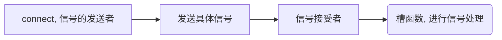

## 一、 连接方法 (connect)
以实现一个窗口的关闭为例，   

**==信号槽的特点是松散耦合==**， 即发送端和接受端本身没有关联，通过connect连接将两端连接和耦合在一起

注意信号槽可能是从父类中继承而来的
如可以在 QAbstractButton 类中查找到 Slots 和 Signals 的方法
![[attachments/Pasted image 20230606002820.png|300]]
其中pressed是摁下的瞬间
released是释放的瞬间, 而toggleed表示切换的部分
clicked是按钮的点击(具体之后看)
<mark style="background: transparent; color: yellow">在Widgets类的右侧可以找到槽的内容</mark>(Public Slots). 直接使用其中的部分
![[attachments/Pasted image 20230606004544.png|450]]
得到槽的公共槽函数如下: 
![[attachments/Pasted image 20230606004906.png|300]]

使用connect 函数来进行信号的传递，槽函数的调用如下: 
```cpp 
// 进行信号与槽的创建
// 参数1. 信号的发送者指针 2 是发送的信号 3. 信号的接受者 4. 槽函数
connect(btn2, &QPushButton::clicked, this, &MainWindow::close);  // 调用父类的槽函数， 注意直接使用即可
// 也可以使用从父类派生的槽函数调用
connect(myBtn, &QPushButton::clicked, this, &QWidget::close);
```


## 二、 自定义的信号和槽函数
例如设计两个类并使用 Teacher 触发信号

使用 Teacher 类中可以有四歌部分的定义, 一是public 域，二是private域，signals域和 public slots 域存储信号和公共槽函数

**信号声明的特点**
1.没有返回值 2. 只需要进行声明， 不需要进行实现 3.可以有参数，并可以进行重载

其中solts槽函数可以放在public slots下， 也**可以放在public下** 声明成全局函数。
```cpp
class Teacher : public QWidget
{
    Q_OBJECT // 需要继承QWidget类
public:
    explicit Teacher(QWidget *parent = nullptr);
    ~Teacher();
private:
// 自定义信号的写法:
signals:
    void mySignal();
// 1.没有返回值 2. 只需要进行声明， 不需要进行实现 3.可以有参数，并可以进行重载
public slots:
};
#endif // TEACHER_H
```

槽函数需要进行声明和实现， 并且有参数，可以进行重载
槽函数的声明放在student.h中， 如下:
需要说明， 报错可能是继承关系的问题，Teacher类必须要继承QWidget才可以使用solt和signal, 并且在前面加上Q_Object
```cpp 
#ifndef STUDENT_H
#define STUDENT_H
#include <QObject>
#include <QWidget>
class student : public QWidget
{
    Q_OBJECT;  // 这个必须要加上
public:
    explicit student(QWidget *parent = nullptr);
    ~student();
signals:
	
public slots:
    void mySlot(); // 进行自定义槽函数的声明
};

#endif // STUDENT_H

```
在实现部分cpp中
```cpp 
void student::mySlot()
{
    qDebug()<<"my slot Triggered";
}
```

在头函数中的private域使用cpp语法， 创建私有对象
```cpp 
private:
    Teacher *tea1 = nullptr;  // 使用Teacher类中的对象
    student *stu1 = nullptr;
```

MainWindow.h文件中，有如下需要做的函数
```cpp
#include "teacher.h"
#include "student.h"
// 声明对象放在h文件中
this-> tea1 =new Teacher;
connect(this->tea1, &Teacher::mySignal, this->stu1, &student::mySlot);
this-> TriggerFunc(); // 调用主函数中的TriggerFunc触发函数
// 直接加上这一句只是一个创建连接的过程，因此需要对tea1进行触发
```

主函数(MainWindow.cpp)中， 首先新建两个对象, 然后建立connect关系，需要注意: **==定义一个触发函数并在其中使用emit进行对自定义信号的触发==**

```cpp
MainWindow::MainWindow(QWidget *parent)
    : QMainWindow(parent)    // 初始化列表
    , ui(new Ui::MainWindow)
{
    ui->setupUi(this);
    // 声明对象放在h文件中, 注意两个的创建，都必须使用new
    this-> tea1 =new Teacher;
    this-> stu1 =new student;
    connect(this->tea1, &Teacher::mySignal, this->stu1, &student::mySlot); // 将信号连接槽函数
    // 直接加上这一句只是一个创建连接的过程，因此需要对tea1进行触发
    connect(btn, &QPushButton::clicked, this -> stu1, &student::mySlot);    // 使用这样的方法可以使用按钮信号连接
    // 将按钮连接到调用上
}

// 需要在主函数中定义触发函数，并在函数中使用emit触发连接
void MainWindow::TriggerFunc(){
    qDebug() << "The Trigger function has been Triggered";
    emit tea1->mySignal();  // 触发信号函数
}
```

此时点击按钮btn和程序退出调用函数时，均会触发自定义信号函数, 效果如下：
![[attachments/Pasted image 20230606085314.png|800]]

需要说明的是，多个信号可以连接一个槽函数，一个信号也可以连接多个槽函数
需要说明，**信号的参数和槽函数的==参数类型==必须一一对应**, <mark style="background: transparent; color: yellow">信号中参数的个数可以多于槽函数的个数</mark>

此时可以以Student的信号传参为例，由于Student的方法是void返回值， 而click 的返回类型是bool, 因此如果是void 则可以连接成功，但是如果是QString的参数种类则会连接失败。
```cpp 
void (Teacher::*sig1)(void) = &Teacher::mySignal;
void (student::*sig2)(void) = &student::mySlot;

connect(btn , &QPushButton::clicked, this -> tea, sig1);
```

`````ad-caution
title: 让一个子窗口的参数触发另一个子窗口的槽函数的方法
collapse: open

方法是在主窗口中将带参的信号和槽函数进行定义和connect, 然后在子窗口1中获取参数并调用emit函数触发这个信号， 然后将带参的信号进行emit

`````

## 三、 信号和槽函数的重载

```cpp 
// 首先在teacher.cpp中重载signal ，传入不同的参数
signals:
	void MySignal(Qstring paraName);
	void MySignal(Qstring paraName);
```
在student 中, 重新实现有参的重载，而在emit时进行修改
```cpp 
public slots:
    void mySlot(); // 进行自定义槽函数的声明
    void mySlot(QString paraName); // 然后在cpp中实现参数重新定义的槽
```
其中在mySolt的定义中，需要加入对应的方法
```cpp
void student::mySlot(QString paraname){
    // QString 转换char*的方法
    // 使用toUtf8编码， 则此时方法是QString先通过.Utf8()转换成QByteArray,再转换为char*
    qDebug()<< paraname.toUtf8().data() << " reolad triggered";
}
```
需要注意的是，如果发生了重载，则需要在mainWindow.cpp 中增加成员函数的定义
```cpp 
void (Teacher:: *teacher)(QString) = &Teacher::mySignal
```

在main函数的定义中， 需要使用**带有参数的函数指针**来传入信号和槽的函数参数， 同时也需要重写emit 的部分， 传入相应的参数。

```cpp 
// 使用如下的方法, 定义有指定参数的函数指针sig1,sig2分别指向
void (Teacher::*sig1)(QString) = &Teacher::mySignal;
void (student::*sig2)(QString) = &student::mySlot;

// 使用增加参数的方法，连接Teacher的信号和student的槽
connect(this->tea1, sig1, this->stu1, sig2);

// 需要在主函数中定义触发函数，并在函数中使用emit触发连接
void MainWindow::TriggerFunc(){
    qDebug() << "The Trigger function has been Triggered";
    emit tea1->mySignal("The reloaded Signal Function");  // 触发带有重载的信号函数
}
```


## 四、 信号触发信号的方法
### (1) 信号触发函数(类似于槽函数的调用)

```cpp 
// connect(btn, &QPushButton::clicked, this -> stu1, &student::mySlot); // 这一句是连接student调用其槽函数
connect(btn, &QPushButton::clicked, this, &MainWindow::TriggerFunc);  // 这一句是点击按钮使用信号调用mainwindow.cpp中的函数

// 其中TriggerFunc的定义为: 
// 需要在主函数中定义触发函数，并在函数中使用emit触发连接
void MainWindow::TriggerFunc(){
    qDebug() << "The Trigger function has been Triggered";
    emit tea1->mySignal("The reloaded Signal Function");  // 触发带有重载的信号函数
}
```

### (2) 信号触发另一个信号

首先对于有参的信号和槽函数，使用如下的方法构造函数指针指明函数

1. 连接信号的方法，此时调用一个信号即会触发另一个信号
```cpp 
// 使用如下的方法, 定义有指定参数的函数指针sig1,sig2分别指向
void (Teacher::*sig1)(void) = &Teacher::mySignal; // 注意是void 传入参数, 由于btn的信号值是bool, 不会传入QString, 会报错
void (student::*sig2)(void) = &student::mySlot;
connect(btn, &QPushButton::clicked, this->tea1, sig1); // 使用信号连接信号的方式, 需要注意的是，有函数重载时， 需要使用参数定义的指针来进行
```

2. 断开信号连接

```cpp 
disconnect(btn, &QPushButton::clicked, this->tea1, sig1); // 和connect的参数完全相同
```

需要说明的是， 对于Qt4等低版本的信号和槽的连接方式， 可以按照如下的方法进行
```cpp 
connect(this->tea1, SIGNAL(mySignal(para)), stu1, SLOT(para));  // 这个在 Qt4 可以使用
// 其优点是参数直观，缺点是类型不做检测 -> 但是如果参数不同会出现错误
// 此时底层将参数转换为字符串
```

