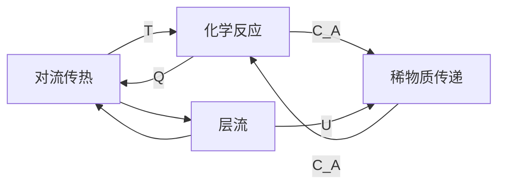

## 计算流体力学建模一
### 一、理论知识
#### (1) 主要内容: 
1. 流体方程与边界条件
2. 蠕动流，层流，非牛顿流体建模
3. 湍流建模
4. 旋转机械内的流体流动
5. 薄膜流和管道流
6. 多孔介质和地下流
7. 多相流仿真
8. 流体中的粒子追踪
9. 非等温流建模
10. 高马赫数流动
11. 多物理场模型：反应流， 流固耦合模型
#### (2) 流体计算的基本原理
通用原理：连续介质在剪切应力下发生的变形
流体力学研究流体及力-应变相应
一般原理：质量，动量和能量守恒
流体的流动分类主要是多孔流动，自由流动

主要的简单流动包括
1. 压力流(Poiseuille)
2. 拖曳流(Couette)
3. stokes边界层
4. Taylor-Green 涡流

流体力学包括
1. 流体静力学: 压力变化, 流动状态相对较弱
2. 流体动力学: 对于轮胎的充气过程等等， 运动不可忽略，同时计算速度场和压力场
3. 流体运动学: 流体质点的运动， 遵从连续性介质假设，研究速度，位移和加速度的问题

一般而言研究的都是流体运动学(流体运动受力作用)
对于数值的求解方法，可以在空间和时间上进行离散
1. 有限差分法(FDM)
2. 有限体积法(FVM)
3. 有限元法(FEM)
#### (3) 流体力学的平衡方程
###### 1. 质量守恒方程(连续性方程)
$$\frac{\partial \rho}{\partial t} + \frac{\partial(\rho u)}{\partial x} + \frac{\partial (\rho v) }{\partial y} + \frac{\partial (\rho w)}{\partial z} = 0$$
也即：
$$\frac{Du}{Dt} =  \frac{1}{\rho} \nabla \cdot\sigma + g$$
###### 2. 基于牛顿第二定律的动量守恒平衡方程
动量守恒方程(Navier-Stokes方程)
$$\rho \frac{\partial u}{\partial t} + u \frac{\partial u}{\partial t} + v\frac{\partial  u}{\partial y} = - (\frac{\partial \sigma_x}{\partial x} + \frac{\partial \tau_{xy}}{\partial y}) + X $$
也即：
$$\rho \frac{Du}{Dt} = \rho\left(\frac{\partial u}{\partial t} + \left(u \cdot \nabla\right) u \right) = -\nabla p  + \nabla \cdot \left\{ \mu \left[\nabla u + (\nabla u)^T - \frac{2}{3}(\nabla \cdot u) I \right] + \zeta (\nabla \cdot u)I \right\} +  \rho g$$
###### 3. 能量守恒方程
![[Pasted image 20230107190225.png|350]]

#### 4. 方程综述
共5个方程(3个动量方程), 有11个变量
![[Screenshot_20230107_190714_tv.danmaku.bilibilihd.jpg]]

#### 5. 本构关系
例如牛顿流体：
$$\tau = 2\mu S - \frac{2}{3}\eta (\nabla\cdot u) I$$
通过添加额外的本构方程， 去掉$\tau$部分的力

#### 6. 需要考虑的特征参数
![[Screenshot_20230107_202037_tv.danmaku.bilibilihd 1.jpg]]
主要区分不同类型的流场的方式: 
1. 通过介质区分准数
2. 通过相关准数进行区分

考察单向流的流场
1. 雷诺数: 
$$Re_L \equiv \frac{\rho U L }{\mu} = \frac{\rho L}{\nu} = \frac{\text{inertia force}}{\text{viscous force}}$$
$$\begin{matrix}
Re << 1 \qquad \text{creeping flow} \\
Re = 1 \to 2000 \qquad \text{laminar flow} \\
Re > 4000 \qquad \text{turblent flow}
\end{matrix} \qquad $$
注意一定要确定好相应的雷诺数 ，可能需要进行手动计算
![[Pasted image 20230108111142.png|450]]

2. 马赫数
$$Ma \equiv \frac{|u|}{a} = \frac{\text{flowing speed}}{\text{acoustic velocity}}$$
$$\begin{matrix}
Ma = 0 \qquad \text{Incompressible fluid}\\
0 < Ma < 0.3 \qquad \text{Weakly compressible fluid}\\
0.1 < Ma < 1 \qquad \text{Moderately compressible fluid} \\
Ma \geq 1 \qquad \text{Compressible fluid} 
\end{matrix}$$
单相流Ma < 0.3 
the equation shape of the different equations are different
附注： 注意可压缩流体， 不可压缩流体和可压缩流动和不可压缩流动的区别
$$\begin{matrix}
c_{air} = 343 m/s \\
c_{water} = 1484 m/s 
\end{matrix}$$
3. Knudsen number
$$K_n \equiv \frac{\lambda}{L} = \frac{\text{average free path}}{\text{physical length dimension}}$$
$$
\begin{matrix}
K_n < 0.01  \qquad \text{continous flow} \\
0.1 < K_n <10 \qquad \text{transition flow} \\
K_n > 10 \qquad \text{free molecular flow}
\end{matrix}
$$
一般情况下，在过渡流和分子流无法界定时，使用过渡流解决问题

#### 7. 边界条件
包括流动种类以及以下的边界条件
1. 流动压力
参考压力：一般的压力为相对于参考压力的部分， NS方程只计算压力梯度，不计算绝对值。
有的流场需要使用==绝对压力==的材料属性进行计算，需要和能量方程进行关联， 包含管道流和高马赫数流
使用相对压力进行求解时，由于使用了参考压力，接近于系统的压力，参考压力主要决定了流场求解的稳定性和收敛性

2. 流体属性
3. 初始值
对于稳态问题，边界条件不需要与初始值一致
对于瞬态的初始值，初始值是物理上的初始状态，对之后得到的解有较大的影响。
![[Pasted image 20230108144112.png|400]]

在边界条件选项中，还存在充分发展的流动等设置
壁边界条件的滑移速度和滑移效应。内部壁可以避免对薄的结构划分网格，可以设定为滑移壁，无滑移壁等等

出口位置的设置: 如果出口附近存在特定的流动结构如回流部分(难以计算质量守恒)，需要将出口延长至完全包含该流动结构然后进行求解
![[Pasted image 20230108144447.png]]
对于一个开始下降很快但后期不稳定的部分，可能是没有稳态解的问题，需要使用瞬态求解器解出一个瞬态解
流量控制装置也可以作为边界条件

#### 8. 轴对称和周期性
虽然可以极大减少计算时间，但是必须保证严格的对称
#### 9. 压力点约束
对于无法决定流场入口的速度， 且无法对压力做限制时， 作为压力点约束的位置
一般来说，选取重力场中的上面的点作为相应的压力约束点

考虑重力时，出口的压力不可以恒定
![[Pasted image 20230108145606.png|300]]
#### 10. 稳定性
在模型开发器中设置勾选稳定性的部分， 然后在层流中找到自洽稳定性和非自洽稳定性并进行勾选

对于非自洽稳定性
由于方程稳定，收敛简单地多，但是不符合质量守恒和动量守恒的自洽性
增加$\delta$ 取值虽然会增加稳定性但是会增大误差

对于自洽稳定性(默认勾选)
符合质量和动量守恒的自洽
可以使用侧风扩散后可以消除梯度位置不稳定，
保证梯度部分的精度,得到更加精确的结果

稳定性技术的影响主要有网格和容差

#### 11. 适用性(?????)
1. 流线扩散
对流作用占主导的部分， 必须使用流线扩散
2. 侧风扩散
对于不可压缩流动且不包含激波的部分， 可以用于在尖端的边界以及剪切层引入额外的扩散
### 二、 相关案例讲解
#### 1. 非牛顿流体的演示
研究与剪切速率相关的粘度系数对线性聚苯乙烯溶液流动的影响
使用非牛顿流的Carreau模型， 通过轴对称将三维模型转换为二维轴对称模型
参数化扫描研究进口压力的影响

其中有$\mu_0$设置为$166(Pa\cdot s)$,属于比较粘稠的粘性

注意：如果参考压力为1atm，而出口压力为0，则出口绝对压力为1个大气压

对于动力粘度$\mu$，可以使用
如果非牛顿流和预置的参数都不同，则可能需要用测量的参数
通过插值函数实现剪切线速率和粘性的关系的实验测定 
通过int1(spf.sr)来实现相应的计算

往往在流体求解时，需要使用细化或者超细化网格

#### 2. 其它案例
(1) 后台阶流(incompressible-flow-over-a-backstep)
(2) 星型的微流道芯片(star-shaped-microchannel)
(3) 薄板混合器(lamella-mixer)
(4) 层流静态混合器(laminar-static-mixer)
(5) PID控制反应器(process-control-using-a-pid-controller)
## 计算流体力学建模二
### 一、理论知识
#### (1) 湍流建模和RANS方法
COMSOL中的所有的湍流模型，都是基于RANS方程的

流动可以分为层流和湍流
层流到湍流会经过一个无序的漩涡的转裂
通过层流边界层的过程，进行相应的转裂

从低雷诺数的层流过程到高雷诺数的过程为过渡

往往湍流模型使用一阶单元来进行描述，可能出现数值不稳定的现象

在湍流部分，往往是湍流的混沌现象， 流动的细节强烈依赖于初始条件，强混合，湍动能转换为热能(小尺度)
具有高度的耗散性（动量和热的相互转换）

湍流往往采用RANS平均模型来进行，基于空间和时间的平均来求解相应的流场 
RANS(Navier-Stokes)模型可以预测完全湍流区的流动在时间上的平均的解
RANS可以在台式机上进行求解

#### (2) 层流到湍流的转裂判定
临界雷诺数：
当雷诺数近似大于相应的临界雷诺数时， 转换为湍流状态模型

临界雷诺数依赖于不同的流动问题, 与平板边界和障碍物等等有关

#### (3) DNS方法(不用RANS)的计算成本
DNS(直接数值模拟)
计算成本正比于$Re^3$

$LES$大涡模拟
大涡模拟将湍流分为大小尺度分别使用N-S和湍流模型进行求解
精确但是计算成本高
三个接口都是基于变分的多尺度方法(VMS)的
由于RANS方法会导致涡项被过滤掉，使用大涡模拟来进行一些湍流的模拟过程

#### (4) 常见的几种湍流RANS模型
根据引入的偏微分方程数目不同可以分为
(1) 零方程模型
yplus模型
(2) 一方程模型
Spalart - Allmaras粘度模型
(3) 两方程模型
$k-\varepsilon$模型
$k-\omega$模型
(4) 四方程模型
$v^2 -f$模型
![[Pasted image 20230108195155.png|450]]

对于不同的RANS湍流模型的计算成本，从零到四方程计算成本逐渐升高
计算精度也是逐渐增加的，论文中往往使用$k-\varepsilon$模型来进行求解

##### 1. Spalart -Allmaras 模型
Spalart - Allmaras 湍流模型适合于高雷诺数，大自由度的问题
主要用于空气动力学求解问题
具有稳定和容易求解，内存需求小， 不使用壁函数等等优点

对于升力，阻力和传热等等计算比较精确
缺点是不能计算： 
1. 剪切流
2. 分离流
3. 衰变湍流

##### 2. K-epsilon模型
主要用于工业模型计算
稳定，容易求解
可以在壁面附近使用粗糙的网格
往往对于外流问题以及复杂几何，有良好的表现

缺点：
1. 要求流场的雷诺数必须足够大
2. 不能精确计算存在逆压梯度（出口局部的高压问题）， 强曲率流动， 射流等现象存在的流场
3. 在边界附近求解的结果不一定精确
比如计算相应的升力等等
比如对于拉法尔喷管的问题，会形成漩涡（分离涡）,和边界层分离有关不适用
![[Pasted image 20230108202452.png|450]]
后台阶流也是突然扩张，也是会导致逆压梯度的产生

##### 3. $k-\varepsilon$模型的修正
$$\mu_T = \rho C_\mu \frac{k^2}{\varepsilon}$$
其中$C_\mu$应当修正为何应变率变化有关

在标准的$K-\varepsilon$模型中，需要满足一些可真实化约束
![[Pasted image 20230108203207.png|350]]

##### 4. $k-\omega$ 模型的注意事项
注意 $k-\varepsilon$和$k-\omega$的混合长度限制
- 直接通过湍动能和耗散率计算湍流粘性时，可能出现除0错误
- 混合长度可以用来计算湍流粘度

$k-\omega$模型是对$k-\varepsilon$模型的改进
优点：
1. 与$k - \varepsilon$相同的内存需求
2. 对于内部的流动问题表现良好
3. 存在下列现象时，可以更加精确地计算流场：
		(1) 具有强曲率的流动
		(2) 分离流
		(3) 逆压梯度
		(4) 喷射

缺点： 
(1)  通过壁函数进行近似，所以壁附近的解可能不够精确
(2) 对于外流问题，对于自由来流（进口）的$\omega$值敏感

常常使用$k-\varepsilon$模型提供一个初始的条件

##### 5. 低雷诺数的$k-\varepsilon$模型
优点： 
可以用于随后获取更加精确的解
不使用壁函数，计算力和壁面通量的结果更加精确
可以推广到边界层的底层

缺点：
需要更加精细的边界层网格， 以及良好的入口或者初始值条件来提高收敛性
需要的内存高于$k-\varepsilon$以及$k -\omega$模型

##### 6. SST 模型
剪切应力传递模型
结合了$k-\varepsilon$和$k-\omega$模型
对边界条件不敏感   --->  但是对初始条件敏感
满足可真实化约束   
不使用壁函数， 可以求解升阻力问题和传热等问题 --> 但是内存需求高于$k-\varepsilon$模型

##### 7.$v^2- f$模型
通过求解流线法向的湍流速度脉动来考虑湍流的各向异性

可以求解旋钮等中的各向异性的湍流模型
求解的是和$v^2$和$f$有关的两个变量的输运方程

得到法向和切向的各项异性的问题适合使用不同的模型
![[Pasted image 20230108215539.png|500]]
www.comsol.com/blogs/which-turbulence-model-should-choose-cfd-application/

#### (5) 壁函数 | 入口条件
在粘性条件下，对数律时，满足非线性关系
假设计算域从$\delta_w$开始
注意需要合理进行边界层的网格划分
对于不需要壁函数的网格: 需要精细的网格来解析相应的边界区域流动
入口条件:    湍流长度，强度，等等

### 二、实例讲解
#### (1) 湍流实例
使用湍流 -> 生成新的湍流模型接口
靠近壁面， 湍流可以分为三个区域， 边界层的梯度大，尺寸小，二
粘性层

注意：湍流的宏观效应增加质量动量和能量的扩散通量
这对其他物理场存在影响，因此在传递方程中，必须校正方程的传递系数(热传导和扩散系数)

注意：需要使用几何-> 右键直接插入几何序列即可插入mph文件

一般情况下， 湍流条件选用指定湍流的长度和强度
一般的湍流强度约设置为0.05，  而对于湍流长度， 可以将上方的边界条件改为充分发展的湍流

对于边界层网格的设置，有可以设置边界层数，边界层拉伸因子和厚度调节因子（壁面方向的网格尺寸的大小/20是调节因子为1）

通常可以手动计算边界层的厚度
在其中的无量纲量
一般50~100内影响不大

#### (2) 旋转机械流动-二维混合器内的流体混合问题
预测旋转机械中的压力损耗和流动，(Ma<0.3)
内容：
旋转机械中的层流和湍流
基于RANS的湍流模型
搅拌器模块零件库
非等温流，反应流和多相流的多物理场接口

需要通过实际的文献判断是层流还是湍流
使用滑动网格（移动网格特例）方法

研究类型包括
1. 冻结转子
2. 瞬态

可以研究相应的自由液面

##### 注意事项： 
装配体一致对条件，
自动识别旋转壁
内部薄壳壁条件， 描述浸入结构，等等。 
搅拌器模块的零件库

对于非等温流，可以将热流问题进行耦合，从而有热流的耦合效果
旋转机械，多相流

注意在搅拌器中必须选择创建装配体，并选择创建对（在搅拌边界处创建一致对）

注意在定义Uin的斜坡函数时，需要使用
u_in * rm1(t[1/s])
来取消t的量纲 其中[1/s]表示乘积

对于多物理场耦合的求解器设置的参考：学习高效地求解多物理场问题

注意在之后必须在Laminar flow中设置Pairs, 并且使用flow Continuity来保证相应的流体的连续性

可以在Component模块或者Physics模块下添加Particle Tracing for Fluid flow
来进行粒子追踪

## 计算流体力学建模三
### 一、理论知识
主要内容：
- 薄膜流，管道流
- 多孔介质地下水流
- 两相流的仿真
#### (1) 薄膜流和雷诺方程
对于薄膜流，是在狭窄区域的润滑和流动，可以用于对三维的壳建模，并可以考虑气相的空化(???)作用

使用间隙内的雷诺方程来进行求解，忽略惯性力项， 使粘性力起主导作用
适用于间隙内的切向方向较大的流动
雷诺方程包括连续性方程，动量方程

薄膜流动 -> 修正的雷诺方程: 
使用理想气体状态方程修正气体的密度，并保持流场的温度不变

##### **流体属性的设置**
1. 参考平面的属性 -> 一般在油膜的中间假设一个平面为参考平面
需要定义上部的高度和下面的高度，
壁速度的变化也会导致影响相应的部分，注意有壁速度矢量时， 要注意法向的设置，这会影响解得的结果
![[Pasted image 20230109143336.png|500]]
2. 将流动区域分为空化区域和无空化区域
不考虑空化之后气体的可压缩性，
无空化区域的介质为液体，而空化区域压力恒定，且介质为部分或全部气体
可以在可压缩应中对可压缩性进行一些微小的调整(需要打开高级物理场选项)
![[Pasted image 20230109143641.png]]

#### (2) 管道流
将管道流简化为一维问题，通过摩擦因子来进行考虑，雷诺数，壁粗糙度和管道形状
主要的设置参数有:
1. 牛顿流体和非牛顿流体
2. 两相流
3. 管道属性(形状，摩擦模型， 表面粗糙度)

对于进出口边界，可以定义速度，也可以定义压力
可以计算在管道中的化学物质传递(如果需要更多的部分，需要购买化学物质等模块)

注意：在管道流和高马赫数流中压力取绝对压力

管道传热的耦合 -> 需要用到壁传热的边界条件，可以设置壁传热，壁厚，导热等等
可能会加上**内部的膜阻**和外部膜阻 ----> (考虑管道内杂质的阻力作用和腐蚀等等)外部膜阻时不能使用comsol自带的模型, 需要手动定义外部膜阻
注意如果是外流的情况时，，外部的流场不进行计算

注意管道的CFD模块的使用
可以通过水锤校准模型来模拟瞬间关闭阀门后换刀的内压随时间的变化

通过管接口的多物理场将管道流接头和流场相耦合
#### (3) 多孔介质和地下水流
多孔介质是一个多相流系统，至少包含一种不可变固项
最简单情况是一个固项和一个流体项
考虑流体的质量，动量和能量守恒，弹性波

不同的多孔介质使用不同的方程模型，常见的有Brinkman方程和Navier-stokes方程处理方式
对于裂隙，可以转换为一个无厚度的曲面, 为裂隙流接口
Brinkman方程主要考察的是饱和多孔介质的快速流动问题
#### (4) Darcy 定律
主要解决粘性的缓慢流动
裂隙流可以添加为Darcy 

Richard方程
在变饱和的多孔介质中的缓慢渗流
仅包含在地下水流模块中
还需要考虑Brooks & Corey 滞留模型

对于自由和多孔介质流动， 是Navier-stokes和Brinkman方程的耦合
但是一般NS和Darcy定律难以耦合

#### (5) 相传递模型
自由流动中的相传递
多孔介质中的相传递
两相Darcy定律
溶质运移的模拟
裂隙中的物质传递
传热的方程包括地热加热， 热分散性，裂隙或多孔介质层加热
对于多孔介质模型流
可以通过多孔介质流和多孔弹性进行耦合
多孔弹性Biot理论 -> 多孔弹性接口(压力导致的固体变形)多孔介质流和其他物理场如结构力学等等的耦合

#### (6) 多相流仿真
包括分离型多相流模型和分散型多相流模型
(1) 分离型
主要应用与气泡，液滴和颗粒流的仿真
用于微流体中的多相流
宏观流场中的自由界面

主要的几种方法：
1. 水平集方法
2. 相场方法
3. 两相流和动网格

(2) 分散型
应用于气泡数量多体积小的气泡流
可以适用于乳液和气溶胶的仿真
对于流场中存在大量颗粒的情况适用
使用宏观多相流和定义颗粒占据的体积分数来决定不同部分气泡量的多少
1. 气泡流
2. 混合物模型
3. 双欧拉模型

相传递接口

使用水平集方法等等需要精确追踪相界面的位置变化
准确模拟表面张力的影响
水平集和相场方法可以模拟拓扑变化，而==移动网格方法不可==，
移动网格也有优点描述的界面是精确的

#### (7) 水平集方法
主要难的部分
1. 重新初始化参数$\gamma(m/s)$ ， 比较合理的是流体流动的最大速度， 或设置为界面流动的速度
2. 界面控制参数$\varepsilon$, 多数情况下，使用默认的$\frac{h_{max}}{2}$即可

#### (8): 相场方法 | 两相流的设置
1. 添加多物理场 > 两相流
2. 指定中间的面为初始界面

###### 润湿壁问题
对于润湿壁问题，首先需要设定坐标系和接触角润湿壁用于定义流体-流体界面的接触情况
使用润湿壁条件之后，流体-流体界面才能发生移动
界面局部为滑移条件
水平集方法的精度高于相场，而两相流相场的方法稳定性较好

移动网格-两相流的部分可以得到较高精度的界面，也可以在界面上添加物质的传递和相变，但不能涉及拓扑问题

###### 两相流模型
(1) Euler - Euler 模型
主要用于气泡量较多的部分
对于连续项使用NS方程来
对于分散相当成连续的流体，也使用NS方程来求解
通过显示计算动量传递和压力分布和质量分数
假设是分散相被连续项贯穿

==此处需要添加一个经验模型==: 
固体粘度模型/固体压力模型

添加额外的作用力: 
$\beta$-曳力系数

(2) 气泡流模型
模拟液体和气泡, 共享压力场
对于==气泡含量不超过10%==， 通过理想气体定律求解气体的密度
相关案例：核泡沸腾模型

(3) 混合物模型
也是对双欧拉的简化
主要用于模拟浸没在液体中的固体颗粒或者液滴的混合体系
利于收敛的其他方法：
1. 不能采用CFL数表达式（伪时间步进）
2. 当稳态研究比较难收敛时，人为增加粘度可以提高收敛性
3. 对于高梯度的分散相，采用精细网格
4. 设定开放边界问题(尽量不用)

### 二、实例讲解
#### (1) 多孔介质的裂隙流
可以在体积箭头里右键添加相应的颜色表达式
如加上dl.U,可以增加相应的箭头颜色表达式描述
## 计算流体力学建模四
### 一、理论知识
#### (1) 粒子追踪
主要分类:
1. 数学粒子追踪
2. 电荷粒子追踪
3. 流场中的粒子主动

瞬态求解器求解粒子的轨迹 -> 其中不考虑粒子的体积，不考虑粒子的碰撞问题

常见的颗粒受力是曳力
多数情况下是单向耦合
在颗粒密度低时， 颗粒运动是随流体质点运动的，只考虑流体对颗粒的作用力

对于不同的雷诺数范围，适用的曳力定律不同
![[Pasted image 20230114113831.png|550]]

对于湍流的脉动效应，都是使用基于RANS的湍流模型

可以使用添加其他预置力，来得到粒子之间的相互作用的计算
案例：血细胞的介电泳分离, 层流静态混合器的仿真

#### (2) 非等温流和高马赫数流
非等温流和共轭传热模型
可以考虑多孔介质传热，浮力诱导湍流等等
湍流的Prandtl数

多物理场 -> 单向耦合
添加多物理场的流动耦合(fc1)和温度耦合(tc1)
可以实现多物理场的流体和温度的双向耦合

非等温流的多物理场接口-> 对于非等温流， 如果密度变化不是特别大，可以再此基础上，添加流体的密度的线性的温度变化，可以通过湍流变量计算

#### (3) 相变类型及建模思路
###### 1. 考虑不同的相界面问题
分离型两相流：水平集方法，相场方法
- 应用于气液相变(不能使用移动网格方法)
单相流： 移动网格方法
- 应用：液固相变，气固相变
相变材料的模糊界面:
可以达到水平集和相场的效果
- 应用：液固相变，气液相变(慎用)
###### 2. 不考虑相界面运动的问题
分散型两相流：气泡流，混合物模型，双欧拉模型
应用：气液相变，液固相变， 气固相变(升华)
#### (4) 高马赫数流的建模
湍流模型有$k-\varepsilon$和$S-A$模型(常用，描述空气动力学)
在可压缩性中使用压力-压力组合定义进出口边界
条件中设定的压力是绝对压力
总压和总温是一个能量的概念
通过马赫数确定静压和静温
出口需要指定压力

高马赫数流和非等温流的区别: 
在高马赫数流中，流动会导致密度和温度的变化
在相对运动中，边界层是随飞行器一起运动的层：
有流体的粘性加热和耗散，导致压力的变化和流体的可压缩性
而在非等温流中，可压缩性比较小

对非等温流中，可以使用所有的基于RANS的湍流模型

#### (5) 反应流建模
###### 多组分体系讲解
和多组分体系有关, 在化工设计等中常用到
往往有多种传递和反应现象
可以转化为:==质量，动量和能量传递，  &  化学反应的耦合==

多组分体系
-> 稀物质传递 （指浓度不均匀的情况）
主要体现在溶剂仅与溶质存在相互作用
主要扩散有Fick定律， 努森扩散和含尘气体等等
-> 浓物质传递: 
主要是Maxwell - Stefan 定律和混合物平均等等
气体中主要使用浓物质的传递

包含层流，湍流， 旋转机械流，多孔介质，管道，裂隙等一系列接口
可以同时添加流场接口和物质传递接口 -> ”反应流“ 多物理场节点

稀物质传递传递可以视为单向耦合的作用， 可以通过手动的方式实现双向耦合
浓物质传递可以通过稀物质传递中考虑湍流， 不需要添加对传热的促进

#### (6) 流固耦合问题(FSI)
- 流体流动和固体变形 
- 声-固耦合
- 多孔弹性问题的流固耦合
- 两相流中的流固耦合

在小变形问题中，可以使用单向流固耦合
大变形问题中，往往使用双向流固耦合

1. 定义流体和固体接口，
2. 流固界面自动检测
3. 设置固体属性

建模技巧：
1. 使用带平滑函数的阶跃函数
2. 若缺省的分离求解器不收敛， 则使用全耦合求解器
3. 尽量使用单向耦合
4. 对网格的过度变形，指定网格整体移动方向指定边界单元移动，也可以根据网格质量进行重新剖分网格

启用==自动重新剖分网格==可以直接在求解器步骤中找研究扩展 -> 能够自动重新剖分网格

### 二、实例讲解
#### (1) 微型搅拌器中的粒子追踪
注意在流体流动-> 壁， 将壁属性改为反弹而非冻结

注意在流体的流动颗粒追踪中添加曳力

对于计算未完成的手动后处理
在后处理的结果中添加粒子解的数据集
在绘制时，粒子轨迹选取相应的粒子轨迹数据集, 才可以进行绘制
选取fpt.pef可以使用不同释放特征（不同入口的粒子）-> 得到不同入口的粒子使用不同颜色的结果
#### (2) 热分解反应器

考虑层流，热，化学， 稀物质传递， 发生分解反应，浓度下降
分析流速，温度和组分浓度分布

耦合四个物理场

==ctrl  + ? 可以查看所有的参数==

注意流出和温度可以进行配对，而往往不用流入（这个是热流通量）

如何将温度进行耦合：
如图，为了将化学和温度进行耦合，设置化学节点部分的温度为ht，产生的
并在流体部分右键添加热源
![[Pasted image 20230114172807.png|500]]
选取流体热源的反应热源
![[Pasted image 20230114173002.png|500]]
为了将稀物质传递和反应相互耦合，需要在稀物质传递中加入化学反应节点
![[Pasted image 20230114173114.png|250]]
![[Pasted image 20230114173232.png|250]]
将稀物质传递的因变量设置为cA， 此时在化学节点可以有相应的节点定义
![[Pasted image 20230114173704.png|350]]
对于流动对稀物质传递的影响，可以将稀物质流动的速度场设置为流动的速度场
![[Pasted image 20230114173850.png|450]]

