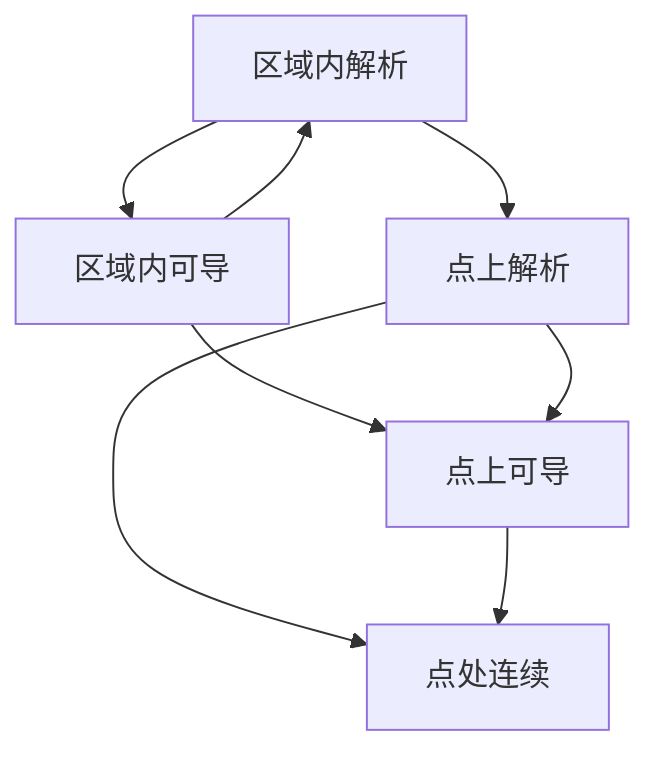

## 一、复变函数的导数
### (1) 导数的定义
设函数$w = f(z)$为定义于区域$D$的函数，$z_0$为区域$D$中的一点, 若极限
$$f'(z_0) = \frac{dw}{dz}|_{z=z_0}=\lim_{\Delta z\to 0} \frac{f(z_0 + \Delta z)}{\Delta z}$$
存在，则说$f(z)$在$z_0$处可导，极限值称之为$f(z)$在$z_0$的导数。
导数的要求是，**极限值存在的要求与$z_{0} + \Delta  z\to z_{0}$的方式无关**, 此处与[[📘ClassNotes/📐Mathmatics/📈Advanced Mathematics/第九章 多元函数的微分法及应用#(3) 二元函数的极限与连续|二元函数的极限与连续]]类似。
在$z_0$可导的函数一定连续，而连续的函数不一定可导。
### (2)导数的运算法则
一般而言，求导是**直接在函数$z$上进行求导的**。若给定$f(z) = f(x, y)$, 则将$x,y$分别换成$x + \Delta x, y + \Delta y$代替$\Delta z$后按定义计算， 若给出$f(z) = f(u(x,y),v(x,y ))$, 则参考[[#(3) 解析函数的求导方法]]进行求导
加减与实变函数相同
$$[f(z)g(z)]' =f'(z) g(z) + f(z) g'(z)$$
$$\left[\frac{f(z)}{g(z)}\right]' = \frac{f'(z) g(z) - f(z)g'(z)}{g(z)^{2}}$$
复合函数和反函数的求导法则:
$$\{f[g(z)]\}' = f'(w)g'(z)   \space  \text{where} \space  w =g(z)$$
$$f'(z) = \frac{1}{\varphi'(w)}\space \text{where} \space  z = \varphi(w) , w =f(z) \quad (\phi'(w)\neq 0)$$
## 二、解析函数
### (1) 微分的概念
对于复变函数$w = u + iv$, 则$\Delta w = f(z_{0} + \Delta z) - f(z_{0}) = f'(z_{0})\Delta  z+ \rho(\Delta z)\Delta z$, 其中高次项为零， 则
$$dw = f'(z_0)\Delta z$$
为函数$w = f(z)$在$z_{0}$的微分, 需要说明, $dz =  \Delta z$, 显然有: 
$$f'(z_{0}) = \left.\frac{dw}{dz} \right|_{z = z_{0}}$$
即函数在$z_{0}$**可导和可微是等价的**(类似一元函数)

### (2) 解析函数与奇点
若函数$f(z)$在$z_{0}$及其**邻域内处处可导**， 则称$f(z)$在$z_{0}$处<mark style="background: transparent; color: red">解析</mark>, 若$f(z)$在$z_{0}$的**每一点都解析**，则称$f(z)$在区域$D$内解析。
如果$f(z)$在$z_{0}$处不解析，则$z_0$称为<mark style="background: transparent; color: red">解析函数的奇点</mark>。

解析函数有如下性质: 
1) 在区域D内的两个函数$f(z)$和$g(z)$的<mark style="background: transparent; color: red">和差积商(除分母为0的点)仍然在D内解析</mark> 
2) 设函数$h=g(z)$在z平面上的区域$D$内解析，函数$w = f(h)$在h平面上的区域$G$内解析， 而对应$D$内的每一个点$z$, 函数$g(z)$都有对应的$h$属于G, 则复合函数$w = f[g(z)]$在$D$内解析
需要说明的是， 所有的<u>多项式在复平面内是处处解析的</u>, 任何有理分式函数$\frac{P(z)}{Q(z)}$在除分母为0的点以外解析

### (3) 解析函数的求导方法
定理(<mark style="background: transparent; color: red">解析函数的充要条件</mark>): 设函数$f(z) = u(x,y) + iv(x,y)$定义在区域D内，通过[[2. 解析函数 2022-12-17 12.46.40.excalidraw|函数解析的充要条件推导]], 则$f(z)$在D内一点$z = x+iy$在定义域内**可微**的充分必要条件是: $u(x,y), v(x,y)$ 在$D$内可微，且满足<mark style="background: transparent; color: red">柯西-黎曼方程</mark>(这个推广到一点可导也类似, 证明<mark style="background: transparent; color: red">仅证明一点处可导条件, 而可微需要连续可导的区域</mark>):
$${\frac{\partial u}{\partial x} =  \frac{\partial v}{\partial y},  \qquad \frac{\partial u}{\partial y} = - \frac{\partial v}{\partial x}}$$
`````ad-todo
title: 充分性的证明
collapse: open
`````

通过[[2. 解析函数 2022-12-19 12.29.12.excalidraw|解析函数导数公式推导]], 可得导数公式: 
$$\Large \boxed{f'(z) = \frac{\partial u}{\partial x} +i \frac{\partial v}{\partial x} = \frac{1}{i} \frac{\partial u}{\partial y} + \frac{\partial v}{\partial y}}$$
注意：在一点处，<mark style="background: transparent; color: red">解析的要求比可导的要求高很多</mark>(要求邻域内的点处处可导)

圆柱坐标系下的柯西-黎曼方程为：
$$\frac{\partial  u}{\partial r} = \frac{1}{r}\frac{\partial v}{\partial \theta}, \qquad \frac{\partial v}{\partial r} = -\frac{1}{r} \frac{\partial u }{\partial \theta}$$
## 三、初等函数
### (1) 指数函数$e^{z}$ 
在复平面内定义一个函数$z$， 使其满足如下三个条件 : 
1. $f(z)$在平面内处处解析   2. $f'(z) = f(z)$  3. $Im(z) = 0$时, $f(z) = e^x$, $x = Re(z)$
$$\Large \boxed {f(z) = e^z = e^x(\cos y + i\sin y)}$$
等价于关系:
$$\begin{cases}
|\exp z| = e^x \\
Arg(\exp z) = y + 2k\pi
\end{cases}$$
指数函数有性质: 
1. $e^{z_{1}} \cdot e^{z_{2}} = e^{z_{1} + z_{2}}$
2. 指数函数具有周期性(周期为$2k\pi$)
### (2) 对数函数$Ln z$
我们设有复变数$w$, 令$w = u + iv,z = re^{i\theta + 2k \pi}$, 满足: 
$$e^{w} = z    \qquad e^{u+iv} = r e^{i\theta +2k \pi} $$
的函数称为对数函数。我们将$w = f(z)$称为对数函数,两边同时取ln得$u = \ln r,  v = \theta + 2k \pi$, 则得到: 
$$\boxed {w = \ln |r|  + i (\theta + 2 k\pi)}$$
也可以写为(<b><mark style="background: transparent; color: blue">复数函数z的对数函数公式</mark></b>) 
$$\large \boxed {w = \ln |z| + i Arg z}$$
由于$\text{Arg}z$取值为多值函数，则整体可以写为:
$$\Large Ln z = ln |z| + iArgz \qquad  ln z = ln|z| + i\arg z$$
其中$\text{arg} z$是幅角主值，而$lnz$是$Lnz$的主值, 彼此之间虚部相差$2k\pi$ 
$$Lnz = ln z + 2k\pi i$$
对数函数有<mark style="background: transparent; color: red">和一般对数相同的性质</mark>: 
$$\begin{matrix}
Ln(z_1 z_2) = Lnz_1 + Lnz_2 \\
Ln \frac{z_1}{z_2} = Ln z_1 - Ln z_2
\end{matrix}$$
但以下等式(由于幅角关系)
$$\begin{cases}
Ln z^n = nLnz \\
Ln \sqrt[n]{z} = \frac{1}{n}Lnz
\end{cases} \qquad \text{不再成立！!}$$
对数函数的解析性，就主值$lnz$而言 , $ln |z|$ **除原点以外处处连续**
$\arg z$在**原点和负实轴内均不连续， 而复平面其他区域均连续** 

利用反函数的求导法则， 得到$w = \ln z$ 的<mark style="background: transparent; color: red">导函数</mark>为 :
$$\frac{d \ln z}{dz} = \frac{1}{(e^{w}) ' } = \frac{1}{z}$$
### (3) 幂函数 $a^b$
我们将幂函数利用指数函数定义进行推广, 有:
$$\Large \boxed{a^{b} = e^{b Lna}  = e^{b [\ln |a| + i (\arg a + 2k\pi)]}}$$
由于$Ln a$的多值性
$$Ln a = ln|a| + i (arga + 2k\pi)$$
则需要**讨论整个函数的多值性**, 显然b为整数时, 仅有一个幅角倍数, 即$a^{b}$为单值函数

1.  b为整数时，$a^b = e^{b[ln|a| + i(arg a + 2k\pi)]}$ 此时由于$2 k\pi i \times b$为$2\pi$的整数倍, 故为单值函数
2.  b为分数$\frac{p}{q}$时，$2 k\pi i \times b$ 有q个不同的位置,因此有q个不同的值 ($k = 0,1,2,3,....q-1$)
3.  其余情况，一般$a^b$有无穷多个值
$$a^b = e^{b(ln|a| + i Arga)}$$
幂函数$z^{\frac{1}{n}} = \sqrt[n]{z}$有导数公式:
$$\left[z^{\frac{1}{n}}\right]'  = \frac{1}{n} z^{\frac{1}{n}- 1} $$
而$z^{b}$也可以自然求导: $(z^{b})' = b z^{b-1}$, 均为多值函数。
s
### (4) 三角函数
#### 1. 概念
我们利用[[📘ClassNotes/📐Mathmatics/ℹ️Complex Variables/第一章 复数的基本运算,复变函数#(2) 三角和指数表示式复数的运算法则|欧拉公式]], 有:
$$\begin{cases} 
e^{iz} = \cos z + i \sin z \\
e^{-iz} = \cos z - i \sin z
\end{cases}$$
容易推出如下公式(与双曲三角函数对比, 参考[[📘ClassNotes/📐Mathmatics/📈Advanced Mathematics/♎重要公式/双曲正弦和双曲余弦函数|双曲正弦和双曲余弦函数]]): 
$$\Large \boxed{\cos z = \frac{e^{iz} + e^{-iz}}{2} \qquad \sin z = \frac{e^{iz} - e^{-iz}}{2i}}$$
`````ad-caution
title: 公式注意
collapse: open
不要漏掉$\sin$公式分母上的$i$
`````
由于$e^{z}$以$2\pi i$为周期，因此正余弦函数**均以$2\pi$为周期(由于e以$2\pi i$为周期)**,各自<mark style="background: transparent; color: red">奇偶性与三角函数相同</mark>,正余弦和角公式等等仍然成立, 求导公式仍然成立, 即有性质: 
$$(\sin z)' = \cos z \qquad (\cos z)' = - \sin z$$
对于$z = x + iy$时, 由三角变换公式, 和定义, 我们给出以下的常用公式：
$$\begin{cases}
\sin(x + iy) = \sin x \cos iy + \cos x \sin iy   \\
\cos(x+ iy) = \cos x\cos iy - \sin x \sin iy
\end{cases}$$
#### 2. 与双曲正余弦函数的关系
三角函数和[[📘ClassNotes/📐Mathmatics/📈Advanced Mathematics/♎重要公式/双曲正弦和双曲余弦函数|双曲正弦和双曲余弦函数]]有入下的关系:当$z$为纯虚数iy时, 有:
$$\begin{cases}
\cos iy = \frac{e^{-y} + e^{y}}{2}  = \text{ch} y  \\
\sin iy = \frac{e^{-y} - e^{y}}{2i}  = i\text{sh} y
\end{cases}$$
$$\begin{cases}
\cos (x + iy) = \cos x \text{ch} y - i \sin x \text{sh} y \\
\sin  (x + iy) = \sin x \text{ch} y + i \cos x \text{sh} y 
\end{cases}$$
其他复变三角函数定义如下:
$$tg z  = \frac{\sin z}{\cos z} \quad ctg z = \frac{\cos z}{\sin z}\quad \sec z  =\frac{1}{\cos z} \quad \csc z = \frac{1}{\sin z}$$

### (5) 反三角函数反双曲函数
反三角函数: 
$$\begin{matrix}
Arcsinz = -i Ln (iz  + \sqrt{1-z^2})\\
Arc\cos z = -i \text{Ln} (z+ \sqrt{z^{2}-1 })\\ 
Arctgz = -\frac{i}{2} Ln\frac{1 + iz}{1-iz}
\end{matrix}$$
反双曲函数: 
$$\begin{matrix}
Arsh z = Ln(z + \sqrt{z^2 + 1 }) \\
Arch z = Ln(z + \sqrt{z^2 -1}) \\
Arth z = \frac{1}{2}Ln(\frac{1+z}{1-z})
\end{matrix}$$
它们均为多值函数。

## 五、 平面场的复势
### (1) 使用复变函数表示平面向量场
![[2. 解析函数 2022-12-18 10.01.46.excalidraw|600]]
对于复变函数$u(x,y) + iv(x,y)$, 由此可以定义一个对应的平面向量场
$$\boldsymbol{A} = u(x,y) \boldsymbol{i}  + v(x,y)\boldsymbol{j}$$
### (2) 平面流速场的复势
设向量场$v$不可压缩(密度= constant), 一个定常的流体速度场
$$v = v_x(x,y)\boldsymbol{i} + v_y(x,y)\boldsymbol{j}$$
若对于无源场(管量场), 则通过[[2. 解析函数 2022-12-18 10.20.43.excalidraw|推导过程]], 得到:
$$\text{div} \boldsymbol{v} = \frac{\partial v_x}{\partial x}+\frac{\partial v_y}{\partial y} = 0\space \rightarrow \space \boxed {\frac{\partial v_x}{\partial x}= -\frac{\partial v_y}{\partial y}}$$
因此必定可以找到一个函数$\psi$使得
$$\frac{\partial \psi}{\partial y} = v_x, \qquad \frac{\partial \psi}{\partial x} = -v_y$$
其中, $\psi$为<mark style="background: transparent; color: red">流函数</mark>, 容易说明, 其等值线$d\psi=0$即为流线 
而对于**无旋场**, 则有:
$$\text{rot} \boldsymbol{v} = \frac{\partial v_y}{\partial x} - \frac{\partial v_x}{\partial y} = 0\space \rightarrow\space  \boxed{\frac{\partial v_{y}}{\partial x} = \frac{\partial v_{x}}{\partial y}}$$
故可以找到$\varphi$满足
$$\frac{\partial \varphi}{\partial x} = v_x , \qquad \frac{\partial \varphi}{\partial y} = v_y$$
$$\text{grad} \varphi = \boldsymbol{v}$$
则$\varphi$为流场$v$的<mark style="background: transparent; color: red">势函数(位函数)</mark>

对于向量场$v$既无源也无旋时，定义**复势函数**为:
$$w = f(z) = \varphi(x,y) + i\psi(x,y)$$
为平面流速场的<mark style="background: transparent; color: red">复势函数</mark>，简称复势。显然有:
$$\boxed{v = v_{x} + iv_{y} = \frac{\partial \varphi}{\partial x} - i \frac{\partial \psi}{\partial x} = \overline{f'(z)}}$$
