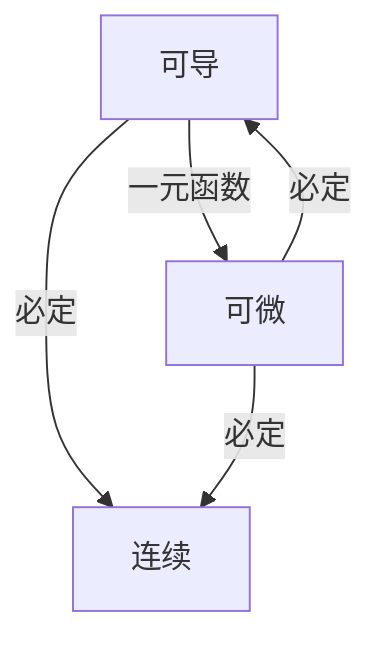

## 一、导数基本内容
### 1. 导数的概念
定义：设函数$y = f(x)$在点$x_0$的某个邻域内有定义， 当自变量$x$在$x_0$处取得增量$\Delta x$时，相应地，因变量取得增量$\Delta y = f(x_0+ \Delta x) -f(x_0)$，如果$\Delta y$与$\Delta x$之比当$\Delta x\to 0$的极限存在,则称函数$f(x)$在点$x_0$处可导并称这个极限为函数$y = f(x)$在点$x_0$处的导数
$$f'(x_0) = \lim_{\Delta x\to 0}\frac{\Delta y}{\Delta x} = \lim_{\Delta x\to 0}\frac{f(x_0 + \Delta x) -f(x_0)}{\Delta x} = \lim_{\Delta h\to 0}\frac{f(x_0+h) - f(x_0)}{h}$$
可以写为
$$y'|_{x_0} = \left. \frac{dy}{dx}\right|_{x_0}= \left.\frac{df(x)}{dx}\right|_{x_0}$$
实际中， 数学中的函数变化率问题即为导数问题。

如果$f(x)$在开区间$I$内每点处都可导， 称为$f'(x)$为$f(x)$在$(a,b)$内的<mark style="background: transparent; color: red">导函数</mark>，简称<mark style="background: transparent; color: red">导数</mark>。对于每一个$x\in I$, 都存在$f'(x)$为确定的$x$点处的导数值 ， 即
$$f'(x_0) = f'(x)|_{x=x_0}$$
此时称为$f(x)$在区间$(a,b)$内可导。若$f(x)$在区间$(a,b)$可导且有$f^+ (a), f^-(b)$存在，则称$f(x)$在$[a,b]$上可导。

`````ad-note
title: 单侧导数
collapse: open
1. 设函数 $y = f(x)$ 在点$x_0$处以及某个左邻域内有定义， 若左极限 $\lim_{x \rightarrow x_0^-} \frac{\Delta y}{\Delta x} = \lim_{\Delta x \rightarrow 0^-} \frac{f(x_0 + \Delta x) - f(x_0)}{\Delta x}$, 这个称为$f(x)$在对应点的左导数， 而相应地将$\Delta x \rightarrow 0^+$称为$f(x)$在对应点的右导数
`````
常见的解题技巧除了定义以外， 还有[[Excalidraw/第二章 导数与微分 2023-07-26 14.28.10|拆分思路的应用]]

### 2. 常见函数的导数公式
![[重要导数公式]]
### 3. 导数的几何意义
几何意义是表示曲线$y = f(x)$在点$M(x_0,f(x_0))$处切线的斜率
![[第二章 导数与微分 2023-01-19 11.43.50.excalidraw|300]]
如果$f(x)$在$x_0$处可导, 则曲线 $y = f(x)$ 在点 $(x_0, f(x_0))$ 处有切线， 切线的方程为：
$$y - f(x_0) = f'(x_0)(x - x_0)$$
此时， 如果$f'(x_0) \neq 0$, 则此曲线 $y = f(x)$ 在点$(x_0, f(x_0))$处的法线方程为: 
$$y - f(x_0) = -\frac{1}{f'(x_0)} (x - x_0)$$

`````ad-note
title: 说明
collapse: open
1. 在某点可导， 则曲线在某点有切线， 并且可以使用上述方法求出切线方程， 反之不然

2. 如果$f(x)$在$x_0$处连续， 且有$f'(x_0) = \infty$, 则曲线 $y = f(x)$在点$(x_0, f(x_0))$ 处有切线， 方程为 $x = x_0$
`````

### 4. 函数可导性和连续性的关系
由于
$$\lim_{h\to 0}\frac{f(x + h) - f(x)}{h} = 0$$
连续是可导的**必要条件，不是充分条件**

对于一元函数 ，可导一定可微， 而多元函数可导不一定可微



### 5. 奇函数和偶函数的求导结论
<mark style="background: transparent; color: blue"><b>(1) 可导函数偶函数的导数是奇函数</b></mark>
<b><mark style="background: transparent; color: blue">(2) 可导函数奇函数的导数是偶函数</mark></b>
<b><mark style="background: transparent; color: blue">(3) 可导周期函数的导数仍然是周期函数， 且周期不变</mark></b>
上述的结论只需要利用奇函数偶函数的定义以及求导法则即可推导出

## 二、函数的求导法则
#### 1. 四则运算求导法则
**定理1: 如果$u =u(x)$, $v= v(x)$都在点$x$具有导数，那么其和差积商满足下列运算规则:** 
$$[u(x) + v(x)]' = u(x)' +v(x)'$$
$$\boxed{[u(x)v(x)]' = u(x)v(x)' + u(x)'v(x)}$$
$$\boxed{\left[\frac{u(x)}{v(x)}\right]' =\frac{u(x)' v(x) - u(x)v(x)'}{v^2(x)}}$$
证明参考[[📘ClassNotes/📐Mathmatics/📈Advanced Mathematics/补充部分/导数的四则运算法则证明|导数的四则运算法则证明]]

#### 2. 反函数的求导法则
**定理2 如果函数$x= f(x)$在区间内单调，可导且有$f'(y) \neq 0$，则其反函数$y=f^{-1}(x)$在区间$I_x = \{ x| x= f(y), y\in I\}$内也可导， 且有反函数导数公式**
$$\boxed{[f^{-1}(x)]' = \frac{1}{f'(y)} \quad \text{or}\quad \frac{dy}{dx} =\frac{1}{\frac{dx}{dy}}}$$
证明参考[[第二章 导数与微分 2023-01-19 12.47.10.excalidraw|反函数的求导法则证明]]

#### 3. 复合函数的求导法则
**定理3. 如果$u = g(x)$在点$x$ 可导，而$y = f(u)$在点$u = g(x)$可导， 则复合函数$y = f[g(x)]$在点$x$可导，且有导数公式**
$$\frac{dy}{dx} = f'(u) \cdot g'(x) \qquad \text{or} \qquad \frac{dy}{dx} =  \frac{dy}{du}\cdot \frac{du}{dx}$$
其中，对于多个变量进行连续复合的情形，设$y = f(u), u = \varphi(v), v =\psi(x)$有公式
$$\frac{dy}{dx} = \frac{dy}{du} \frac{du}{dv} \frac{dv}{dx}$$
(前提是右端的各项导数均存在)
证明过程: [[📘ClassNotes/📐Mathmatics/📈Advanced Mathematics/补充部分/复合函数的求导法则证明|复合函数的求导法则证明]]

### 4. 复合函数的高阶导数求法
对于复合函数的高阶导数， 我们不仅要利用复合函数求导法则， 还需要将导数也视为其余的函数 
例如 求解 $y = f[\varphi(x)]$ 
![[Excalidraw/第二章 导数与微分 2023-07-28 14.26.00|500]]

另外对于隐函数表示的高阶导数， 先使用隐函数求导求出$\frac{dy}{dx}$, 然后利用四则运算法则或者复合求导对$\frac{dy}{dx}$求导得到二阶导数$\frac{d^2 y }{dx^2}$

## 三、高阶导数
### (1) 定义与计算
若$y  =  f(x)$的导数仍然是$x$的可导函数， 则将$y'= f'(x)$的导数称为$f(x)$的二阶导数， 记为$y''$或$\frac{d^2y}{dx^2}$， 类似地定义三阶和更高阶的导数。
对于$n$阶导数， 主要有如下的四种记法：
$$y^{(n)} \qquad f^{(n)}(x), \qquad \frac{d^n y}{dx^n}, \qquad \frac{d^n f}{dx^n}$$

其中有直接方法和间接两种方法
**1. 直接法是先求前几阶导数找规律**
**2. 间接法是利用已知的高阶导数公式， 并通过将函数的恒等变形和变量替换等等求解出高阶导数结果**
[[Excalidraw/第二章 导数与微分 2023-07-28 14.01.30|部分例题(Leibniz公式)]]

### (2) 常见的高阶导数公式
![[高阶导数公式]]

## 四、隐函数和由参数方程确定的函数的导数
#### 1. 隐函数的导数
一般地， 如果变量$x,y$满足一个方程$F(x,y) = 0$，在一定条件下，当$x$取得某区间内的任一值时， 相应地总有满足这个方程的唯一的y值存在，则称$F(x,y) =0$在区间内确定了一个隐函数

将一个隐函数化为显函数，称为**隐函数的显化**
**对于较为简单的隐函数，直接==两边同时对$x$求导数==，然后解方程即可得到隐函数的导数**

`````ad-note
title: 技巧总结
collapse: open
**1. 对数求导法**: 其方法是两边取对数，然后在求出$y$的导数，这些在某些场合常用， 如[[Excalidraw/第二章 导数与微分 2023-07-27 17.59.15|例题]]
(常常是幂指函数的导数)
**2. 取指数求导方法** : 如对于$y = f(x)^{g(x)}$, 求导方法可以变形为
$$y = e^{g(x)\ln f(x)}$$
再使用复合函数求导方法
- 注 : 这个方法可以推广到变为复合函数再求导的方法

**3. ** 对数求导法中，常常利用**对数求导可以拆开的性质**, 方便地求解多项式乘积类型的导数， 如[[Excalidraw/第二章 导数与微分 2023-07-27 17.28.26|例题]]所示
**4. 多项式的因式分解拆分求导方法** ：尤其是对于高阶导数， 对于分母是二次多项式的情况，可以拆分为两个一次多项式的和, 例如
$$\frac{x}{(2 - x) (1 +  x)} = \frac{1}{3}(\frac{1}{2-x} +\frac{1}{1 + x})$$
`````

有时也可以参考[[第九章 多元函数的微分法及应用#五、隐函数的求导公式|多元函数推导的隐函数求导方法]]使用公式: 
$$\frac{dy}{dx} = -\frac{F_x}{F_y}$$
求解得到, 其中$F_x, F_y$是对$x, y$的偏导数

#### 2. 参数方程确定的函数的导数
一般地， 参数方程
$$\begin{cases}
x = \varphi (t) \\
y = \psi (t)
\end{cases}$$
确定的$y$与$x$之间的关系，则称此函数关系所表达的函数为由以上参数方程所确定的的函数

参数方程确定的函数的导数公式: 
如果函数$x = \varphi(t)$具有连续单调的反函数$t=\varphi^{-1}(x)$，且此反函数能与$y = \psi (t)$构成复合函数, 则由参数方程确定的函数可以看成是以上两式复合而成，则导数为：
$$\boxed{\frac{dy}{dx} = \frac{dy}{dt} \cdot \frac{dt}{dx} = \frac{\psi'(t)}{\varphi'(t)} = \frac{\frac{dy}{dt}}{\frac{dx}{dt}}}$$

对于参数方程确定的二阶导数，有
$$\boxed{\frac{d^2y}{dx^2} =  \frac{d}{dx}(\frac{dy}{dx}) = \frac{d}{dt} \frac{\psi'(t)}{\varphi'(t)} \frac{dt}{dx} =  \frac{\psi'' (t) \varphi'(t) - \psi'(t) \varphi''(t)}{\varphi'(t)^3}}$$
`````ad-note
title: 参数方程确定的高阶导数的求法
collapse: open

对于参数方程的高阶导数， 例如
$$\begin{cases}
x = \varphi'(t)\\
y = \psi'(t) 
\end{cases}$$
其一阶导数为$y_x = \frac{\psi' (t)}{\varphi' (t)}$, 则二阶导数可以计算为
$$y''(x) = \frac{\psi''(t) \varphi'(t) t_x  - \psi'(t)\varphi''(t) t_x}{\varphi'(t)^2}$$
由于$t$对$x$的导数可以计算为$t_x = \frac{1}{\varphi'(t)}$， 则有:
$$\large \boxed{y''(x) = \frac{\psi''(t) \varphi'(t) - \psi'(t) \varphi''(t)}{[\varphi'(t)]^3}}$$
`````

#### 3. 相关变化率
对于$x= x(t)$和$y =y(t)$, 显然$\frac{dx}{dt}$ 和$\frac{dy}{dt}$之间也存在某种关系
这两个相互依赖的变化率称为相关变化率


## 五、函数的微分
#### 1. 微分的定义
定义: 设**一元函数**$f(x)$在某区间内有定义，$x_0$及$x_0+\Delta x$在此区间内，如果==函数的增量==
$$\Delta y = f(x_0 + \Delta x) - f(x_0)$$
可以表示为
$$\Delta y =  A\Delta x + o(\Delta x) = dy + o(dy)$$
上式中， $dy$为$\Delta y$的线性主部 ，**则称函数$y =f(x)$在点$x_0$可微**, 其中$A\Delta x$称为函数$y = f(x)$在点$x_0$相应于自变量$\Delta x$的微分，记为: 
$$dy = A\Delta x$$

`````ad-note
title: $dy$和$\Delta y$的区别
collapse: open
在上述过程中， $dy$是微分，有$dy = A \Delta  x$, 而$\Delta y$是增量, 有$\Delta  y = A \Delta x + o(\Delta  x)$
`````

#### 2. 函数可微的条件
1. 对于一元函数$f(x)$, 其**在点$x_0$可微的充分必要条件是$f(x)$在$x_0$可导**， 且其微分一定是
$$dy = f'(x)dx$$
2. 对于**多元函数$f(x,y)$, 在点$(x_0, y_0)$可微，则一定可导，但是在对应的点可导时，不一定可微**
[[第二章 导数与微分 2023-01-20 15.27.17.excalidraw|定理证明过程]]

#### 3. 微分的几何意义
对应函数的微分公式可以使用下列几何图形来进行说明：
![[第二章 导数与微分 2023-01-20 15.42.03.excalidraw|300]]

对于微分的公式和运算法则(和差积商和复合函数)，与导数完全相同

#### 一些常用的近似公式推导
参考: [[📘ClassNotes/📐Mathmatics/📈Advanced Mathematics/♎重要公式/常见等价无穷小与极限|常见等价无穷小与极限]]
$$(1+ x)^\alpha  \approx 1+ \alpha x$$
$$\sin x \approx x$$
$$\tan x\approx x$$
$$e^x \approx 1+ x$$
$$\ln(1 + x) \approx x$$


